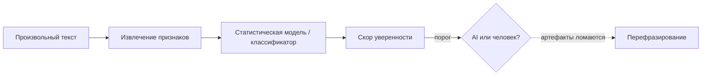

## Русская версия

# Raschka строит AI-детектор текста с нуля: разбор без иллюзий

Себастьян Рашка, чей вчерашний разбор ватермарок Claude уже попадал в нашу подборку, выпустил логичное продолжение — [«Building an AI Text Detector From Scratch»](https://magazine.sebastianraschka.com/p/ai-detector-from-scratch). Если ватермаркинг — это способ провайдера модели встроить сигнал прямо в момент генерации, то детектор — задача с обратной стороны: дан произвольный текст, нужно понять, писала ли его модель, не имея доступа ни к каким специальным меткам от вендора.

Rashka известен тем, что не просто пересказывает концепции, а действительно доводит их до работающего кода — и судя по заголовку, здесь та же логика: не обзор существующих детекторов, а пошаговое построение своего, с нуля, чтобы показать, из чего он вообще состоит под капотом. Практический смысл такого разбора велик именно потому, что большинство людей сталкивается с AI-детекторами как с чёрным ящиком — сервис выдаёт «87% AI-generated» без объяснений, и разработчику или редактору приходится либо слепо доверять, либо слепо игнорировать.

Стоит сразу зафиксировать главный скепсис-момент, который важен для любого материала на эту тему: надёжных универсальных детекторов AI-текста на сегодня не существует, и это не вопрос конкретной реализации, а фундаментальное ограничение задачи. Современные модели генерируют текст, статистически неотличимый от человеческого на уровне отдельных предложений; детекторы, как правило, ловят не «признаки ИИ» напрямую, а статистические артефакты конкретных моделей и конкретных промптов — и эти артефакты меняются от версии к версии, легко ломаются перефразированием, и дают заметный процент ложных срабатываний на человеческом тексте, особенно написанном носителями не первого языка или в формальном/шаблонном стиле.

Именно поэтому «построить детектор с нуля» — полезное упражнение не потому что даёт готовое надёжное решение, а потому что явно показывает: детектор — это статистическая эвристика с определённым порогом уверенности, а не бинарный факт. Когда вы видите код, генерирующий эту цифру, гораздо сложнее принимать её на веру как окончательный вердикт.

### Почему вам это важно

Если в вашей организации используются коммерческие AI-детекторы — для проверки студенческих работ, модерации контента или комплаенса — [этот разбор](https://magazine.sebastianraschka.com/p/ai-detector-from-scratch) стоит прочитать прежде, чем строить процессы, которые опираются на вывод детектора как на факт. Понимание механики под капотом — это единственный способ адекватно оценить, насколько можно доверять конкретному проценту, который вам показывает интерфейс, и как высоки ставки ложного обвинения человека в использовании ИИ.

## English version

# Raschka builds an AI text detector from scratch: a look without illusions

Sebastian Raschka, whose breakdown of Claude's watermarking already made it into yesterday's roundup, has published a logical follow-up: [«Building an AI Text Detector From Scratch»](https://magazine.sebastianraschka.com/p/ai-detector-from-scratch). If watermarking is a way for a model provider to embed a signal at generation time, detection is the problem from the other side: given an arbitrary piece of text, figure out whether a model wrote it, with no access to any special marker from the vendor.

Raschka is known for not just summarizing concepts but actually taking them down to working code, and going by the title, this follows the same pattern: not a survey of existing detectors, but a step-by-step build of one from scratch, to show what's actually under the hood. That kind of breakdown has real practical value precisely because most people encounter AI detectors as a black box — a service returns "87% AI-generated" with no explanation, leaving a developer or editor to either trust it blindly or dismiss it blindly.

Worth stating the main point of skepticism upfront, since it matters for any piece on this topic: there is no reliable, universal AI-text detector today, and that's not a limitation of any particular implementation — it's a fundamental limit of the problem itself. Modern models generate text that's statistically indistinguishable from human writing at the level of individual sentences; detectors generally don't catch "signs of AI" directly, but statistical artifacts of specific models and specific prompts — artifacts that shift from version to version, break easily under paraphrasing, and produce a meaningful false-positive rate on human text, especially text written by non-native speakers or in a formal, templated style.

That's exactly why "build a detector from scratch" is a useful exercise — not because it hands you a reliable off-the-shelf solution, but because it makes explicit that a detector is a statistical heuristic with a confidence threshold, not a binary fact. Once you see the code generating that number, it becomes much harder to take it at face value as a final verdict.

### Why it matters

If your organization uses commercial AI detectors — for checking student work, content moderation, or compliance — [this breakdown](https://magazine.sebastianraschka.com/p/ai-detector-from-scratch) is worth reading before building processes that treat a detector's output as fact. Understanding the mechanics underneath is the only real way to judge how much trust to put in whatever percentage the interface shows you, and how high the stakes are for falsely accusing a person of using AI.

