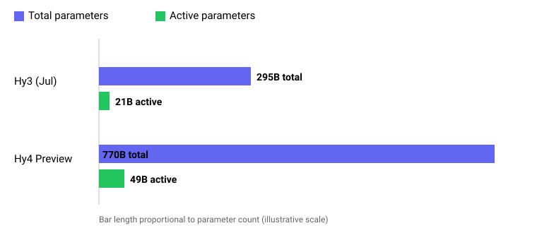

## Русская версия

# Hy4 Preview: Tencent выкатывает открытую модель на 770 млрд параметров

Саймон Уиллисон [написал](https://simonwillison.net/2026/Aug/29/hy4/) о свежем релизе Tencent — Hy4 Preview, новой открытой текстовой LLM (без визуального модуля, только текст на входе). Цифры сами по себе впечатляют: 770 млрд параметров всего, из них активных на каждый forward pass — 49 млрд, окно контекста в 1 миллион токенов, а вес всех файлов на Hugging Face — 1.56 терабайта. Для сравнения, предыдущая модель линейки, Hy3, вышедшая в июле, была заметно скромнее: 295 млрд параметров всего и 21 млрд активных. Рост почти в 2.5 раза по общему размеру и более чем в 2 раза по активным параметрам — это не косметическое обновление, а следующее поколение архитектуры.

Разрыв между «770 млрд всего» и «49 млрд активных» — это отсылка к архитектуре mixture-of-experts (MoE): модель физически хранит гигантское количество параметров, но на каждый токен активирует лишь небольшую их часть — конкретный набор «экспертов», выбранный роутером. Это ровно тот трюк, который позволяет наращивать общую ёмкость модели (что обычно коррелирует со знаниями и качеством), не взрывая при этом стоимость инференса пропорционально — платите вы по факту за 49 млрд активных параметров, а не за все 770 млрд. Именно поэтому такие модели и становятся всё крупнее по общему размеру: физическое хранение относительно дёшево, а стоимость на пользователя определяется активной частью.

Открытые веса на Hugging Face — тоже не мелочь: 1.56 терабайта — это серьёзная заявка, которую не запустишь на бытовом железе без квантования и распределённого инференса, и это стоит держать в уме, прежде чем радоваться слову «открытая». Открытость весов не равна доступности: гонять такую модель локально смогут единицы, у кого есть кластер или очень дорогой сервер.

### Почему вам это важно

Если вы следите за открытыми моделями как за альтернативой закрытым API, Hy4 — хороший повод свериться с реальностью: рост общего размера модели при контролируемом росте активных параметров — это magistral-тренд последних релизов, а не разовая находка Tencent. [Прочитайте пост Уиллисона целиком](https://simonwillison.net/2026/Aug/29/hy4/) — он же обычно одним из первых прогоняет такие модели через практические тесты, и стоит следить за его последующими заметками о реальном качестве Hy4 за пределами карточки релиза.

## English version

# Hy4 Preview: Tencent ships a 770-billion-parameter open model

Simon Willison [wrote about](https://simonwillison.net/2026/Aug/29/hy4/) Tencent's latest release — Hy4 Preview, a new open-weight text-only LLM (no vision input). The numbers alone are striking: 770B total parameters, 49B of them active per forward pass, a 1M-token context window, and 1.56TB of weight files on Hugging Face. For comparison, the previous model in the line, Hy3, released in July, was noticeably smaller: 295B total parameters and 21B active. That's almost a 2.5x jump in total size and more than 2x in active parameters — not a cosmetic update, but a next architectural generation.

The gap between "770B total" and "49B active" points to a mixture-of-experts (MoE) architecture: the model physically stores a huge parameter count, but activates only a small subset per token — a specific set of "experts" chosen by a router. That's exactly the trick that lets total model capacity grow (which usually correlates with knowledge and quality) without inference cost scaling proportionally — you effectively pay for the 49B active parameters, not the full 770B. That's why these models keep getting bigger in total size: raw storage is relatively cheap, and per-user cost is set by the active slice, not the total.

The open weights on Hugging Face are worth pausing on too: 1.56TB is a serious footprint that you can't just spin up on consumer hardware without quantization and distributed inference — worth keeping in mind before getting too excited about the word "open." Open weights aren't the same as accessible — running this locally will be within reach of very few people, only those with a cluster or a very expensive server.

### Why it matters

If you follow open models as an alternative to closed APIs, Hy4 is a good reality check: growing total model size while keeping active-parameter growth in check is the dominant trend across recent releases, not a one-off Tencent move. [Read Willison's full post](https://simonwillison.net/2026/Aug/29/hy4/) — he's usually among the first to actually run these models through practical tests, so it's worth watching for his follow-up notes on Hy4's real-world quality beyond the release card.
