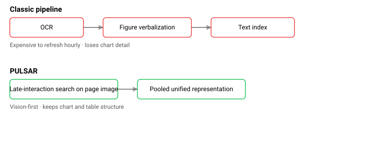
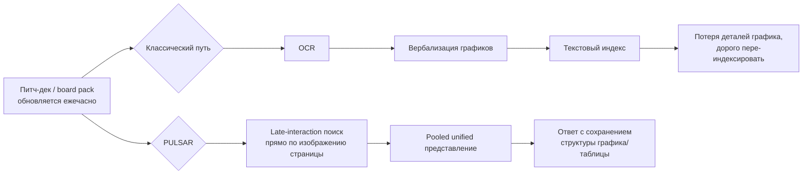

## Русская версия

# PULSAR: RAG для питч-деков, который не гонит их через OCR

Свежая статья [PULSAR: Pooled Unified Late-Interaction Search and Retrieval for Enterprise Visual Document RAG](http://arxiv.org/abs/2608.28572v1) описывает довольно приземлённую, но болезненную проблему: институциональные инвесторы работают с визуально плотными документами — питч-деками, board packs, материалами due diligence, — которые могут меняться ежечасно в разгар закрытия сделки. Авторы прямо называют классический подход неэффективным для такого темпа: OCR с последующей вербализацией графиков (превращением диаграммы в текстовое описание) стоит дорого пересчитывать заново при каждом обновлении документа на таком масштабе, а сам процесс верболизации может терять детали графика — то есть именно ту информацию, ради которой документ вообще открывают.

Решение, которое предлагают авторы — PULSAR — они описывают как «production vision-first» систему поиска: вместо того чтобы сначала превращать страницу в текст, а потом искать по тексту, система работает напрямую с визуальным представлением документа через late-interaction поиск — механизм, при котором сравнение запроса и документа происходит на уровне отдельных визуальных токенов/патчей, а не единого сжатого эмбеддинга всей страницы. «Pooled unified» в названии намекает на то, что множество таких визуальных представлений объединяются в единую индексируемую структуру, а не хранятся и обрабатываются как разрозненные фрагменты.

Важно, что это не академическая демонстрация на игрушечном датасете, а система, которую авторы прямо называют «production» — то есть заявляется как работающая в реальных условиях с реальной нагрузкой институциональных инвесторов, а не только на бенчмарках. Это стоит воспринимать с обычной осторожностью к любым self-reported заявлениям в препринте: «production-ready» в статье и «production-ready» после независимой проверки — не всегда одно и то же, а конкретных метрик качества извлечения в доступном фрагменте абстракта нет.

Тем не менее сама постановка задачи точна: финансовые и инвестиционные документы — один из самых требовательных доменов для RAG именно потому, что смысл там часто закодирован визуально (график роста выручки, таблица метрик), а не в прозе, которую легко векторизовать.

### Почему вам это важно

Если вы строите RAG поверх документов, где важна визуальная структура — таблицы, графики, диаграммы, — [статья про PULSAR](http://arxiv.org/abs/2608.28572v1) стоит прочтения как контраргумент дефолтному пайплайну «OCR → текстовый эмбеддинг». Vision-first поиск — растущее направление именно там, где потеря деталей графика в OCR-описании стоит вам денег или решения, а не просто неудобства.

## English version

# PULSAR: a RAG pipeline for pitch decks that skips OCR

A fresh preprint, [PULSAR: Pooled Unified Late-Interaction Search and Retrieval for Enterprise Visual Document RAG](http://arxiv.org/abs/2608.28572v1), tackles a fairly mundane but painful problem: institutional investors work with visually dense documents — pitch decks, board packs, diligence materials — that can change hourly in the middle of a deal closing. The authors call out the classic approach as ill-suited to that pace: OCR followed by figure verbalization (turning a chart into a text description) is expensive to re-run at that refresh rate and at that scale, and the verbalization step itself can lose chart detail — exactly the information the document was opened for in the first place.

Their answer, PULSAR, is what they describe as a "production vision-first" retrieval system: instead of first converting a page to text and then searching the text, it works directly on the document's visual representation via late-interaction search — a matching mechanism where query and document are compared at the level of individual visual tokens or patches rather than a single compressed whole-page embedding. The "pooled unified" part of the name points to how these many visual representations get merged into a single indexable structure rather than stored and processed as scattered fragments.

Notably, the authors explicitly call this a "production" system rather than a toy academic demo — meaning it's claimed to run under real institutional-investor load, not just on benchmarks. That's worth the usual dose of caution reserved for any self-reported claim in a preprint: "production-ready" in a paper and "production-ready" after independent verification aren't always the same thing, and the available abstract excerpt doesn't include concrete retrieval-quality numbers.

Still, the framing of the problem is precise: financial and investment documents are one of the most demanding domains for RAG exactly because meaning is often encoded visually — a revenue-growth chart, a metrics table — rather than in prose that's easy to vectorize.

### Why it matters

If you're building RAG over documents where visual structure carries the meaning — tables, charts, diagrams — the [PULSAR paper](http://arxiv.org/abs/2608.28572v1) is worth reading as a counterargument to the default "OCR → text embedding" pipeline. Vision-first retrieval is a growing direction precisely where losing chart detail in an OCR description costs you money or a decision, not just convenience.
