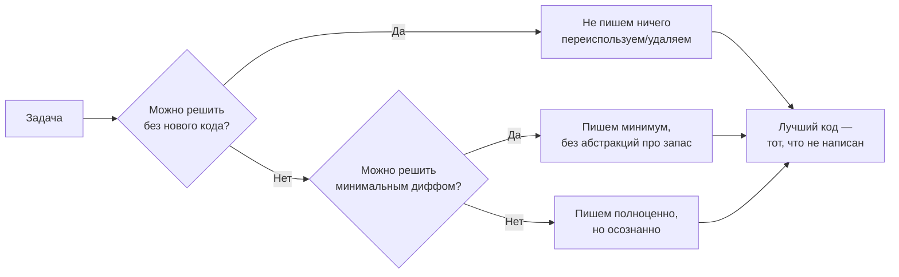
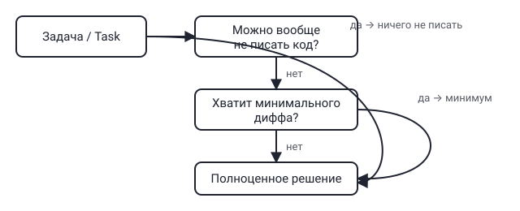

## Русская версия

# ponytail: агент, который думает как самый ленивый синьор в комнате

За последние сутки репозиторий [ponytail](https://github.com/DietrichGebert/ponytail) прибавил ещё +1 273 звезды и добрался до 119 035 при 6 468 форках — язык JavaScript, категория «AI Agents». Формулировка в описании репозитория цепляет сразу: «Makes your AI agent think like the laziest senior dev in the room. The best code is the code you never wrote» — «заставляет вашего агента думать как самый ленивый синьор в комнате: лучший код — это тот, который вы никогда не писали».

За шуткой стоит вполне рабочая инженерная идея, знакомая любому, кто хоть раз code review проводил. Джуниор на задачу «почини баг» часто отвечает новым классом, новым флагом конфигурации и парой хелперов «на будущее». Опытный синьор в такой же ситуации сначала спрашивает: а можно ли вообще ничего не писать — переиспользовать существующее, удалить лишнее, обойтись однострочным фиксом? LLM-агенты по умолчанию куда ближе к джуниору: они обучены генерировать код, и генерация — это то, что они делают охотно и много, даже когда правильный ответ — «не трогать». [ponytail](https://github.com/DietrichGebert/ponytail), судя по описанию, пытается зашить именно этот скепсис по умолчанию в поведение агента — сначала спросить «а нужно ли», а не сразу писать.

Здесь стоит держать в голове и обратную сторону: агент, натренированный на минимализм, рискует впасть в другую крайность — недописывать нужную обработку ошибок или валидацию там, где она на самом деле нужна, просто потому что «меньше кода — значит лучше» стало жёстким правилом, а не эвристикой для конкретной ситуации. Цифры звёзд тоже стоит воспринимать спокойно: рост популярности говорит о том, что боль «агенты пишут слишком много лишнего кода» знакома многим разработчикам, а вовсе не о том, что конкретная реализация решает её идеально.

### Почему вам это важно

Если вы пишете системный промпт для своего агента или харнесса, стоит явно спросить себя: поощряет ли он «не писать код», когда это возможно, или по умолчанию тянет к генерации нового? [Посмотрите на подход ponytail](https://github.com/DietrichGebert/ponytail) как на референс формулировки такой установки — даже если вы не подключите сам проект, сама идея «сначала — можно ли не писать» стоит того, чтобы явно прописать её в инструкциях для вашего агента.

## English version

# ponytail: making your AI agent think like the laziest senior dev in the room

In the last day, [ponytail](https://github.com/DietrichGebert/ponytail) gained another +1,273 stars, reaching 119,035 with 6,468 forks — JavaScript, filed under "AI Agents." The repo's own tagline is the hook: "Makes your AI agent think like the laziest senior dev in the room. The best code is the code you never wrote."

Behind the joke is a real engineering idea familiar to anyone who's done code review. A junior handed "fix this bug" often responds with a new class, a new config flag, and a couple of helpers "for later." An experienced senior faced with the same task asks first: can I get away with writing nothing at all — reuse what's there, delete what's redundant, ship a one-line fix? LLM agents default much closer to the junior end: they're trained to generate code, and generating is what they do eagerly and often, even when the right answer is "leave it alone." [ponytail](https://github.com/DietrichGebert/ponytail), going by its description, tries to bake that default skepticism into the agent's behavior — ask "is this needed" before reaching for the keyboard.

Worth keeping the flip side in mind too: an agent trained toward minimalism risks swinging the other way — skipping error handling or validation that's actually needed, just because "less code is better" became a hard rule instead of a situational heuristic. And the star count deserves the same level-headed read as always: rising popularity says the pain of "agents write too much unnecessary code" resonates with a lot of developers — it doesn't say this particular implementation solves it perfectly.

### Why it matters

If you're writing a system prompt for your own agent or harness, it's worth asking directly: does it encourage "don't write code" as a first option, or does it default toward generating something new? [Look at ponytail's approach](https://github.com/DietrichGebert/ponytail) as a reference for how to phrase that instinct — even if you never wire up the project itself, "can this be solved without writing code" is worth spelling out explicitly in your own agent's instructions.
