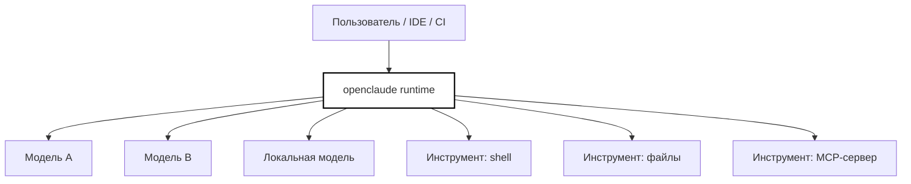
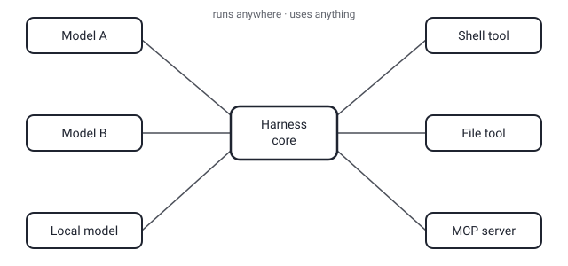

## Русская версия

# openclaude: «работает где угодно, использует что угодно» и первое место в трендах

В сегодняшнем срезе трендов GitHub на первом месте — [openclaude](https://github.com/Gitlawb/openclaude), TypeScript-репозиторий, который за сутки прибавил +181 звезду и дошёл до 31 449. Формулировка из описания короткая и programmatic: «runs anywhere. uses anything» — «работает где угодно, использует что угодно».

Такая формулировка — не просто маркетинговый слоган, а заявка на архитектурную позицию в довольно перегруженной нише агентских харнессов. «Работает где угодно» обычно означает независимость от конкретной среды выполнения — не привязку к одному облаку, одной IDE или одному способу деплоя. «Использует что угодно» — это про отвязку от одного провайдера модели или одного набора инструментов: харнесс, который умеет говорить с разными LLM и подключать разные источники инструментов (в духе MCP или аналогичных протоколов), а не быть жёстко сшитым с одной моделью и фиксированным списком встроенных функций. Именно эта развязка — модель отдельно, инструменты отдельно, среда исполнения отдельно — стала за последний год негласным стандартом качества агентских фреймворков.

Здесь стоит сделать ту же оговорку, что и всегда с трендами GitHub: первое место в списке и рост звёзд говорят о видимости проекта прямо сейчас, а не о его технической зрелости или production-готовности через полгода. Ниша агентских харнессов меняется быстро — то, что стоит на первом месте сегодня, может уступить место совсем другому проекту через пару недель, и это нормальная динамика, а не признак того, что openclaude «ненадёжен». Важнее смотреть не на позицию в рейтинге, а на то, действительно ли заявленная независимость от модели и среды выполнения реализована по факту, а не только в описании репозитория.

### Почему вам это важно

Если вы выбираете харнесс для своего агента, «runs anywhere, uses anything» — хороший чек-лист вопросов к любому кандидату, включая сам [openclaude](https://github.com/Gitlawb/openclaude): можно ли безболезненно сменить модель, можно ли подключить свой инструмент без форка ядра, не завязана ли логика намертво на одну облачную платформу? Ответы на эти три вопроса скажут о зрелости харнесса больше, чем число звёзд на GitHub.

## English version

# openclaude: "runs anywhere, uses anything," and the #1 trending spot

In today's GitHub trending snapshot, the top spot goes to [openclaude](https://github.com/Gitlawb/openclaude), a TypeScript repo that gained +181 stars in the last day, reaching 31,449. The repo's own tagline is short and to the point: "runs anywhere. uses anything."

That phrasing isn't just marketing — it's a stated architectural position in an already crowded niche of agent harnesses. "Runs anywhere" usually means independence from a specific runtime — not locked into one cloud, one IDE, or one deployment method. "Uses anything" is about decoupling from a single model provider or a single fixed toolset: a harness that can talk to different LLMs and plug in different tool sources (in the spirit of MCP or similar protocols), rather than being hard-wired to one model and a fixed list of built-in functions. That decoupling — model separate from tools separate from runtime — has quietly become the informal quality bar for agent frameworks over the past year.

The usual caveat about GitHub trends applies here too: the #1 spot and star growth reflect a project's visibility right now, not its technical maturity or production readiness six months from now. The agent-harness niche moves fast — what tops the list today can be displaced by something else entirely in a couple of weeks, and that's normal churn, not a sign that openclaude is unreliable. What matters more than rank is whether the claimed model-and-runtime independence actually holds up in practice, not just in the repo's tagline.

### Why it matters

If you're picking a harness for your own agent, "runs anywhere, uses anything" is a good checklist to run against any candidate, [openclaude](https://github.com/Gitlawb/openclaude) included: can you swap the model without pain, can you plug in your own tool without forking the core, is the logic hard-wired to one cloud platform? Those three answers tell you more about a harness's maturity than its star count ever will.
