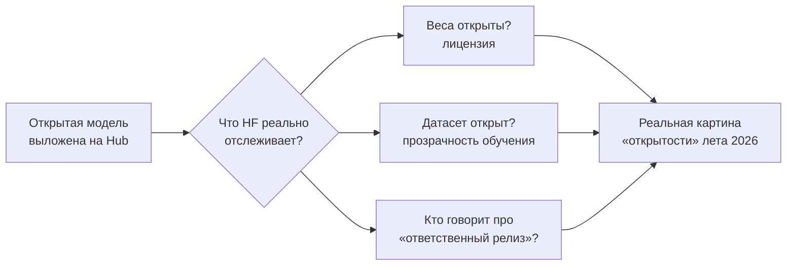
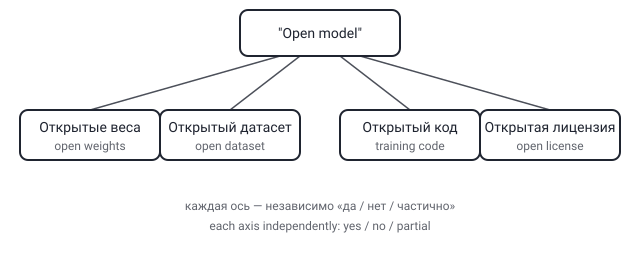

## Русская версия

# State of Open Models: что Hugging Face увидела в открытых моделях этим летом

Hugging Face выпустил обзорный пост [«State of Open Models: Summer 2026 Observations»](https://huggingface.co/blog/state-of-open-models-summer-2026) за авторством Adina Yakefu, Apolinário (известного по работе с мультимодальным AI-артом) и Irene Solaiman — исследовательницы, давно занимающейся темой ответственного релиза моделей. Уже сам состав авторов задаёт тон: это не хроника релизов ради хроники, а попытка зафиксировать, куда сдвинулось само понятие «открытая модель» за прошедшее лето.

Слово «open» в контексте моделей давно перестало быть бинарным флагом — открыто или нет. Есть открытость весов, открытость датасета, открытость кода обучения, открытость лицензии на коммерческое использование, и любая комбинация этих осей может называться «open model» в маркетинговых материалах, хотя по факту закрывает лишь часть цепочки. Irene Solaiman как раз известна работой над таксономиями именно такой градуированной открытости — так что появление её имени рядом с этим обзором намекает: пост, скорее всего, не ограничивается перечислением новых релизов, а пытается структурировать, по каким осям вообще стоит сравнивать «открытость» моделей друг с другом.

Здесь стоит быть осторожным с формулировками в диджесте: у нас есть только заголовок и список авторов поста, а не сам его текст с конкретными цифрами и выводами — так что любые более детальные заявления о содержании были бы додумыванием, а не пересказом. Что можно сказать уверенно — раз материал вышел от Hugging Face, крупнейшего публичного хаба именно для открытых весов, у авторов есть прямой доступ к агрегированной статистике по загрузкам, лицензиям и активности community, которой ни у кого больше просто нет в таком объёме.

### Почему вам это важно

Если вы выбираете открытую модель для продакшена, стоит [прочитать сам пост целиком](https://huggingface.co/blog/state-of-open-models-summer-2026), а не полагаться на маркетинговый ярлык «open» на карточке модели — за одним и тем же словом может стоять совершенно разный уровень реальной прозрачности, и именно это различие определяет, сможете ли вы аудировать модель, дообучить её законно или воспроизвести её поведение самостоятельно.

## English version

# State of Open Models: what Hugging Face saw in open models this summer

Hugging Face published an overview post, [«State of Open Models: Summer 2026 Observations»](https://huggingface.co/blog/state-of-open-models-summer-2026), by Adina Yakefu, Apolinário (known for multimodal AI art work), and Irene Solaiman — a researcher with a long track record on responsible model release. The author lineup alone sets the tone: this isn't a release chronicle for its own sake, it's an attempt to pin down where the very idea of an "open model" moved over the summer.

The word "open" in the context of models stopped being a binary flag a while ago. There's open weights, an open dataset, open training code, an open license for commercial use — and any combination of those axes can get marketed as an "open model," even when only part of the chain is actually open. Irene Solaiman is specifically known for work on taxonomies of exactly this kind of graduated openness — so her name attached to this piece suggests it likely goes beyond listing new releases and tries to structure which axes are worth comparing "openness" along in the first place.

Worth being careful with the phrasing here: the digest only gives us the title and author list, not the post's actual text with concrete numbers and conclusions — so any more detailed claims about its content would be invention rather than a summary. What can be said with confidence: since this comes from Hugging Face, the largest public hub specifically for open weights, the authors have direct access to aggregated download, license, and community-activity statistics at a scale nobody else really has.

### Why it matters

If you're picking an open model for production, [read the actual post](https://huggingface.co/blog/state-of-open-models-summer-2026) rather than relying on the marketing label "open" on a model card — the same word can hide very different levels of actual transparency, and that difference determines whether you can audit the model, legally fine-tune it, or reproduce its behavior on your own.
