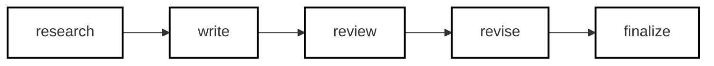
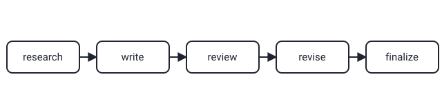

## Русская версия

# academic-research-skills: пять шагов научной работы как готовый skill для Claude Code

Второе место в сегодняшних трендах GitHub держит [academic-research-skills](https://github.com/Imbad0202/academic-research-skills) — репозиторий на Python, за сутки набравший +184 звезды и дошедший до 45 049, с приростом 193 звезды именно за сегодня. Описание короткое и предельно конкретное: «Academic Research Skills for Claude Code: research → write → review → revise → finalize» — то есть готовый набор skills, воспроизводящий полный цикл написания научной работы внутри Claude Code.

Идея здесь не в том, чтобы заменить исследователя, а в том, чтобы формализовать сам процесс в виде явных, переиспользуемых шагов, которые агент проходит последовательно: сбор и синтез источников (research), написание черновика (write), самопроверка на предмет логических дыр и неподтверждённых утверждений (review), внесение правок по итогам этой проверки (revise) и, наконец, приведение текста к финальному виду с оформлением (finalize). Это ровно та же логика, что стоит за skills вообще — не одна гигантская инструкция «напиши мне научную статью», а пошаговый чек-лист, который сложнее сломать одним неудачным промптом и который можно применять к любой конкретной работе, просто меняя тему.

Заметно, что за последние недели формат «X-skills для Claude Code» стал устойчивым паттерном: агентские skills для конкретных доменов появляются быстрее, чем их успевают систематизировать. Это одновременно и хороший знак — сообщество активно экспериментирует с тем, как декомпозировать сложные интеллектуальные задачи для агентов, — и повод для осторожности: не любой skill с таким названием реально прошёл проверку на надёжность в разных дисциплинах и форматах цитирования, и «45 тысяч звёзд» тут снова метрика внимания, а не гарантия качества итогового текста.

### Почему вам это важно

Если вы или ваши студенты используете Claude Code для работы с текстами, [посмотрите структуру этого skill](https://github.com/Imbad0202/academic-research-skills) как на шаблон декомпозиции: пять явных этапов вместо одной большой просьбы — паттерн, который переносится далеко за пределы академического письма, на любую задачу, где важен контроль качества на каждом шаге, а не только на выходе.

## English version

# academic-research-skills: the five-step research workflow as a ready-made Claude Code skill

The #2 spot in today's GitHub trending goes to [academic-research-skills](https://github.com/Imbad0202/academic-research-skills), a Python repo that gained +184 stars in the last day, reaching 45,049, with 193 stars specifically today. The description is short and specific: "Academic Research Skills for Claude Code: research → write → review → revise → finalize" — a ready-made set of skills that reproduces the full cycle of writing an academic paper inside Claude Code.

The idea here isn't to replace the researcher, but to formalize the process itself as explicit, reusable steps an agent works through in sequence: gathering and synthesizing sources (research), drafting the text (write), self-checking for logical gaps and unsupported claims (review), incorporating fixes from that check (revise), and finally polishing the text into its finished, formatted form (finalize). That's exactly the logic behind skills in general — not one giant "write me a research paper" instruction, but a step-by-step checklist that's harder to break with a single bad prompt and that can be reapplied to any specific piece of work just by swapping the topic.

It's noticeable that over the past few weeks, "X-skills for Claude Code" has become a stable pattern: domain-specific agent skills are appearing faster than anyone can systematically catalog them. That's a good sign in one sense — the community is actively experimenting with how to decompose complex intellectual work for agents — and a reason for caution in another: not every skill with a name like this has actually been validated for reliability across different disciplines and citation formats, and "45,000 stars" is once again a measure of attention, not a guarantee of output quality.

### Why it matters

If you or your students use Claude Code for writing, [look at this skill's structure](https://github.com/Imbad0202/academic-research-skills) as a decomposition template: five explicit stages instead of one big ask — a pattern that transfers far beyond academic writing, to any task where quality control matters at every step, not just at the output.
