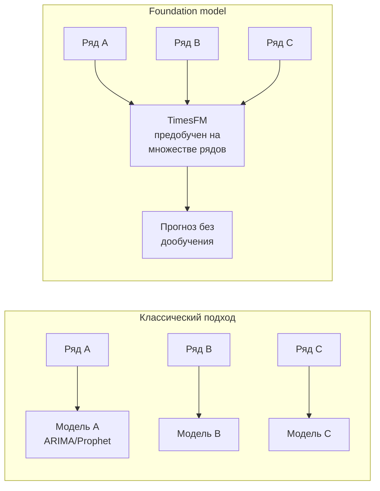
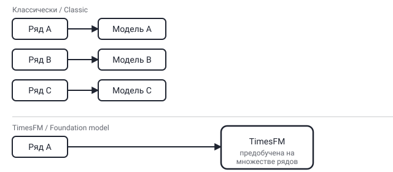

## Русская версия

# TimesFM: один предобученный трансформер вместо отдельной модели на каждый временной ряд

В топе трендов сегодня — репозиторий [google-research/timesfm](https://github.com/google-research/timesfm): +298 звёзд за сутки, итого 30 038, второе место рейтинга. Описание короткое и по делу: «TimesFM (Time Series Foundation Model) is a pretrained time-series foundation model developed by Google Research for time-series forecasting» — предобученная foundation-модель для прогнозирования временных рядов.

Чтобы понять, что здесь нового, полезно вспомнить, как прогнозирование временных рядов делалось классически. Для каждого конкретного ряда — продаж конкретного магазина, нагрузки конкретного сервера, спроса на конкретный товар — обычно строилась отдельная модель: ARIMA, Prophet, градиентный бустинг на признаках, иногда своя LSTM. Модель обучалась на истории именно этого ряда и переносить её на другой ряд напрямую не получалось — разная сезонность, разный масштаб, разная природа шума. TimesFM предлагает другую схему: одна модель, предобученная сразу на огромном множестве разнородных рядов, а на новый ряд применяется без дообучения (zero-shot) — примерно так же, как языковая модель отвечает на новый вопрос без файнтюна под конкретного пользователя.

Идея не то чтобы совсем новая — сам жанр «foundation model для табличных/временных данных» развивается уже пару лет, и TimesFM (Google Research) — одна из заметных попыток довести его до состояния «можно использовать в проде», о чём и говорит рост звёзд именно сейчас. Но стоит держать в голове честную оговорку: zero-shot-прогноз на незнакомом ряде почти никогда не бьёт модель, специально обученную и тщательно настроенную под этот конкретный ряд с его специфической сезонностью и внешними факторами. Ценность foundation-модели — не в максимальной точности на каждом отдельном ряде, а в том, что не нужно держать (и поддерживать) сотни узкоспециализированных моделей одновременно — заметный выигрыш в инженерных издержках, который стоит явно взвешивать против потери точности.

### Почему вам это важно

Если у вас в проде десятки или сотни временных рядов (метрики нагрузки, продажи по SKU, спрос по регионам) и вы поддерживаете под каждый отдельную модель — [посмотрите на TimesFM](https://github.com/google-research/timesfm) как на кандидата для быстрого baseline: не для замены точной модели там, где точность критична, а для рядов, где «прогноз есть и он разумный» важнее, чем «прогноз идеален», и где цена поддержки десятков ARIMA-моделей вручную уже перевешивает потерю точности от единой модели.

## English version

# TimesFM: one pretrained transformer instead of a bespoke model per time series

Today's trending list has [google-research/timesfm](https://github.com/google-research/timesfm) near the top: +298 stars in a day, 30,038 total, ranked #2. The description is short and to the point: "TimesFM (Time Series Foundation Model) is a pretrained time-series foundation model developed by Google Research for time-series forecasting."

To see what's actually new here, it helps to remember how time-series forecasting has traditionally been done. For each specific series — a particular store's sales, a particular server's load, demand for a particular product — you'd typically build a separate model: ARIMA, Prophet, gradient boosting on engineered features, sometimes a custom LSTM. The model trained on that one series' history, and it didn't transfer to another series directly — different seasonality, different scale, different noise structure. TimesFM proposes a different setup: one model, pretrained on a huge and diverse collection of time series, applied to a new series with no fine-tuning (zero-shot) — roughly the way a language model answers a new question without being fine-tuned for that specific user.

The idea isn't brand new — "foundation model for tabular/time-series data" as a genre has been building for a couple of years, and TimesFM (from Google Research) is one of the notable attempts to push it toward "usable in production," which is presumably why it's climbing the trending list right now. But the honest caveat is worth keeping in mind: a zero-shot forecast on an unfamiliar series almost never beats a model specifically trained and carefully tuned for that particular series' seasonality and external factors. The value of a foundation model isn't maximum accuracy on any single series — it's not having to maintain (and keep retraining) hundreds of narrowly specialized models at once, a real reduction in engineering overhead that's worth weighing explicitly against the accuracy you give up.

### Why it matters

If you're running dozens or hundreds of time series in production (load metrics, per-SKU sales, regional demand) and maintaining a separate model for each — [look at TimesFM](https://github.com/google-research/timesfm) as a candidate for a fast baseline: not a replacement for a tuned model where accuracy is critical, but a fit for series where "a reasonable forecast exists" matters more than "the forecast is optimal," and where the cost of hand-maintaining dozens of ARIMA models already outweighs the accuracy lost to a single shared model.
