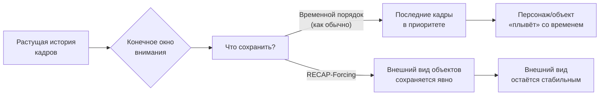
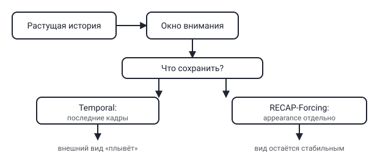

## Русская версия

# RECAP-Forcing: что генератору длинного видео стоит держать в памяти, а что — забыть

Среди сегодняшних индустриальных новостей — работа [RECAP-Forcing: Retaining Content Appearances for Long Video Generation](https://huggingface.co/papers/2608.26671) авторства Haiyang Xu, Zheng Ding и Zhuowen Tu. Формулировка проблемы в аннотации предельно чёткая: «генерация длинного авторегрессионного видео сталкивается с фундаментальной проблемой памяти: при конечном окне внимания модель должна решать, какую информацию из постоянно растущей истории сохранить». Дальше авторы отмечают, что существующие методы организуют память по временному принципу — то есть, судя по всему, попросту держат в контексте недавние кадры и постепенно вытесняют старые.

Здесь стоит остановиться и понять, почему временная организация памяти — это удобный, но не обязательно правильный выбор по умолчанию. Модель, генерирующая видео кадр за кадром, физически не может держать в контексте всю историю — окно внимания конечно, и рано или поздно старые кадры приходится выбрасывать. Самый простой критерий — «выбрасывать самое старое» — работает интуитивно, но у него есть скрытая цена: если в кадре, скажем, 500 назад был показан персонаж с конкретной причёской или конкретным цветом куртки, а всё это время он не попадал в кадр, чисто временной механизм памяти о нём просто забудет. Когда персонаж снова появится в кадре, у модели не останется опоры на то, как он выглядел — и внешний вид «поплывёт».

Название RECAP-Forcing («retaining content appearances» — «сохранение внешнего вида содержимого») намекает, что авторы предлагают организовывать память не по принципу «когда это было», а по принципу «что это такое» — держать в памяти характерные визуальные признаки объектов и персонажей отдельно от чисто временного потока кадров, независимо от того, сколько времени прошло с их последнего появления. По аннотации не видно точного механизма — это может быть отдельный банк признаков внешнего вида, специальный тип токенов памяти или что-то ещё, — но сама переформулировка вопроса («что сохранить» вместо «как давно это было») стоит того, чтобы её заметить.

### Почему вам это важно

Проблема «конечное окно, растущая история, что выбросить» — это не только про видео: то же самое стоит перед любым долгоживущим агентом с ограниченным контекстом. Прежде чем чистить память по принципу «выбросить самое старое», спросите себя: какая информация здесь играет роль «внешнего вида персонажа» — то, что редко упоминается, но критично не потерять, если оно снова понадобится. [RECAP-Forcing](https://huggingface.co/papers/2608.26671) — конкретный пример того, как «temporal» память можно заменить «content-aware» памятью в узкой предметной области; сама идея переносится шире.

## English version

# RECAP-Forcing: what a long-video generator should keep in memory, and what it should forget

Among today's industry items is [RECAP-Forcing: Retaining Content Appearances for Long Video Generation](https://huggingface.co/papers/2608.26671), by Haiyang Xu, Zheng Ding, and Zhuowen Tu. The abstract states the problem plainly: "long autoregressive video generation faces a fundamental memory challenge: with a finite attention window, a model must decide which information from an ever-expanding history to retain." It goes on to note that existing methods "organize memory temporally" — that is, apparently, they simply keep recent frames in context and gradually push out the old ones.

It's worth pausing on why organizing memory by time is a convenient but not necessarily correct default. A model generating video frame by frame can't literally hold its entire history in context — the attention window is finite, and sooner or later old frames get dropped. The simplest rule, "discard the oldest," is intuitive, but it has a hidden cost: if a character appeared 500 frames ago wearing a specific hairstyle or a specific jacket color, and hasn't been on screen since, a purely temporal memory mechanism will simply forget it. When that character reappears, the model has nothing to anchor its appearance to — and the look drifts.

The name RECAP-Forcing — "retaining content appearances" — hints that the authors organize memory not by "when this happened" but by "what this is": keeping characteristic visual features of objects and characters in memory separately from the purely temporal stream of frames, regardless of how long it's been since they last appeared. The abstract doesn't spell out the exact mechanism — it could be a separate appearance-feature bank, a dedicated type of memory token, or something else — but the reframing itself, from "how recent" to "what to retain," is worth noticing on its own.

### Why it matters

"Finite window, growing history, what to drop" isn't a video-only problem — any long-running agent with a bounded context faces the same question. Before pruning memory by "discard the oldest," ask yourself what plays the role of a "character's appearance" in your case — information that's rarely mentioned but critical not to lose if it's needed again. [RECAP-Forcing](https://huggingface.co/papers/2608.26671) is a concrete example of swapping temporal memory for content-aware memory in one narrow domain; the idea itself generalizes further.
