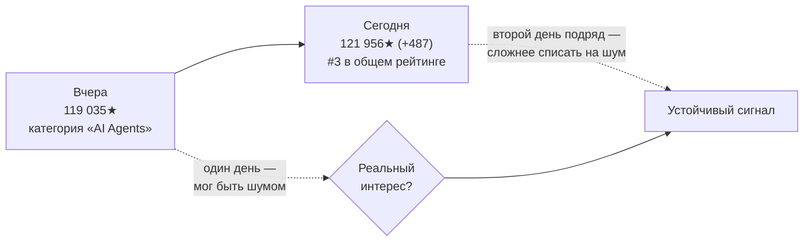
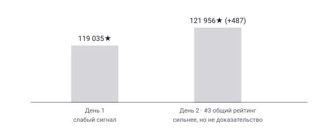

## Русская версия

# ponytail на второй день в топ-3: что на самом деле доказывает устойчивый тренд

Вчера мы писали про [ponytail](https://github.com/DietrichGebert/ponytail) как про репозиторий с любопытной идеей — учить агента спрашивать «а нужно ли вообще писать код» вместо того, чтобы сразу генерировать. Сегодня у него +487 звёзд за сутки, итого 121 956, и он поднялся до третьего места в общем рейтинге трендов — не только в категории «AI Agents», как накануне. Это повод не пересказывать идею снова, а разобраться в другом вопросе: что вообще доказывает такой двухдневный рост звёзд?

Один день в топе GitHub Trending — слабый сигнал сам по себе. Алгоритм трендов чувствителен к разовым всплескам: пост на Hacker News, репост в крупном Twitter/X-аккаунте, упоминание в рассылке — и вот уже сотни разработчиков зашли, поставили звезду не глядя и забыли про репозиторий через час. Звезда на GitHub стоит один клик и ничего не обязывает — в отличие от форка, issue или PR она не требует даже минимального намерения что-то с проектом сделать. Именно поэтому единичный день роста плохо отличим от шума.

Второй день подряд с ростом — уже другое дело, хотя всё ещё не строгое доказательство. Инерция хайпа реальна: репозиторий, попавший в топ трендов вчера, автоматически получает больше показов сегодня просто потому, что список трендов сам себя усиливает — люди чаще заходят туда, где уже многолюдно. Но у этого эффекта есть предел: если бы вчерашний всплеск был исключительно разовым событием (один вирусный пост), рост сегодня, как правило, резко замедляется — люди, увидевшие исходный пост, уже отреагировали. Ускорение или стабильный темп роста на второй день скорее говорит о том, что источники интереса разные и продолжают появляться, а не о том, что все смотрят на один и тот же старый пост.

Что при этом остаётся недоказанным даже двумя днями роста — так это то, использует ли кто-то ponytail на практике и решает ли он реальную проблему лучше альтернатив. Звёзды измеряют внимание, не использование. Единственные метрики, которые действительно про это говорят — открытые issues с реальными вопросами по использованию, PR от внешних контрибьюторов, упоминания в чужих продакшн-стеках — и их видно не в счётчике звёзд, а только если зайти в сам репозиторий и посмотреть на activity.

### Почему вам это важно

Когда вы решаете, стоит ли пробовать новый инструмент из трендов, разница между «был в трендах один день» и «второй день подряд поднимается в общем рейтинге» — это разница между «возможно, разовый хайп» и «возможно, что-то реальное». Но даже второй случай — это сигнал «стоит присмотреться», а не «стоит доверять» — за финальным ответом идите смотреть на issues и реальные примеры использования [в самом репозитории](https://github.com/DietrichGebert/ponytail), а не на счётчик звёзд.

## English version

# ponytail's second day in the top 3: what a sustained trend actually proves

Yesterday we wrote about [ponytail](https://github.com/DietrichGebert/ponytail) and its core idea — training an agent to ask "is writing code even necessary" before generating anything. Today it's up another +487 stars, 121,956 total, and it climbed to #3 in the overall trending list, not just within the "AI Agents" category as the day before. That's a reason not to repeat the idea, but to dig into a different question: what does a two-day rise in star count actually prove?

One day at the top of GitHub Trending is a weak signal on its own. The trending algorithm is sensitive to one-off spikes: a Hacker News post, a repost from a large Twitter/X account, a mention in a newsletter — and suddenly hundreds of developers drop by, star it without a second look, and forget about the repo an hour later. A GitHub star costs one click and commits to nothing — unlike a fork, an issue, or a PR, it requires no minimal intent to actually do anything with the project. That's exactly why a single day of growth is hard to distinguish from noise.

A second consecutive day of growth is a different matter, though still not proof. Hype has real inertia: a repo that topped yesterday's trending list automatically gets more impressions today simply because trending lists are self-reinforcing — people look more often at whatever already looks crowded. But that effect has a ceiling: if yesterday's spike had been a genuinely one-off event (a single viral post), today's growth would typically taper off sharply — the people who saw the original post have already reacted. Growth that accelerates or holds steady on day two points more toward multiple, continuing sources of interest than toward everyone still staring at the same old post.

What two days of growth still doesn't prove is whether anyone is actually using ponytail in practice, or whether it solves a real problem better than the alternatives. Stars measure attention, not adoption. The only metrics that actually speak to that — open issues with genuine usage questions, PRs from outside contributors, mentions in someone else's production stack — don't show up in the star count at all; you only see them by going into the repo itself and looking at its activity.

### Why it matters

When deciding whether a trending tool is worth trying, the gap between "trended for one day" and "climbing the overall ranking for a second day running" is the gap between "maybe a one-off spike" and "maybe something real." But even the second case is a "worth a closer look" signal, not a "worth trusting" one — for the actual answer, go look at the issues and real usage examples [inside the repo itself](https://github.com/DietrichGebert/ponytail), not at the star counter.
