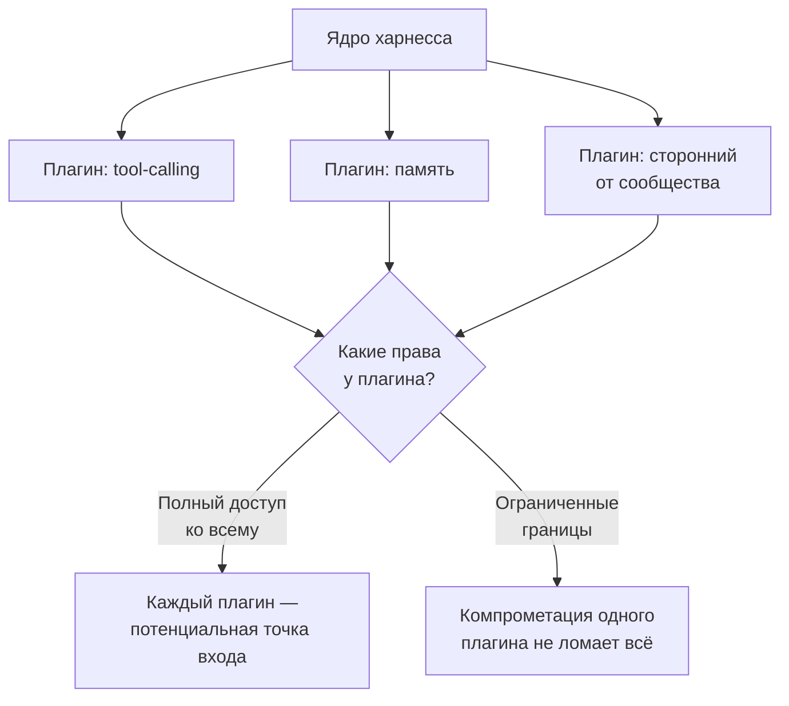
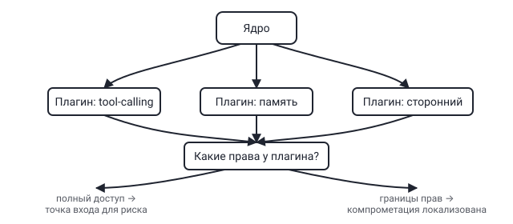

## Русская версия

# deepseek-harness: у «всё — плагин» есть и обратная сторона — площадь для аудита

Мы уже дважды писали про [deepseek-harness](https://github.com/deepseek-ai/deepseek-harness) — сначала про его прирост звёзд, потом про архитектурную идею «Everything is a Plugin». За очередные сутки харнесс прибавил ещё +1 469 звёзд (208 680 всего) и +234 форка (24 326 всего). Любопытно, что темп роста звёзд третий день подряд слегка замедляется (1 712 → 1 551 → 1 469), а форки растут стабильно — форк требует куда более осознанного намерения, чем клик по звезде, так что этот показатель обычно честнее говорит о реальном интересе разработчиков что-то делать с кодом, а не просто «лайкнуть» его.

Сегодня стоит посмотреть на «всё — плагин» с другой стороны. Мы уже отмечали плюс: ядро и расширения развиваются независимо, community может добавлять функциональность, не трогая основной код. Но у любой плагинной архитектуры для агентского харнесса есть и обратная сторона, которую легко упустить за восторгом от гибкости: чем больше поведения агента вынесено в плагины, тем больше отдельных точек, которые теоретически могут перехватывать вызовы инструментов, читать промежуточные данные или влиять на то, что модель видит в контексте. Экосистема вокруг харнесса уже растёт — вчера в трендах засветился курируемый список плагинов awesome-deepseek-harness, а это значит, что часть плагинов, которые реально ставят себе разработчики, написана не самим DeepSeek, а сторонними авторами.

В самой аннотации репозитория нет деталей о модели прав для плагинов — сколько доступа получает плагин по умолчанию, изолированы ли плагины друг от друга, может ли плагин перехватывать данные до того, как их увидит ядро. Это не заявление о том, что харнесс небезопасен — просто вопрос, на который «Everything is a Plugin» само по себе не отвечает, а архитектурная гибкость без явных границ прав исторически была источником проблем в любой другой плагинной экосистеме, от браузерных расширений до IDE-плагинов.

### Почему вам это важно

Если вы рассматриваете харнесс с плагинной архитектурой — свой или чужой, — стоит явно спросить: какие права получает плагин по умолчанию, можно ли ограничить их per-plugin, и что произойдёт, если один сторонний плагин окажется скомпрометирован или просто написан небрежно. [Посмотрите документацию deepseek-harness](https://github.com/deepseek-ai/deepseek-harness) на предмет модели прав для плагинов, прежде чем ставить сторонние расширения из растущей экосистемы вокруг него — гибкость и безопасность здесь не противоречат друг другу, но их нужно проектировать вместе, а не полагаться на одно ради другого.

## English version

# deepseek-harness: "everything is a plugin" has a flip side — audit surface

We've now written about [deepseek-harness](https://github.com/deepseek-ai/deepseek-harness) twice — first about its star growth, then about its "Everything is a Plugin" architecture. Over the latest 24 hours it gained another +1,469 stars (208,680 total) and +234 forks (24,326 total). Interestingly, star growth has slightly decelerated for a third straight day (1,712 → 1,551 → 1,469), while forks keep climbing steadily — a fork takes far more deliberate intent than clicking a star, so it's usually a more honest signal of developers actually wanting to do something with the code, not just "like" it.

Today it's worth looking at "everything is a plugin" from the other side. We already noted the upside: core and extensions evolve independently, and the community can add functionality without touching the base code. But any plugin architecture for an agent harness has a flip side that's easy to miss amid the enthusiasm for flexibility: the more of an agent's behavior lives in plugins, the more individual points there are that could, in principle, intercept tool calls, read intermediate data, or influence what the model sees in context. The ecosystem around the harness is already growing — yesterday's trending list featured the curated plugin list awesome-deepseek-harness — which means some of the plugins developers actually install aren't written by DeepSeek at all, but by third parties.

The repo description itself doesn't spell out the permission model for plugins — how much access a plugin gets by default, whether plugins are isolated from each other, whether a plugin can intercept data before the core ever sees it. That's not a claim that the harness is insecure — it's simply a question "Everything is a Plugin" doesn't answer on its own, and architectural flexibility without explicit permission boundaries has historically been a source of trouble in every other plugin ecosystem, from browser extensions to IDE plugins.

### Why it matters

If you're evaluating a plugin-based harness — your own or someone else's — ask explicitly: what access does a plugin get by default, can that be scoped per plugin, and what happens if a third-party plugin turns out to be compromised or just carelessly written. [Check deepseek-harness's docs](https://github.com/deepseek-ai/deepseek-harness) for its plugin permission model before installing third-party extensions from its growing ecosystem — flexibility and security aren't at odds here, but they need to be designed together, not assumed from one alone.
