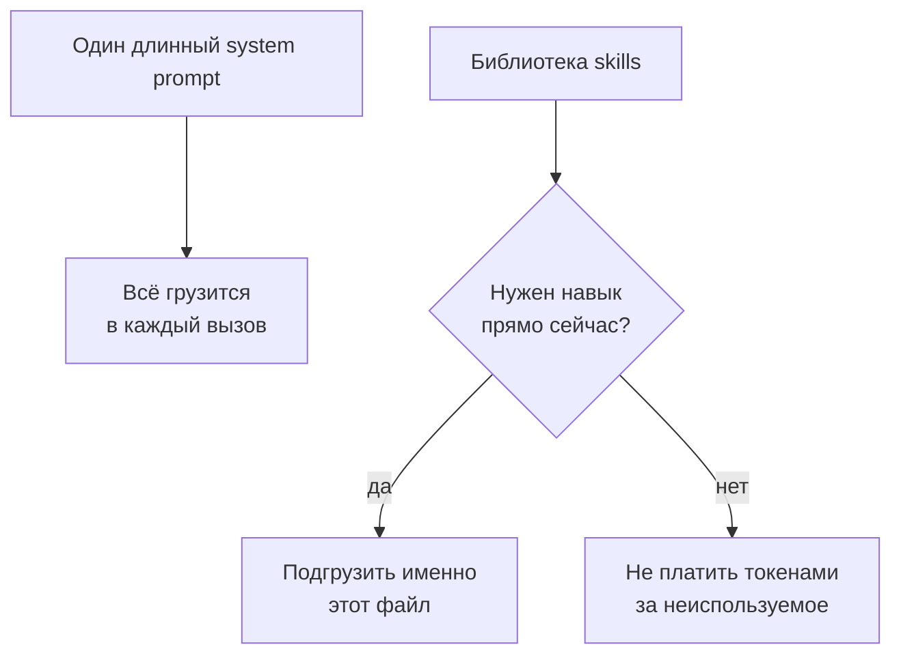

## Русская версия

# Чужая папка .agents в топе трендов: skills — это формат или просто чьи-то заметки?

Сегодня на втором месте в трендах — репозиторий [mattpocock/skills](https://github.com/mattpocock/skills): +466 звёзд за сутки (247 789 всего), описание короткое и честное — «Skills for Real Engineers. Straight from my .agents directory» («навыки для реальных инженеров, прямо из моей папки .agents»). Мэтт Покок известен в сообществе TypeScript как автор популярных курсов и обучающих материалов, и это важная деталь: репозиторий с личными заметками известного автора соберёт звёзды заметно быстрее, чем такой же по содержанию репозиторий от никому не известного разработчика — сама метрика «звёзды за сутки» тут в значительной части измеряет узнаваемость автора, а не проверенную полезность контента.

По сути своей skills — это способ не засовывать всё, что агент потенциально может знать, в один гигантский системный промпт, который целиком оплачивается токенами при каждом вызове. Вместо этого агенту доступен набор отдельных файлов-инструкций — каждый описывает один конкретный сценарий работы — и в контекст подгружается только то, что реально нужно для текущей задачи. Идея не новая и не эксклюзивная для одного вендора — сама категория «пакетируемые инструкции для агента» развивается параллельно у разных инструментов, и то, что чья-то личная рабочая папка становится трендовым репозиторием, — скорее сигнал о растущем интересе к формату как таковому, чем о том, что конкретно эти skills — эталонные.

Здесь стоит держать в голове ту же оговорку, что и всегда с личными «рабочими» репозиториями: «Straight from my .agents directory» звучит как гарантия практической проверенности («я это реально использую»), но не как гарантия, что эти конкретные инструкции подойдут вашему стеку, вашему языку программирования или вашему харнессу — они написаны под конкретный workflow конкретного человека, а не как универсальный стандарт.

### Почему вам это важно

Если вы присматриваетесь к [репозиторию Покока](https://github.com/mattpocock/skills) как к источнику готовых skills — берите его не как «набор лучших практик», а как пример того, как один опытный разработчик реально организовал свою папку с инструкциями для агента, и сверяйте отдельные файлы со своим стеком, прежде чем копировать. Звёзды на GitHub здесь измеряют охват автора, а не то, сработает ли конкретный skill в вашем проекте — это можно узнать только попробовав.

## English version

# Someone's .agents folder is trending — is "skills" a format or just their notes?

Today's #2 trending repo is [mattpocock/skills](https://github.com/mattpocock/skills): +466 stars in a day (247,789 total), with a short, honest description — "Skills for Real Engineers. Straight from my .agents directory." Matt Pocock is well known in the TypeScript community as the author of popular courses and teaching material, and that matters here: a repo of personal notes from a well-known author will accumulate stars noticeably faster than an identical repo from an unknown developer — "stars gained today" is measuring the author's reach as much as it's measuring proven usefulness of the content.

At its core, "skills" is a way to avoid stuffing everything an agent might potentially need to know into one giant system prompt that gets paid for in tokens on every single call. Instead, the agent has access to a set of separate instruction files — each describing one specific working scenario — and only what's actually needed for the current task gets loaded into context. The idea isn't new or exclusive to one vendor — the whole category of "packaged instructions for an agent" is developing in parallel across different tools, and the fact that someone's personal working folder is trending is more a signal of growing interest in the format itself than proof that these particular skills are exemplary.

The same caveat applies here that applies to any personal "working" repo: "Straight from my .agents directory" reads like a guarantee of practical validation ("I actually use this"), not a guarantee that these specific instructions fit your stack, your programming language, or your harness — they were written for one person's concrete workflow, not as a universal standard.

### Why it matters

If you're eyeing [Pocock's repo](https://github.com/mattpocock/skills) as a source of ready-made skills, treat it not as a "set of best practices" but as an example of how one experienced developer actually organized their agent-instruction folder — and check individual files against your own stack before copying them wholesale. GitHub stars here measure the author's reach, not whether a given skill will work in your project — that you can only find out by trying it.
