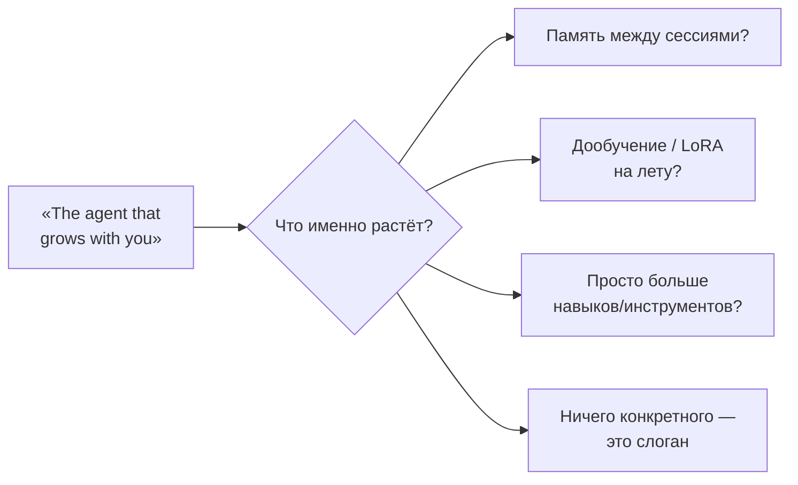
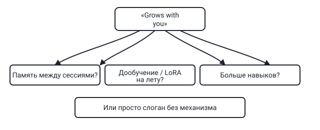

## Русская версия

# hermes-agent: «агент, который растёт вместе с вами» — растёт как именно?

Третье место в сегодняшних трендах — [NousResearch/hermes-agent](https://github.com/NousResearch/hermes-agent): +127 звёзд за сутки, 240 949 всего, Python. Nous Research — команда, известная линейкой моделей Hermes (файнтюны на открытых весах), так что у репозитория с их именем есть кредит доверия ещё до того, как кто-то прочитал код. Описание в трендах короткое: «The agent that grows with you» — «агент, который растёт вместе с вами».

Формулировка звучит привлекательно, но она ничего не говорит о механизме. «Растёт вместе с вами» может означать буквально что угодно: накопление памяти между сессиями (агент помнит предыдущие разговоры и подстраивается под пользователя), какую-то форму дообучения на лету (LoRA-адаптер, который обновляется по мере использования), постепенное расширение набора доступных инструментов и навыков, или — самый скучный, но самый вероятный вариант — просто маркетинговый слоган без конкретной технической реализации за словом «growth». Каждый из этих вариантов — совершенно разные инженерные решения с разной ценой: память между сессиями — это вопрос retrieval и хранения, дообучение на лету — это вопрос стоимости вычислений и риска деградации модели, а расширение набора инструментов — это вообще другая категория проблем, ближе к тому, как устроена авторизация вызовов инструментов.

Здесь стоит применить тот же фильтр, что мы уже применяли к openclaude на этой неделе: заявленное репозиторием обещание («runs anywhere, uses anything» тогда, «grows with you» сейчас) — это позиционирование, а не спецификация. Оно не подтверждается и не опровергается фактом попадания в топ трендов — рост звёзд в первую очередь отражает узнаваемость Nous Research и привлекательность формулировки, а не проверенный механизм «роста» агента.

### Почему вам это важно

Прежде чем оценивать [hermes-agent](https://github.com/NousResearch/hermes-agent) как кандидата для своего стека, найдите в документации конкретный ответ на вопрос «что именно растёт и как» — если это память между сессиями, спросите, где и как долго она хранится; если это дообучение на лету, спросите, какой ценой и с каким риском регрессии; если ответа на этот вопрос нет вообще, значит «grows with you» пока не более чем строчка в описании репозитория.

## English version

# hermes-agent: "the agent that grows with you" — grows how, exactly?

Today's #3 trending repo is [NousResearch/hermes-agent](https://github.com/NousResearch/hermes-agent): +127 stars in a day, 240,949 total, written in Python. Nous Research is known for the Hermes line of open-weight fine-tunes, so a repo carrying their name earns some trust before anyone reads a line of code. The trending description is short: "The agent that grows with you."

The phrase sounds appealing, but it says nothing about the mechanism. "Grows with you" could mean literally anything: memory that accumulates across sessions (the agent remembers past conversations and adapts to the user), some form of on-the-fly fine-tuning (a LoRA adapter that updates as it's used), a gradually expanding set of available tools and skills, or — the most boring but most likely option — just a marketing tagline with no specific technical mechanism behind the word "growth." Each of these is a completely different engineering problem with a different cost: cross-session memory is a retrieval-and-storage question, on-the-fly fine-tuning is a compute-cost-and-degradation-risk question, and an expanding toolset is an entirely different category, closer to how tool-call authorization is designed.

The same filter applies here that we applied to openclaude earlier this week: a repo's stated promise ("runs anywhere, uses anything" then, "grows with you" now) is positioning, not a spec. It's neither confirmed nor refuted by making the trending list — star growth mostly reflects Nous Research's name recognition and how catchy the phrase is, not a verified "growth" mechanism.

### Why it matters

Before evaluating [hermes-agent](https://github.com/NousResearch/hermes-agent) for your own stack, find a concrete answer in its docs to "what exactly grows, and how" — if it's cross-session memory, ask where and how long it's stored; if it's on-the-fly fine-tuning, ask at what cost and what regression risk; if there's no answer to that question at all, then "grows with you" is, for now, just a line in the repo description.
