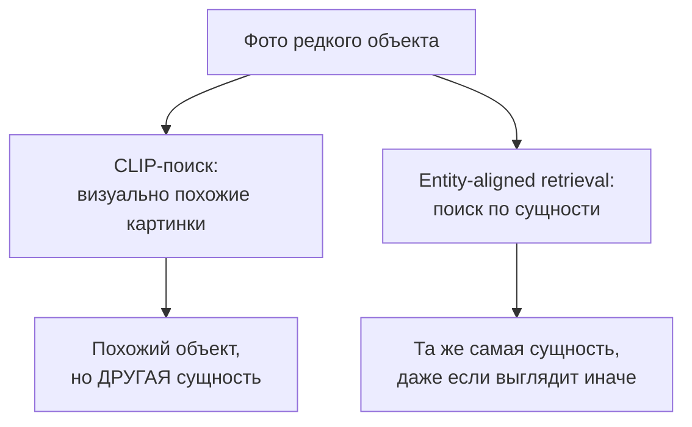
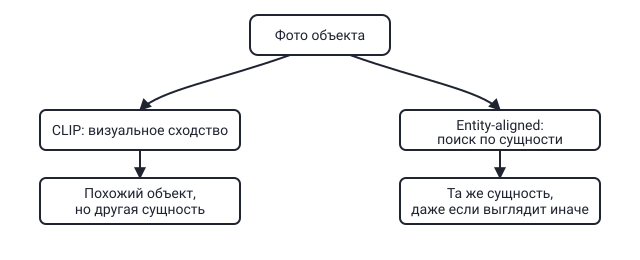

## Русская версия

# «Похоже visually» и «то самое» — не одно и то же: почему CLIP-поиск ломается на редких сущностях

В сегодняшнем дайджесте — статья с говорящим названием: [«Beyond Visual Similarity: Entity-Aligned Retrieval for Knowledge-Based Visual Question Answering»](https://huggingface.co/papers/2608.21450) (Hangrui Xu, Zhengxian Wu, Yunyao Yu, Zhuohong Chen, Rui Cong и другие). Задача, которую решают авторы — Knowledge-Based VQA (KB-VQA): модель должна ответить на вопрос по фотографии, но для ответа недостаточно того, что видно на картинке, — нужно подтянуть внешние знания про конкретную сущность на фото, особенно если это что-то редкое, «long-tail» — не масс-маркетный объект, а что-то специфическое, для чего у модели нет заученных фактов.

По описанию авторов, типичный пайплайн для такой задачи сегодня опирается на CLIP-style retrieval — поиск похожих изображений в векторном пространстве, обученном сопоставлять картинку и текст по общему смыслу. Здесь и зарыта проблема, на которую указывает уже само название статьи: «visual similarity» — это не то же самое, что «та же сущность». Два разных вида птиц, две разные модели одного автомобиля, два разных исторических здания похожей архитектуры — всё это может быть визуально почти неотличимо для эмбеддинга, обученного на общем сходстве, но при этом требует совершенно разных фактов для ответа на вопрос. Чем более редкая сущность — тем выше шанс, что похожий по картинке сосед в векторном пространстве окажется просто похожим, а не тем же самым.

Аннотация в дайджесте обрывается до описания конкретного метода, поэтому детали предложенного «entity-aligned retrieval» здесь разбирать не будем — но сама постановка проблемы уже полезна независимо от решения: она формулирует явное различие между «unit of retrieval = визуальное сходство» и «unit of retrieval = идентичность сущности», и это различие имеет смысл для любой RAG-системы, работающей с изображениями, а не только для конкретно этой статьи.

### Почему вам это важно

Если вы строите ретрив по изображениям (визуальный поиск, VQA, мультимодальный RAG) и полагаетесь на CLIP-style эмбеддинги «из коробки» — держите в голове, что «похоже» и «то же самое» расходятся именно там, где это больнее всего: на редких, специфических объектах, где у модели меньше всего заученных знаний и больше всего цена ошибки. [Посмотрите постановку задачи в статье](https://huggingface.co/papers/2608.21450) как повод спросить: что именно является единицей поиска в вашей системе — картинка, похожая по эмбеддингу, или сущность, подтверждённая иначе?

## English version

# "Looks similar" and "is the same thing" aren't the same — why CLIP retrieval breaks on rare entities

Today's digest includes a paper whose title says it all: [«Beyond Visual Similarity: Entity-Aligned Retrieval for Knowledge-Based Visual Question Answering»](https://huggingface.co/papers/2608.21450) (Hangrui Xu, Zhengxian Wu, Yunyao Yu, Zhuohong Chen, Rui Cong, and others). The task the authors tackle is Knowledge-Based VQA (KB-VQA): a model has to answer a question about a photo, but what's visible in the image isn't enough — it needs to pull in outside knowledge about the specific entity in the photo, especially when that entity is rare, "long-tail" — not a mass-market object but something specific the model has no memorized facts about.

Per the authors' description, a typical pipeline for this task today relies on CLIP-style retrieval — finding similar images in a vector space trained to align pictures and text by shared meaning. That's exactly where the problem the paper's title points at is buried: "visual similarity" is not the same thing as "the same entity." Two different bird species, two different models of the same car, two different historical buildings with similar architecture — all of these can be nearly indistinguishable to an embedding trained on general resemblance, while requiring completely different facts to answer a question correctly. The rarer the entity, the higher the odds that its nearest neighbor in vector space is merely similar-looking, not the same thing at all.

The digest's abstract snippet cuts off before describing the specific method, so we won't dig into the details of the proposed "entity-aligned retrieval" here — but the problem framing itself is useful independent of the solution: it draws an explicit line between "unit of retrieval = visual similarity" and "unit of retrieval = entity identity," and that distinction matters for any image-grounded RAG system, not just this one paper.

### Why it matters

If you're building image-based retrieval (visual search, VQA, multimodal RAG) and leaning on off-the-shelf CLIP-style embeddings, keep in mind that "looks similar" and "is the same thing" diverge exactly where it hurts most: on rare, specific objects, where the model has the least memorized knowledge and the highest cost of getting it wrong. [Read the problem framing in the paper](https://huggingface.co/papers/2608.21450) as a prompt to ask: what is the actual unit of retrieval in your system — an image similar by embedding, or an entity confirmed some other way?
