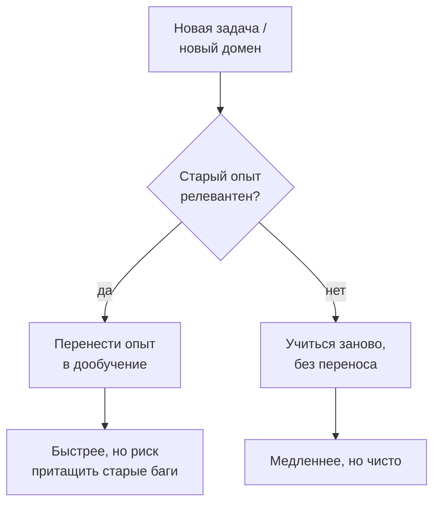
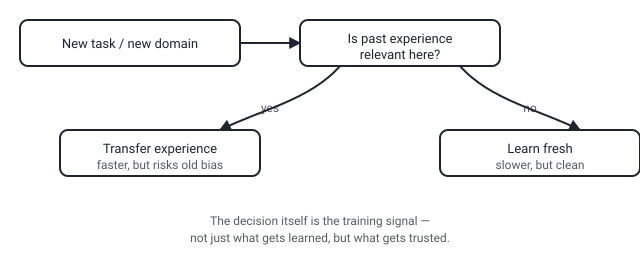

## Русская версия

# Автономный дообучатель учится не переносить чужой опыт

На Hugging Face Papers сегодня в топе — работа с почти издевательским названием: [«Knowing When Not to Reuse: Conditional Experience Transfer in Autonomous LLM Post-Training»](https://huggingface.co/papers/2608.26730) («Знать, когда НЕ переиспользовать: условный перенос опыта в автономном дообучении LLM»). Авторы — Tingyun Li, Wenfeng Feng, Weiqing Li, Abudukelimu Wuerkaixi, Guohua Liu и другие — отталкиваются от простого наблюдения: большие языковые модели обладают широкими возможностями, но адаптация под новый домен, новые инструменты и меняющиеся требования почти всегда означает повторное дообучение. А если этот процесс делает автономная система сама, без человека в цикле на каждом шаге, встаёт вопрос: должна ли она тащить с собой весь накопленный опыт предыдущих циклов дообучения или иногда выгоднее начать с чистого листа.

Интуитивно кажется, что накопленный опыт — это всегда плюс: меньше данных, меньше вычислений, быстрее сходимость. Но у переноса опыта есть обратная сторона, о которой реже говорят: вместе с полезными паттернами переносятся и артефакты предыдущего домена — смещения, оптимизированные под старую задачу эвристики, которые в новом контексте становятся не подсказкой, а помехой. Именно поэтому в названии работы акцент стоит не на «как переносить», а на «когда НЕ переносить» — задача сформулирована как выбор, а не как автоматически полезная операция.

Это встраивается в более широкий тренд: по мере того как дообучение всё чаще выполняется не человеком-инженером вручную, а автоматизированным контуром (агент сам решает, когда и на чём дообучиться), у этого контура должен появиться механизм принятия решений — не только «чему учиться», но и «какой прошлый опыт достоин доверия в этой конкретной ситуации». Это ровно тот тип вопроса, которым определяется качество источника обучающего сигнала: сырой объём накопленного опыта ничего не говорит о том, насколько он применим здесь и сейчас.

Полного описания метода в кратком аннотации нет — авторы обещают эмпирическое исследование условий, при которых перенос опыта помогает, а при которых вредит, но детали механизма отбора остаются за пределами превью на странице HF Papers.

### Почему вам это важно

Если вы строите пайплайн, где модель дообучается многократно и автономно — на новых данных, новых задачах, с минимальным участием человека, — стоит закладывать в архитектуру не только «банк опыта», из которого агент может черпать, но и явный механизм отказа от переноса. Слепое накопление истории дообучений без критерия релевантности рано или поздно превратит банк опыта в источник систематических ошибок, а не ускорения.

## English version

# An autonomous fine-tuner is learning when NOT to reuse someone else's experience

Today's top pick from Hugging Face Papers has an almost cheeky title: [«Knowing When Not to Reuse: Conditional Experience Transfer in Autonomous LLM Post-Training»](https://huggingface.co/papers/2608.26730). The authors — Tingyun Li, Wenfeng Feng, Weiqing Li, Abudukelimu Wuerkaixi, Guohua Liu, and others — start from a plain observation: large language models offer broad capabilities, but adapting them to evolving domains, tools, and requirements almost always means repeated post-training. And once that process is handled by an autonomous system rather than a human in the loop at every step, a real question shows up: should the system always drag along everything it learned from previous post-training rounds, or is starting fresh sometimes the better call?

Intuitively, accumulated experience feels like a pure win — less data needed, less compute, faster convergence. But experience transfer has a less-discussed downside: along with useful patterns, you also carry over artifacts of the previous domain — heuristics tuned for the old task that become noise, not signal, in the new one. That's exactly why the title frames the problem as "when NOT to transfer" rather than "how to transfer" — it treats reuse as a decision to be made, not an operation that's automatically beneficial.

This fits a broader shift: as post-training increasingly runs through an automated loop instead of a human engineer manually curating each round, that loop needs a decision mechanism of its own — not just "what to learn" but "which past experience deserves trust in this specific situation." That's precisely the kind of question that determines the quality of a training signal: raw volume of accumulated experience says nothing about how applicable it is right here, right now.

The short abstract doesn't spell out the full method — the authors promise an empirical study of the conditions under which experience transfer helps versus hurts, but the selection mechanism's details sit beyond what the HF Papers preview shows.

### Why it matters

If you're building a pipeline where a model gets fine-tuned repeatedly and autonomously — on new data, new tasks, with minimal human involvement — it's worth designing in not just an "experience bank" the agent can draw from, but an explicit mechanism for declining to transfer. Blindly accumulating fine-tuning history without a relevance check will eventually turn that experience bank into a source of systematic errors rather than a speedup.
