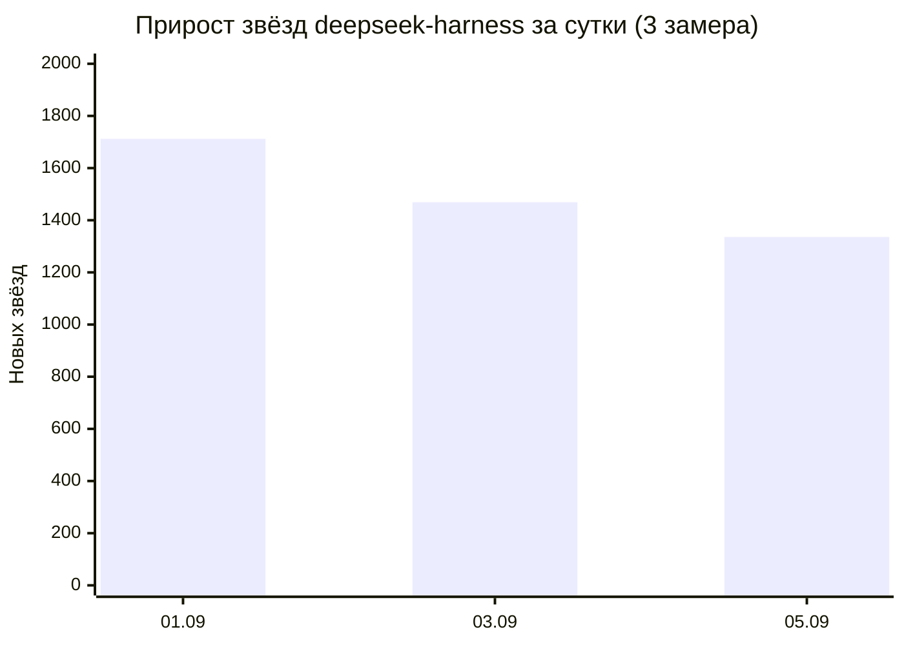
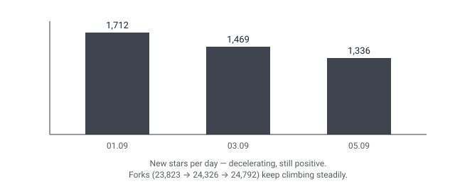

## Русская версия

# deepseek-harness: три замера наконец складываются в кривую

Мы писали про [deepseek-harness](https://github.com/deepseek-ai/deepseek-harness) уже дважды: 1 сентября (205 660★, +1 712 за сутки) и 3 сентября (208 680★, +1 469, с уже тогда заметным замедлением темпа). Сегодняшний снимок: 211 537★ (+1 336 за сутки) и 24 792 форка — рост форков продолжается устойчивее, чем рост звёзд, что мы тоже уже отмечали.

Одна точка данных — это факт. Две точки — это, возможно, случайность. А вот три последовательных замера прироста звёзд — 1 712 → 1 469 → 1 336 — это уже форма кривой, и она типична не для взлёта хайпа, а для его насыщения: аудитория, которая вообще способна узнать про репозиторий через тренды GitHub, конечна, и по мере того как большая её часть уже поставила звезду, прирост неизбежно замедляется — даже если абсолютный интерес к проекту не падает ни на йоту. Это тот самый случай, где единственный способ отличить «реальный сигнал» от «шумного пика трендов» — это не одна метка на графике, а форма кривой во времени: замедляющийся, но стабильно положительный прирост на протяжении нескольких дней выглядит совсем иначе, чем один резкий скачок с последующим обвалом.

Здесь важно не путать «замедление роста звёзд» с «падением интереса» — это разные вещи. Если бы форки тоже замедлялись пропорционально, это было бы куда более тревожным сигналом: форк требует реального намерения что-то сделать с кодом, а не просто отметить репозиторий. У нас нет форк-темпа за все три дня в одном месте, но сам факт, что абсолютное число форков продолжает расти (23 823 → 24 326 → 24 792), при замедляющихся звёздах — это ровно то различие, которое стоит искать, когда трендовый репозиторий начинает выглядеть «не таким горячим», как раньше.

### Почему вам это важно

Если вы оцениваете, «остывает» ли интерес к какому-то инструменту или репозиторию, не полагайтесь на единственный снимок трендов — смотрите на последовательность хотя бы из трёх-четырёх измерений и разделяйте метрики по «стоимости действия»: звезда — это один клик, форк — уже осознанное намерение. Замедление первого при стабильности второго — это здоровое насыщение аудитории, а не отток. [Репозиторий deepseek-harness](https://github.com/deepseek-ai/deepseek-harness) — удобный живой пример того, как эта разница выглядит на реальных числах.

## English version

# deepseek-harness: three readings finally add up to a curve

We've now written about [deepseek-harness](https://github.com/deepseek-ai/deepseek-harness) twice: on September 1 (205,660 stars, +1,712 in a day) and September 3 (208,680 stars, +1,469, with a slowdown already visible then). Today's snapshot: 211,537 stars (+1,336 in the last day) and 24,792 forks — fork growth staying steadier than star growth, which we'd already noted before.

One data point is a fact. Two points might be noise. But three consecutive daily star-growth readings — 1,712 → 1,469 → 1,336 — start to form an actual curve, and it's the shape typical of hype saturating, not hype dying: the pool of people who could plausibly discover a repo through GitHub trending is finite, and as more of that pool has already clicked star, growth necessarily slows — even if genuine interest in the project hasn't dropped one bit. This is exactly the case where the only way to tell "real signal" from "a noisy trending spike" isn't a single point on a chart but the shape of the curve over time: a decelerating-but-still-positive gain over several days looks nothing like one sharp spike followed by a collapse.

It matters not to confuse "slowing star growth" with "falling interest" — those are different things. If forks were decelerating at the same rate, that would be a far more worrying signal, since a fork requires actual intent to do something with the code, not just bookmark the repo. We don't have a fork-growth-rate series for all three days in one place, but the fact that the absolute fork count keeps climbing (23,823 → 24,326 → 24,792) while stars decelerate is exactly the distinction worth looking for when a trending repo starts to seem "less hot" than before.

### Why it matters

If you're trying to judge whether interest in a tool or repo is cooling off, don't trust a single trending snapshot — look at a sequence of at least three or four readings, and split the metrics by "cost of action": a star is one click, a fork is a deliberate intent. Slowing stars alongside steady forks is healthy audience saturation, not churn. [The deepseek-harness repo](https://github.com/deepseek-ai/deepseek-harness) is a handy live example of what that distinction looks like in real numbers.
