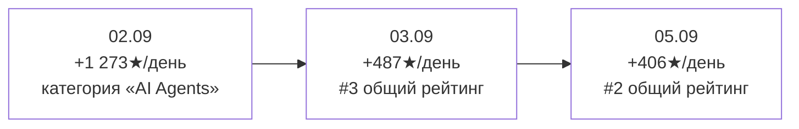
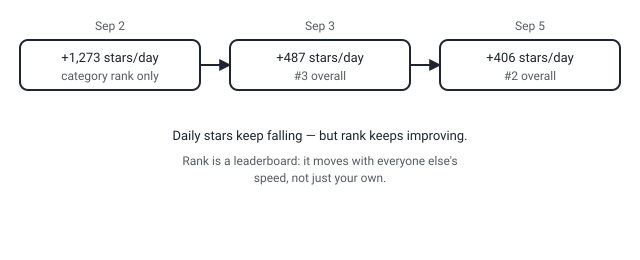

## Русская версия

# ponytail поднялся до #2, хотя звёзд в день стало меньше — рейтинг трендов относителен

Третий раз пишем про [ponytail](https://github.com/DietrichGebert/ponytail): 2 сентября — 119 035★ (+1 273 за сутки, топ только в категории «AI Agents»), 3 сентября — 121 956★ (+487, уже #3 в общем рейтинге), сегодня — 126 337★ (+406, но уже #2 в общем рейтинге), при 6 468 форках на старте и продолжающемся росте с тех пор.

Обратите внимание на нестыковку: абсолютный прирост звёзд в день падает третий замер подряд (1 273 → 487 → 406), а место в общем рейтинге трендов при этом растёт (категория → #3 → #2). Если рейтинг трендов был бы простой функцией «сколько звёзд получил репозиторий сегодня», это два противоречащих друг другу факта. Но рейтинг трендов — не абсолютная шкала, а таблица результатов гонки: место зависит не только от вашей скорости, но и от скорости всех остальных участников в тот же день. Ponytail не обязательно ускорился — скорее, конкуренты за место в топе в предыдущие дни набирали ещё больше, а сегодня набрали меньше него.

Это довольно важная поправка к тому, как обычно читают такие таблицы. «Поднялся на позицию» интуитивно читается как «стал популярнее», но с относительным рейтингом это не всегда так — можно подняться в таблице, вообще не изменив своей траектории, просто потому что окружение изменилось. Чтобы отличить «стал популярнее» от «конкуренты стали менее заметны», нужна именно абсолютная метрика — прирост звёзд в день, а не место в списке. И здесь абсолютная метрика ponytail говорит скорее о продолжающемся, хоть и замедляющемся, интересе, чем о новом взлёте.

### Почему вам это важно

Когда встречаете фразу вида «поднялся на N позиций в трендах» — не читайте её как самостоятельное доказательство роста популярности. Ищите рядом абсолютную цифру (звёзды/день, скачивания/день, что угодно измеримое в единицах, а не в месте относительно других) — только она отвечает на вопрос, изменилась ли траектория самого проекта, а не траектория его соседей по таблице. История [ponytail](https://github.com/DietrichGebert/ponytail) за три дня — наглядный пример того, как эти две вещи расходятся.

## English version

# ponytail climbed to #2 with fewer daily stars — trending rank is relative

Third time writing about [ponytail](https://github.com/DietrichGebert/ponytail): September 2 — 119,035 stars (+1,273 that day, top only within the "AI Agents" category), September 3 — 121,956 stars (+487, already #3 in the overall ranking), today — 126,337 stars (+406, but now #2 overall), starting from 6,468 forks and climbing steadily since.

Notice the mismatch: absolute daily star growth has fallen for a third consecutive reading (1,273 → 487 → 406), while the overall trending rank has climbed (category-only → #3 → #2). If the trending rank were a simple function of "how many stars did this repo get today," those two facts would contradict each other. But a trending rank isn't an absolute scale — it's a race leaderboard, where your position depends not just on your own speed but on everyone else's speed that same day. Ponytail hasn't necessarily accelerated — it's more likely that whatever was competing for the top spots on previous days pulled in even more back then, and less today.

That's a fairly important correction to how these tables usually get read. "Moved up a spot" intuitively reads as "got more popular," but with a relative ranking that isn't always true — you can rise in the table without your own trajectory changing at all, simply because the field around you shifted. Telling "got more popular" apart from "the competition got quieter" requires an absolute metric — daily star count, not table position. And by that absolute metric, ponytail looks like continued, if decelerating, interest — not a fresh spike.

### Why it matters

When you see a phrase like "climbed N spots in trending," don't read it as standalone proof of rising popularity. Look for the absolute number next to it (stars/day, downloads/day, anything measured in real units rather than position relative to others) — only that answers whether the project's own trajectory changed, versus its neighbors' in the table. [Ponytail's](https://github.com/DietrichGebert/ponytail) three-day history is a clean example of how those two things can diverge.
