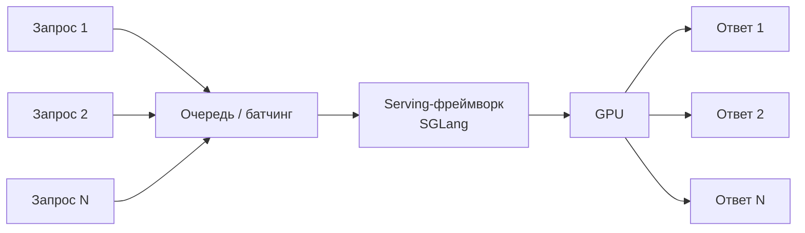
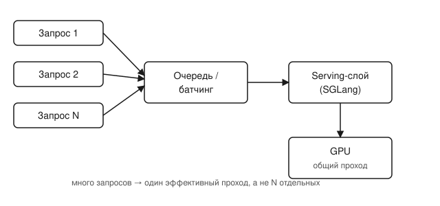

## Русская версия

# SGLang в трендах: почему «ещё один сервер для LLM» вообще нужен

В сегодняшнем дайджесте трендов GitHub — [sglang](https://github.com/sgl-project/sglang): 34 257 → 35 494 звёзд за сутки (+1 237), 8 563 форка, категория «Transformer», описан как «high-performance serving framework for large language models and multimodal models», Python. Само название ничего сенсационного не обещает — «фреймворк для обслуживания моделей» звучит скучно рядом с заголовками про очередной прорывной бенчмарк. Но именно эта скука и есть повод разобраться, зачем такие проекты вообще существуют и почему инженеры голосуют за них звёздами настойчивее, чем за иные шумные модели.

Обученная модель — это веса и код прямого прохода. Чтобы превратить это в сервис, к которому обращаются одновременно сотни или тысячи пользователей, нужен отдельный слой поверх модели: он решает, как группировать параллельные запросы в батчи, чтобы не гонять GPU по одному запросу за раз, как укладывать в память растущий контекст каждого диалога, не упираясь в лимит видеопамяти раньше времени, и как балансировать между задержкой ответа на один запрос и суммарной пропускной способностью на всех сразу. Это ровно тот слой, который дайджест называет «serving framework», и именно в нём чаще всего рвётся продакшен: модель в бенчмарке отвечает мгновенно на один вопрос в лаборатории, а под реальной нагрузкой в сотни параллельных сессий та же модель без правильного serving-слоя захлёбывается или разоряет бюджет на GPU.

Что в дайджесте есть, а что — нет: есть рост звёзд, число форков и общее описание категории. Нет конкретных цифр по латентности, throughput или сравнению с другими серверами — аннотация проекта не о технических деталях реализации, а формат трендов GitHub такое обычно и не даёт. Поэтому не будем додумывать за авторов, чем именно sglang решает задачу батчинга и памяти лучше конкурентов — сама категория «high-performance serving для LLM и мультимодальных моделей» уже говорит, какую нишу закрывает проект.

Число форков (8 563) при этом — более честный сигнал реального использования, чем звёзды: форк обычно означает «беру код и адаптирую под свой стек», а не «поставил лайк, пролистав ленту».

### Почему вам это важно

Если вы деплоите LLM для реальных пользователей, а не только гоняете модель в ноутбуке, serving-слой — не опциональная надстройка, а место, где решается, выдержит ли система нагрузку и сколько будет стоить каждый ответ. [Посмотрите на sglang](https://github.com/sgl-project/sglang) как на пример целой категории инструментов, а не как на конкретную рекомендацию: прежде чем писать свой сервер для инференса с нуля, стоит проверить, не решает ли эту задачу уже готовый serving-фреймворк — и именно этот вопрос стоит сверять с реальными бенчмарками под вашу нагрузку, а не с числом звёзд в тренде.

## English version

# SGLang trending: why "yet another LLM server" is actually necessary

Today's GitHub trending digest includes [sglang](https://github.com/sgl-project/sglang): 34,257 → 35,494 stars in a day (+1,237), 8,563 forks, category "Transformer," described as a "high-performance serving framework for large language models and multimodal models," written in Python. The name itself promises nothing sensational — "a framework for serving models" sounds dull next to headlines about the next breakthrough benchmark. But that dullness is exactly why it's worth understanding what such projects are for, and why engineers vote for them with stars more consistently than for some louder models.

A trained model is weights and a forward pass. Turning that into a service that hundreds or thousands of users hit at once needs a separate layer on top of the model: it decides how to group concurrent requests into batches instead of running the GPU one request at a time, how to fit each conversation's growing context into memory without hitting the VRAM ceiling too early, and how to balance single-request latency against total throughput across everyone at once. That's exactly the layer the digest calls a "serving framework," and it's usually where production breaks: a model that answers a single benchmark question instantly in a lab can choke or blow through its GPU budget under real load from hundreds of concurrent sessions if it lacks the right serving layer.

What the digest actually gives us: star growth, fork count, and a category label. What it doesn't give: specific latency numbers, throughput figures, or comparisons against other servers — a GitHub trending snapshot isn't built to carry implementation details, and the project description doesn't spell them out either. So we won't guess on the authors' behalf exactly how sglang solves batching and memory better than alternatives — the category itself, "high-performance serving for LLMs and multimodal models," already tells you what niche the project fills.

The fork count (8,563), meanwhile, is a more honest signal of real usage than stars: a fork usually means "I'm taking this code and adapting it to my stack," not "I scrolled past and hit like."

### Why it matters

If you're deploying an LLM for real users rather than just running it in a notebook, the serving layer isn't an optional add-on — it's where the question of whether the system survives real load, and what each response costs, actually gets decided. [Look at sglang](https://github.com/sgl-project/sglang) as an example of a whole tooling category, not a specific endorsement: before writing your own inference server from scratch, it's worth checking whether an existing serving framework already solves the problem — and that check belongs against real benchmarks under your own load, not against a trending star count.
