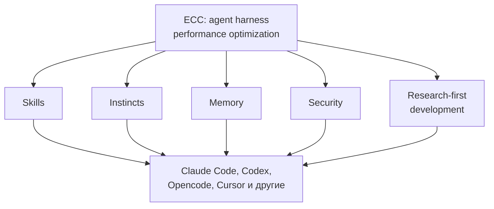
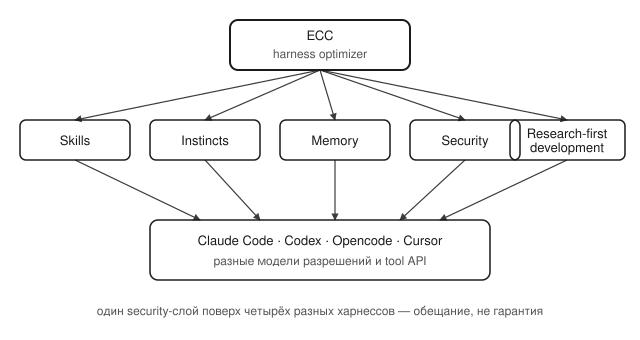

## Русская версия

# ECC: пять слов вместо одного описания агентского харнесса — и что это значит для безопасности

В сегодняшнем дайджесте трендов GitHub — [affaan-m/ECC](https://github.com/affaan-m/ECC): 249 855 → 250 067 звёзд (+212 за окно замера трендов, при этом отдельно указано «1 314 stars today» — трекер явно считает суточный прирост по двум разным окнам, и сверять их напрямую не стоит), ранг #2, JavaScript. Само описание заслуживает разбора построчно: «The agent harness performance optimization system. Skills, instincts, memory, security, and research-first development for Claude Code, Codex, Opencode, Cursor and beyond».

Это описание интересно тем, что в одном предложении собраны пять довольно разных задач, каждая из которых сама по себе тянет на отдельный проект: skills — это про то, какие узкоспециализированные инструкции подгружать модели только тогда, когда они реально нужны, а не держать их все в системном промпте постоянно. Instincts — более расплывчатый термин, судя по всему, про эвристики или короткие правила поведения, которые агент применяет без долгого рассуждения. Memory — это отдельный слой: что агент помнит между сессиями и как это подгружается назад в контекст. Security — единственный пункт, который прямо называет границу допустимого: что агенту разрешено делать, а что нет. И research-first development — скорее методологический принцип, чем техническая подсистема.

Что бросается в глаза: проект заявляет, что работает сразу с четырьмя разными харнессами (Claude Code, Codex, Opencode, Cursor) «и не только». Это претензия на универсальный слой поверх чужих инструментов — а не встроенную часть одного конкретного агента. У такой универсальности есть цена: harness для Claude Code устроен не так, как harness для Cursor, у них разные модели разрешений и разные API для инструментов. Слой security, который одинаково работает поверх всех четырёх, либо очень общий (и тогда мало что реально гарантирует), либо для каждого харнесса реализован отдельно под его специфику — сам дайджест не говорит, какой вариант перед нами, а звёзды и форки на GitHub этого тоже не показывают.

### Почему вам это важно

Если вы рассматриваете такие надстройки поверх агентских харнессов, задайте один конкретный вопрос прежде, чем ставить звезду или тем более подключать security-слой к продакшену: что именно в описании — реализованная граница разрешений с проверяемым поведением, а что — красивое слово в списке фич. [Посмотрите на репозиторий](https://github.com/affaan-m/ECC) не как на готовое решение, а как на повод сверить обещание «security» с тем, что происходит, когда агент реально пытается выйти за рамки дозволенного.

## English version

# ECC: five words in one description of an agent harness — and what that means for security

Today's GitHub trending digest includes [affaan-m/ECC](https://github.com/affaan-m/ECC): 249,855 → 250,067 stars (+212 over the trending tracker's measurement window, while a separate figure reads "1,314 stars today" — the tracker is clearly counting daily growth over two different windows, so the two numbers shouldn't be reconciled directly), ranked #2, JavaScript. The description itself is worth reading line by line: "The agent harness performance optimization system. Skills, instincts, memory, security, and research-first development for Claude Code, Codex, Opencode, Cursor and beyond."

What's interesting about this description is that it packs five fairly different concerns into one sentence, any one of which could be its own project. Skills is about which narrow, specialized instructions get loaded into the model only when actually needed, instead of sitting permanently in the system prompt. Instincts is a vaguer term — apparently short behavioral heuristics the agent applies without extended reasoning. Memory is its own layer: what the agent retains across sessions and how that gets loaded back into context. Security is the one item that names an actual boundary: what the agent is and isn't allowed to do. And research-first development reads more like a methodology than a technical subsystem.

What stands out is the claim to work across four different harnesses at once (Claude Code, Codex, Opencode, Cursor) "and beyond" — a bid to be a universal layer on top of other people's tools, rather than a built-in part of any single agent. That universality has a cost: Claude Code's harness isn't structured like Cursor's, and they don't share a permission model or tool API. A security layer that works identically across all four is either broad enough to guarantee little in practice, or implemented separately for each harness's specifics — and the digest doesn't tell us which, nor do GitHub stars and forks.

### Why it matters

If you're evaluating add-on layers like this on top of agent harnesses, ask one concrete question before starring the repo, let alone wiring a security layer into production: which part of the description is an enforced permission boundary with verifiable behavior, and which is just a nice word in a feature list. [Look at the repository](https://github.com/affaan-m/ECC) not as a finished solution but as a prompt to check the "security" promise against what actually happens when the agent tries to step outside its allowed bounds.
