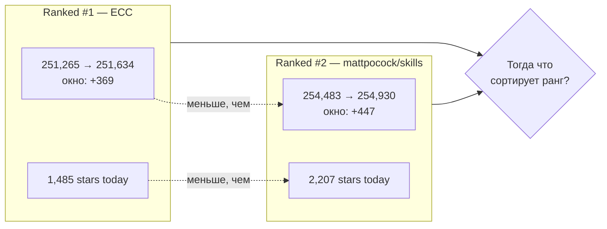
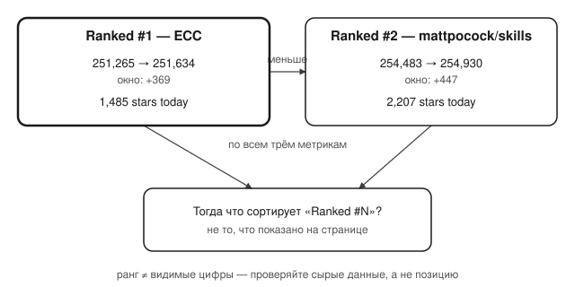

## Русская версия

# ECC — «Ranked #1» сегодня, хотя звёзд, роста и «stars today» у него меньше, чем у #2

Вчера в этом же дайджесте [affaan-m/ECC](https://github.com/affaan-m/ECC) шёл под рангом #2, а [mattpocock/skills](https://github.com/mattpocock/skills) — под #1. Сегодня они поменялись местами: ECC теперь #1, mattpocock — #2. Казалось бы, обычная перестановка в трендах — но если сопоставить цифры рядом, ранг перестаёт складываться.

У ECC сегодня: 251,265 → 251,634 звёзд (окно замера +369), отдельно указано «1,485 stars today». У mattpocock/skills: 254,483 → 254,930 (окно +447), «2,207 stars today». По всем трём метрикам, которые дайджест вообще показывает — общее число звёзд, прирост за окно замера, прирост «за сегодня» — mattpocock опережает ECC. И тем не менее именно ECC стоит на позиции #1, а mattpocock — на #2.

Это не опечатка и не разовая аномалия: [ECC уже разбирался здесь](https://github.com/affaan-m/ECC) вчера под другим углом (пять слов вместо описания security-слоя), и тогда он тоже был #2 при меньших абсолютных числах, чем у соседа по трендам. Устойчивая картина в том, что позиция в списке «Ranked #N» явно вычисляется не по видимым на странице цифрам, а по чему-то ещё — скорее всего, по скорости роста в более коротком окне, чем сутки, или по взвешенному сочетанию метрик, которое трекер не раскрывает.

Проблема не в том, что у трекера сложная формула — сложные формулы ранжирования нормальны. Проблема в том, что цифры, которые показаны рядом с рангом, создают у читателя иллюзию, будто ранг — это просто «у кого больше звёзд сегодня». Здесь эта иллюзия рушится за десять секунд сравнения двух блоков текста.

### Почему вам это важно

Если вы ориентируетесь на позицию в трендах GitHub (или любом похожем трекере) как на сигнал «что стоит попробовать первым», проверяйте это не по рангу, а по сырым цифрам под ним — и будьте готовы, что ранг и цифры могут прямо противоречить друг другу, как здесь у [ECC против mattpocock/skills](https://github.com/affaan-m/ECC). Ранг — это чужая непрозрачная формула, а не объективный факт о проекте.

## English version

# ECC is "Ranked #1" today despite trailing #2 on every visible number

Yesterday, in this same digest, [affaan-m/ECC](https://github.com/affaan-m/ECC) sat at rank #2 while [mattpocock/skills](https://github.com/mattpocock/skills) held #1. Today they've swapped: ECC is now #1, mattpocock is #2. That would read as an ordinary trending reshuffle — until you put the numbers side by side, at which point the rank stops adding up.

ECC today: 251,265 → 251,634 stars (measurement-window growth +369), with a separately listed "1,485 stars today." mattpocock/skills: 254,483 → 254,930 (window growth +447), "2,207 stars today." On every metric the digest actually displays — total stars, window growth, "today" growth — mattpocock leads ECC. And yet ECC is the one sitting at #1, with mattpocock at #2.

This isn't a one-off glitch: [ECC was already covered here](https://github.com/affaan-m/ECC) yesterday from a different angle (five words packing a whole security-layer claim), and even then it held #2 while trailing its trending neighbor on the raw numbers. The consistent pattern is that the "Ranked #N" position is clearly not computed from the figures printed next to it — more likely it reflects growth velocity over some window shorter than a day, or some weighted blend the tracker never discloses.

The issue isn't that the ranking formula is complex — complex ranking formulas are normal. The issue is that the numbers displayed right next to the rank create the impression that rank simply means "whoever has more stars today." That impression collapses after ten seconds of comparing two text blocks.

### Why it matters

If you use a GitHub trending position (or any similar tracker's rank) as a signal for "what to try first," verify it against the raw numbers underneath, not the rank label itself — and be ready for the two to directly contradict each other, as they do here with [ECC versus mattpocock/skills](https://github.com/affaan-m/ECC). The rank is someone else's opaque formula, not an objective fact about the project.
