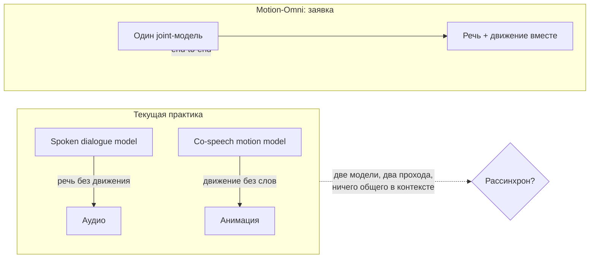
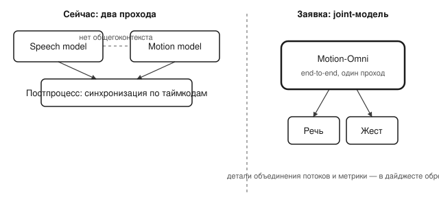

## Русская версия

# Motion-Omni: почему «говорящий аватар» до сих пор собран из двух моделей, которые друг друга не видят

В сегодняшнем дайджесте — статья [«Motion-Omni: End-to-End Joint Speech and Full-Body Motion for Spoken Dialogue»](https://huggingface.co/papers/2609.04250) (Chengqian Ma, Wei Tao, Haoyu Zhang, Yiwen Guo). Аннотация в дайджесте обрывается на середине, поэтому конкретные метрики или архитектурные детали здесь разбирать не будем — но сама постановка задачи, которую авторы формулируют в начале, стоит отдельного разговора.

Тезис такой: аватар, который ведёт разговор, должен одновременно решать, что сказать, и как двигаться, пока говорит. Но на практике эти две способности живут в разных семействах моделей: модели spoken dialogue генерируют речь без движения, а модели co-speech motion генерируют движение без слов. Это не техническая мелочь, а структурная проблема: если речь и жест производятся двумя независимыми проходами, между ними физически нет общего контекста, из которого могла бы родиться согласованность — модель движения не «знает», что модель речи только что решила сделать паузу перед ключевым словом, а модель речи не в курсе, что жест уже начался чуть раньше.

На практике это давно решают костылём: сначала генерируют речь, потом накладывают на неё анимацию как отдельный постпроцесс, синхронизируя по таймкодам. Это работает похоже на дубляж — движение подгоняется под уже готовый звук, а не рождается вместе с ним. Заявка Motion-Omni — сделать это end-to-end, одной joint-моделью, а не пайплайном из двух независимых.

Здесь стоит быть честным: дайджест не раскрывает, как именно авторы объединяют два потока данных (общий токенайзер? общий трансформер с двумя выходными головами? что-то ещё) и какие метрики подтверждают, что joint-подход действительно лучше пайплайна, а не просто архитектурно чище. Пока перед нами постановка проблемы, а не проверенное решение.

### Почему вам это важно

Если вы строите или оцениваете голосовых аватаров, разделение «речь отдельно, движение отдельно» — это ровно то место, где стоит спрашивать не «выглядит ли демо гладко», а «что физически связывает решение сказать это слово с решением сделать этот жест». [Полная статья](https://huggingface.co/papers/2609.04250) — повод проверить, отвечает ли она на этот вопрос предметно, а не просто заявляет «joint» в заголовке.

## English version

# Motion-Omni: why a "talking avatar" is still stitched together from two models that can't see each other

Today's digest surfaces the paper [«Motion-Omni: End-to-End Joint Speech and Full-Body Motion for Spoken Dialogue»](https://huggingface.co/papers/2609.04250) (Chengqian Ma, Wei Tao, Haoyu Zhang, Yiwen Guo). The digest's abstract excerpt cuts off mid-sentence, so specific metrics or architectural details won't be covered here — but the problem statement the authors open with is worth its own discussion.

The claim: an avatar holding a conversation should decide what to say and how to move while saying it, at the same time. In practice, though, these two abilities live in separate model families — spoken dialogue models produce speech without motion, and co-speech motion models produce motion without words. That's not a minor implementation detail, it's a structural problem: if speech and gesture come from two independent passes, there's no shared context between them from which coordination could actually emerge — the motion model has no idea the speech model just decided to pause before a key word, and the speech model doesn't know a gesture already started slightly earlier.

In practice, this gets patched with a workaround: generate the speech first, then layer motion on top as a separate post-process, synced by timecodes. It works a bit like dubbing — motion is fitted to already-finished audio, rather than emerging together with it. Motion-Omni's claim is to do this end-to-end, as one joint model instead of a two-stage pipeline.

Worth being honest here: the digest doesn't reveal how the authors actually merge the two data streams (a shared tokenizer? one transformer with two output heads? something else), or what metrics back up the idea that a joint approach genuinely beats the pipeline rather than just being architecturally cleaner. What's in front of us right now is a problem statement, not a verified solution.

### Why it matters

If you're building or evaluating voice avatars, the "speech here, motion there" split is exactly where you should be asking not "does the demo look smooth" but "what physically connects the decision to say this word with the decision to make this gesture." [The full paper](https://huggingface.co/papers/2609.04250) is worth checking against that specific question, rather than taking "joint" in the title at face value.
