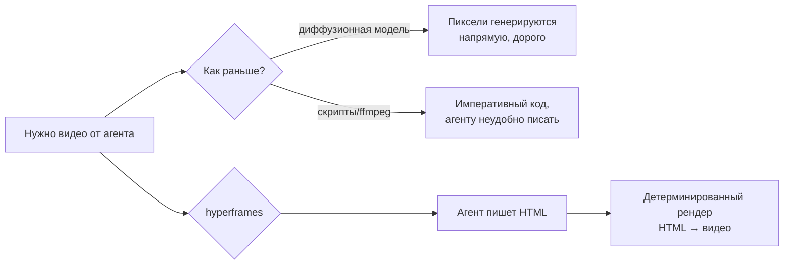
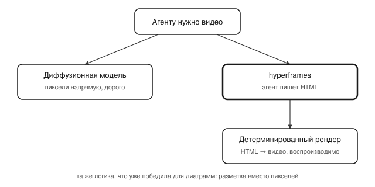

## Русская версия

# Write HTML. Render video. Агенты получают видео как текстовую задачу

Сегодня в трендах GitHub на первом месте — [heygen-com/hyperframes](https://github.com/heygen-com/hyperframes): 45,806 → 46,375 звёзд (+569 за окно, 474 «today»), TypeScript. Описание короче твита: «Write HTML. Render video. Built for agents.»

Идея, если читать её буквально: агент не генерирует видео напрямую (это удел диффузионных моделей, и там каждый пиксель — результат дорогого сэмплирования), а пишет HTML — то, что LLM и так умеет делать надёжно и предсказуемо, — а затем этот HTML детерминированно рендерится в видеоряд. По сути, видео превращается в задачу «сгенерируй разметку», а не «сгенерируй пиксели». Это ровно та же логика, что уже победила для диаграмм: агенту проще и дешевле написать ```mermaid``` или SVG-код, чем рисовать картинку по пикселям — и результат воспроизводим, его можно версионировать в git и редактировать вручную.

Стоит сразу назвать источник честно: HeyGen — коммерческая компания в сфере AI-аватаров и видео, так что hyperframes выглядит как открытая часть инфраструктуры, на которой построен их собственный продукт, а не нейтральный инструмент от независимого разработчика. Это не делает репозиторий хуже, но объясняет, зачем компании вообще открывать такой код: чем больше агентов и SDK пишут HTML под их рендерер, тем прочнее позиция HeyGen как инфраструктурного слоя.

Чего дайджест не говорит: какие именно HTML/CSS-примитивы поддерживаются (обычные CSS-анимации? canvas? WebGL-шейдеры?), насколько тяжёлый рендер-пайплайн стоит за кадром, и есть ли ограничения на длину или сложность сцены. Судя по одному описанию, можно строить только гипотезы.

### Почему вам это важно

Если в вашем агентном пайплайне есть шаг «сгенерировать видео» — стоит проверить, не решается ли он тем же трюком, что уже решил проблему диаграмм: заменить генерацию пикселей генерацией разметки плюс детерминированный рендерер. Дешевле, воспроизводимее, и агенту это писать привычнее. [Репозиторий](https://github.com/heygen-com/hyperframes) — повод посмотреть, готов ли этот конкретный инструмент для продакшена, а не только для трендов на GitHub.

## English version

# Write HTML. Render video. Video becomes a text-generation problem for agents

Today's #1 spot on GitHub trending goes to [heygen-com/hyperframes](https://github.com/heygen-com/hyperframes): 45,806 → 46,375 stars (+569 over the window, 474 "today"), TypeScript. The description is shorter than a tweet: "Write HTML. Render video. Built for agents."

Read literally, the pitch is this: instead of an agent generating video directly (the domain of diffusion models, where every pixel is the product of expensive sampling), it writes HTML — something LLMs already do reliably and predictably — and that HTML gets deterministically rendered into a video track. Video generation turns into "produce markup," not "produce pixels." That's the exact same logic that already won for diagrams: it's cheaper and easier for an agent to write a ```mermaid``` block or SVG code than to paint a picture pixel by pixel — and the result is reproducible, git-versionable, and hand-editable.

Worth naming the source honestly upfront: HeyGen is a commercial AI avatar and video company, so hyperframes reads as the open piece of infrastructure their own product is built on, not a neutral tool from an independent developer. That doesn't make the repo worse, but it explains why a company would open-source this at all: the more agents and SDKs write HTML for their renderer, the stronger HeyGen's position as an infrastructure layer.

What the digest doesn't say: which specific HTML/CSS primitives are supported (plain CSS animations? canvas? WebGL shaders?), how heavy the rendering pipeline is behind the scenes, or whether there are limits on scene length or complexity. Going off one description line, that's guesswork territory.

### Why it matters

If your agent pipeline has a "generate a video" step, it's worth checking whether the same trick that already solved diagrams applies here: swap pixel generation for markup generation plus a deterministic renderer. Cheaper, more reproducible, and closer to what an agent is already good at writing. [The repository](https://github.com/heygen-com/hyperframes) is worth a look to judge whether this particular tool is production-ready, not just trending on GitHub.
