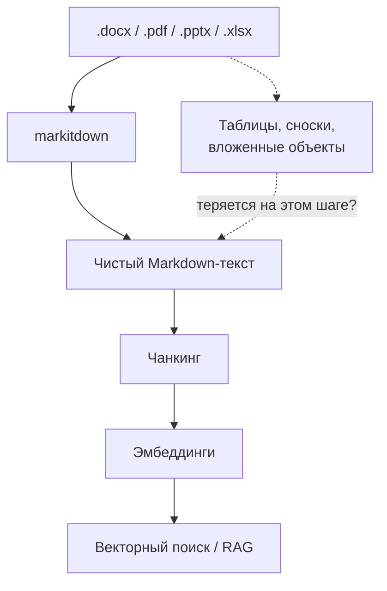
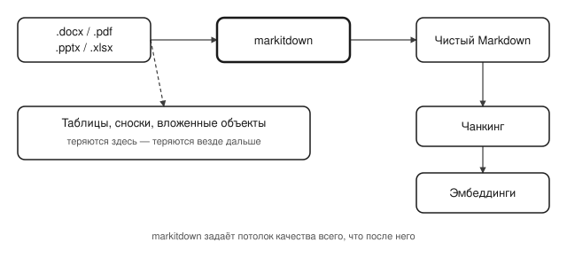

## Русская версия

# markitdown снова в трендах: почему конвертация в Markdown — это уже про retrieval, а не про удобство

[microsoft/markitdown](https://github.com/microsoft/markitdown) сегодня в трендах GitHub на #2: 180,141 → 180,574 звёзд (+433 за окно, 886 «today»), Python. Описание не изменилось за всё время существования проекта: «Python tool for converting files and office documents to Markdown». Ничего сенсационного — и именно это интересно: репозиторий с почти 180 тысячами звёзд продолжает набирать почти тысячу в день, хотя делает одну скучную вещь.

Скучную — но фундаментальную для любого RAG-пайплайна. Прежде чем документ можно нарезать на чанки и превратить в эмбеддинги, его нужно превратить в текст. .docx, .pdf, .pptx, .xlsx — у каждого формата свой внутренний мир объектов, таблиц, сносок и вложенных структур, и «просто извлечь текст» на практике означает решить десяток мелких, но важных вопросов: как передать структуру таблицы, что делать со сносками, как быть с текстом внутри изображений. markitdown берёт эту грязную работу на себя и отдаёт на выходе чистый Markdown — формат, который одинаково хорошо читают и человек, и модель, и парсер для чанкинга.

Если смотреть на это через призму retrieval-дизайна: единица извлечения (чанк) определяется уже после того, как документ прошёл через markitdown, — то есть markitdown фактически задаёт верхнюю границу качества всего последующего поиска. Потеряется структура таблицы на этом шаге — потеряется и способность модели ответить на вопрос по этой таблице, сколько бы вы потом ни оптимизировали эмбеддинги или гибридный поиск.

Чего дайджест не говорит: что именно изменилось в сегодняшнем релизе (сам факт тренда не значит, что вышла новая версия — рост звёзд может быть чисто органическим, от новых пользователей, находящих проект впервые), и насколько хорошо инструмент справляется со сложными вложенными таблицами против простого текста.

### Почему вам это важно

Если ваш RAG работает хуже, чем ожидалось, стоит проверить не только эмбеддинги и стратегию чанкинга, но и самый первый, самый скучный шаг — во что именно превратился исходный документ до того, как до него добралась остальная система. [markitdown](https://github.com/microsoft/markitdown) — не единственный инструмент для этого, но его популярность — хороший повод сверить, не является ли этот шаг у вас узким местом, которое никто не проверяет.

## English version

# markitdown is trending again: why converting to Markdown is already a retrieval decision, not a convenience feature

[microsoft/markitdown](https://github.com/microsoft/markitdown) sits at #2 on today's GitHub trending: 180,141 → 180,574 stars (+433 over the window, 886 "today"), Python. The description hasn't changed since the project started: "Python tool for converting files and office documents to Markdown." Nothing dramatic — and that's exactly what's interesting: a repo with nearly 180,000 stars keeps adding almost a thousand a day for doing one boring thing.

Boring, but foundational to any RAG pipeline. Before a document can be chunked and turned into embeddings, it has to become text first. .docx, .pdf, .pptx, .xlsx — each format has its own internal world of objects, tables, footnotes, and nested structures, and "just extract the text" in practice means resolving a dozen small but consequential questions: how to represent a table's structure, what to do with footnotes, how to handle text embedded in images. markitdown absorbs that dirty work and outputs clean Markdown — a format that reads equally well to a human, a model, and a chunking parser.

Looked at through a retrieval-design lens: the unit of retrieval (the chunk) gets defined only after the document has already passed through markitdown — which means markitdown effectively sets the ceiling on how good everything downstream can be. Lose a table's structure at this step and you lose the model's ability to answer questions about that table, no matter how much you later tune embeddings or hybrid search.

What the digest doesn't say: what actually changed in today's trending spike (a trend doesn't necessarily mean a new release shipped — star growth can be purely organic, from new users discovering the project), or how well the tool handles deeply nested tables versus plain text.

### Why it matters

If your RAG performs worse than expected, it's worth checking not just embeddings and chunking strategy but the first, most boring step — what your source document actually turned into before the rest of the system ever saw it. [markitdown](https://github.com/microsoft/markitdown) isn't the only tool for this, but its popularity is a good prompt to check whether that step is a bottleneck nobody's actually looking at.
