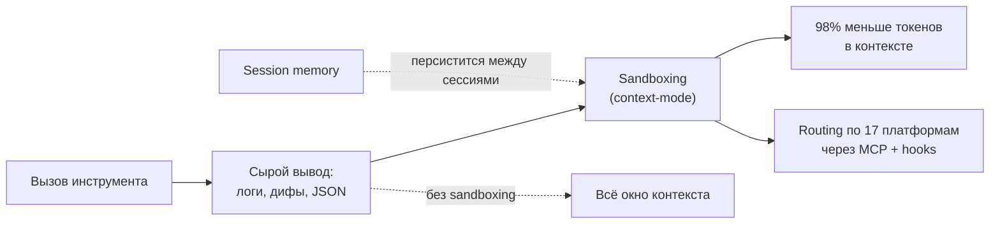
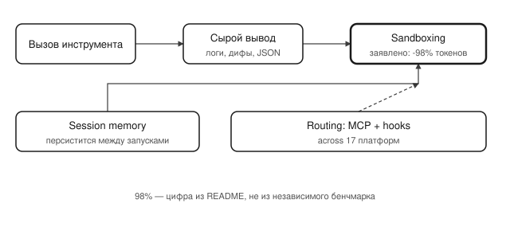

## Русская версия

# context-mode: 98% сокращения вывода инструментов — и что на самом деле значит эта цифра

В сегодняшнем дайджесте на третьем месте трендов — [mksglu/context-mode](https://github.com/mksglu/context-mode): 20,798 → 20,966 звёзд (+168 за окно, 96 «today»), TypeScript. Описание из трёх частей: «Context window optimization for AI coding agents. Sandboxes tool output (98% reduction), persists session memory, and enforces routing across 17 platforms via MCP + hooks».

Разберём по частям, потому что за формулировкой «оптимизация контекстного окна» обычно скрывается что-то одно из нескольких разных решений. Первая часть — «sandboxing вывода инструментов» с заявленным сокращением 98%. Это узнаваемая проблема: агент вызывает инструмент (грep по репозиторию, сборку, тесты), инструмент возвращает мегабайт сырого лога, и весь этот лог целиком попадает в контекст модели, хотя реально нужны три строки с ошибкой. «Sandboxing» здесь, судя по всему, значит: вывод инструмента не льётся в контекст напрямую, а перехватывается и урезается до релевантного, прежде чем модель его увидит.

Вторая часть — персистентная память сессии: то, что модель «помнит» между отдельными запусками агента, а не теряет всё при каждом новом контексте. Третья — роутинг через MCP и hooks сразу по 17 платформам, то есть один и тот же слой оптимизации контекста работает поверх разных агентных харнессов, а не только внутри одного конкретного инструмента.

Про заявленные 98% стоит быть аккуратным: это цифра из описания репозитория, не из независимого бенчмарка, и она наверняка сильно зависит от того, какой именно вызов инструмента брать за пример — для «git log» с тысячей коммитов сокращение может быть кардинально другим, чем для короткого вывода линтера. Дайджест не даёт ни методологии измерения, ни диапазона по разным сценариям.

### Почему вам это важно

Если ваш агент регулярно «забивает» контекст сырым выводом инструментов — логами сборки, полными дифами, JSON-ответами API — стоит проверить, есть ли у вас вообще этот промежуточный слой между «инструмент ответил» и «модель это увидела», или вывод льётся напрямую. [context-mode](https://github.com/mksglu/context-mode) — конкретный пример такого слоя; воспринимайте цифру 98% как повод протестировать на своих собственных сценариях, а не как готовый результат.

## English version

# context-mode: a claimed 98% reduction in tool output — and what that number actually means

Third place on today's GitHub trending is [mksglu/context-mode](https://github.com/mksglu/context-mode): 20,798 → 20,966 stars (+168 over the window, 96 "today"), TypeScript. The description has three parts: "Context window optimization for AI coding agents. Sandboxes tool output (98% reduction), persists session memory, and enforces routing across 17 platforms via MCP + hooks."

Worth unpacking, since "context window optimization" usually hides one of several distinct approaches. The first piece is "sandboxing tool output" with a claimed 98% reduction. That's a familiar pain point: an agent calls a tool (grep across a repo, a build, a test run), the tool returns a megabyte of raw log, and that whole log lands in the model's context even though only three lines with the actual error matter. "Sandboxing" here apparently means tool output doesn't flow straight into context — it's intercepted and trimmed to what's relevant before the model ever sees it.

The second piece is persistent session memory — what the model "remembers" across separate agent runs, instead of losing everything with each fresh context. The third is routing through MCP and hooks across 17 platforms at once, meaning the same context-optimization layer sits on top of multiple different agent harnesses rather than living inside one specific tool.

Worth being careful about that claimed 98%: it comes from the repo's own description, not an independent benchmark, and it almost certainly depends heavily on which tool call you pick as the example — the reduction for a "git log" spanning a thousand commits could look very different from a short linter output. The digest gives no measurement methodology and no range across scenarios.

### Why it matters

If your agent regularly clogs its context with raw tool output — build logs, full diffs, API JSON responses — it's worth checking whether you even have this intermediate layer between "the tool responded" and "the model saw it," or whether output just flows straight through. [context-mode](https://github.com/mksglu/context-mode) is one concrete example of such a layer; treat the 98% figure as a reason to test on your own scenarios, not as a ready-made result.
