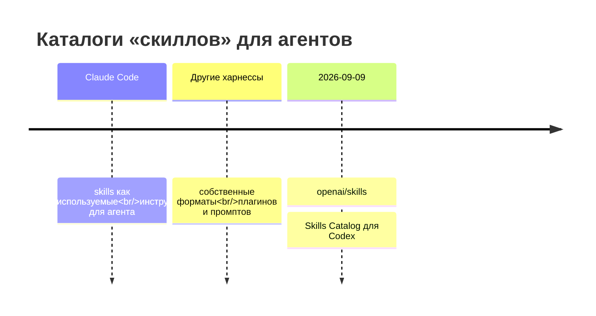
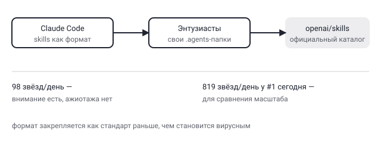

## Русская версия

# openai/skills: Codex получает свой каталог скиллов — и это признание, а не изобретение

Третье место в сегодняшнем GitHub trending — [openai/skills](https://github.com/openai/skills): 26,497 → 26,595 звёзд (+98 за окно, 490 «today»), Python. Описание лаконичное: «Skills Catalog for Codex».

Смысл события не в самом репозитории — это, по сути, витрина готовых скиллов, — а в том, что он вообще появился именно под этим именем. Концепция «skill» как небольшого, переиспользуемого набора инструкций, который меняет поведение агента под конкретную задачу (проверить PR, написать конспект, сгенерировать диаграмму — примеры из соседних трендов последних недель), последние месяцы плотно ассоциировалась с экосистемой Claude Code. Появление официального каталога скиллов от OpenAI для Codex — это не техническая инновация, а сигнал о том, что формат прижился настолько, что его нужно поддерживать на уровне продукта, а не оставлять энтузиастам собирать свои `.agents`-папки вручную (ровно так, как в дайджестах последних недель мелькали десятки community-репозиториев со скиллами и «инстинктами» для разных харнессов).

Это конкретный пример паттерна «the churn watch» — что было нишевой практикой энтузиастов полгода назад, становится официальной фичей продукта сегодня. Ирония в том, что сам формат «маленький файл с инструкциями, который переключает поведение модели» не является революционным — это просто структурированный prompt engineering с версионированием и каталогизацией. Но факт, что конкурирующий харнесс выпускает под это официальный репозиторий с говорящим именем `skills`, — надёжный маркер того, что паттерн перешёл из категории «трюк энтузиастов» в категорию «то, что обязан поддерживать любой серьёзный агентный продукт».

Стоит быть аккуратным с выводами: 98 новых звёзд за день — это далеко не вирусный рост (для сравнения, топ-1 сегодня — 819 звёзд у i-have-adhd). Каталог скиллов от OpenAI получил внимание, но пока не ажиотаж; сама категория интересна больше как индикатор консолидации формата, чем как повод бежать использовать именно этот репозиторий.

### Почему вам это важно

Если вы строите или используете агентные харнессы вне экосистемы Claude Code, стоит следить не за конкретным репозиторием, а за самим фактом: формат «skill» (небольшая, изолированная, переиспользуемая инструкция под задачу) закрепляется как межплатформенный стандарт, а не фича одного продукта. [openai/skills](https://github.com/openai/skills) — первый официальный сигнал этого для Codex; посмотрите, стоит ли уже сейчас проектировать свои промпты в этом формате, чтобы не переписывать их заново, когда стандарт устоится окончательно.

## English version

# openai/skills: Codex gets its own skills catalog — and that's an acknowledgment, not an invention

Third place on today's GitHub trending is [openai/skills](https://github.com/openai/skills): 26,497 → 26,595 stars (+98 over the window, 490 "today"), Python. The description is terse: "Skills Catalog for Codex."

The significance isn't the repo itself — it's essentially a showcase of ready-made skills — it's that it exists under exactly this name at all. The concept of a "skill" as a small, reusable set of instructions that adapts an agent's behavior for a specific task (review a PR, write a summary, generate a diagram — examples from other repos trending in recent weeks) has, for months, been tightly associated with the Claude Code ecosystem. An official skills catalog from OpenAI for Codex isn't a technical innovation — it's a signal that the format has taken hold enough to need product-level support, rather than being left to enthusiasts hand-assembling their own `.agents` folders (exactly the pattern behind dozens of community skill/"instinct" repos that have shown up in recent digests, across different harnesses).

This is a concrete instance of "the churn watch" — what was a niche enthusiast practice six months ago becomes an official product feature today. There's an irony here: the format itself — a small file of instructions that switches the model's behavior — isn't revolutionary; it's just structured prompt engineering with versioning and cataloging bolted on. But a competing harness shipping an official repo named, plainly, `skills` is a reliable marker that the pattern has moved from "enthusiast trick" to "something any serious agent product is expected to support."

Worth being careful with the conclusions here: 98 new stars in a day is far from viral growth (for comparison, today's #1, i-have-adhd, picked up 819). OpenAI's skills catalog is getting attention, not a stampede yet; the category itself is more interesting as a consolidation signal than as a reason to rush and adopt this specific repo.

### Why it matters

If you're building or using agent harnesses outside the Claude Code ecosystem, the thing worth tracking isn't this specific repo — it's the fact that the "skill" format (a small, isolated, reusable per-task instruction) is settling in as a cross-platform standard rather than a single product's feature. [openai/skills](https://github.com/openai/skills) is the first official signal of that for Codex; it's worth checking whether structuring your own prompts this way now saves you a rewrite once the standard fully settles.
