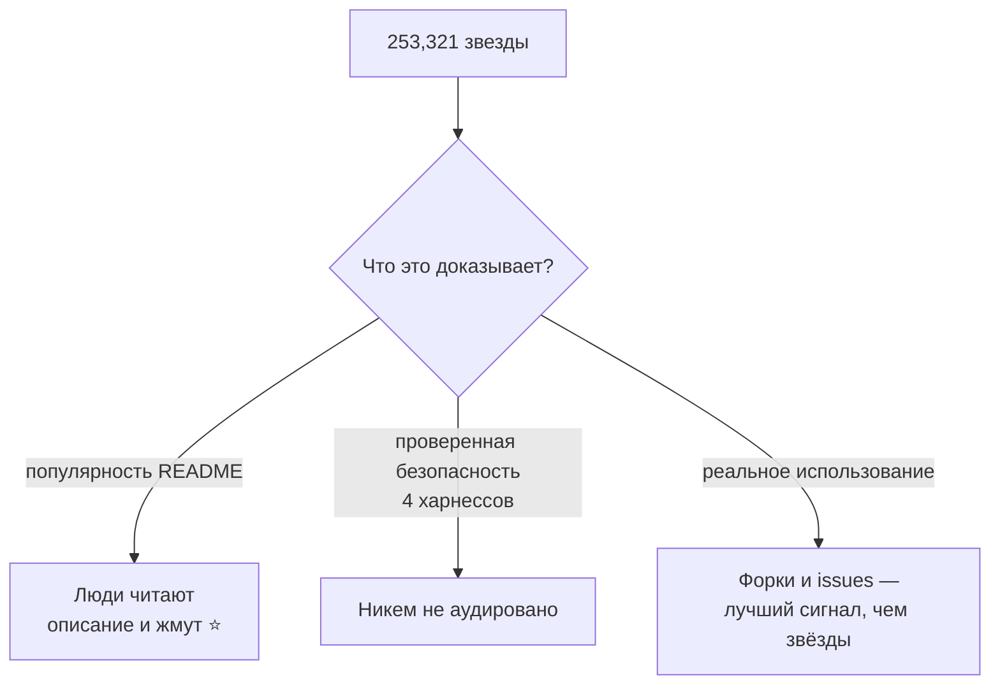
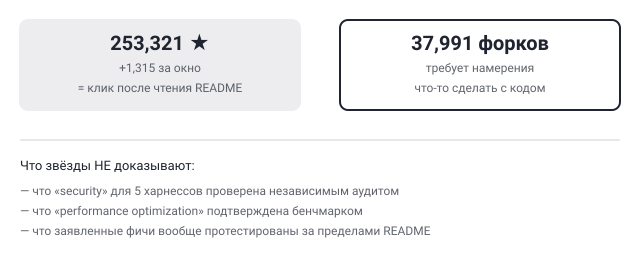

## Русская версия

# ECC перевалил за четверть миллиона звёзд — но что именно этот счётчик доказывает?

[affaan-m/ECC](https://github.com/affaan-m/ECC) продолжает мелькать в трендах: сегодня 252,006 → 253,321 звёзд (+1,315 за окно), JavaScript, 37,991 форков. Описание в дайджесте то же, что и в прошлые разы: «The agent harness performance optimization system. Skills, instincts, memory, security, and research-first development for Claude Code, Codex, Opencode, Cursor and beyond».

Мы уже разбирали этот репозиторий дважды — 6 сентября про формулировку «security» сразу для четырёх разных харнессов без единой проверяемой границы, 7 сентября про то, что «Ranked #1» на GitHub trending не значит «больше звёзд, роста или today-счётчика, чем у конкурента». Сегодняшний повод — сама скорость роста: +1,315 звёзд за окно на уже существующей базе в четверть миллиона. Для сравнения: сегодняшний лидер трендов, i-have-adhd, за то же окно набрал 819 звёзд — то есть у ECC абсолютный прирост выше, но он идёт поверх базы, которая уже на порядок больше.

Здесь стоит разделить два разных вопроса, которые легко смешать. Первый: растёт ли внимание к репозиторию? Да, растёт, и стабильно последние недели. Второй: означает ли это, что заявленная функциональность — «security» для пяти разных харнессов, «research-first development» — действительно работает так, как описано? На этот вопрос счётчик звёзд не отвечает вообще, потому что звезда на GitHub ставится за прочитанное README, а не за отработанный аудит безопасности или воспроизведённый бенчмарк производительности. 37,991 форков — куда более интересная цифра: форк требует хотя бы минимального намерения что-то сделать с кодом, а не просто отметить закладку.

Ирония в том, что название репозитория расшифровывается как «agent harness performance optimization system», но ни в одном из просмотренных описаний нет ссылки на независимый бенчмарк производительности — только перечисление фич (skills, instincts, memory, security). Это не значит, что фичи не работают; значит, что судить по звёздам, работают они или нет, нельзя в принципе — нужны отдельные данные, которых дайджест не даёт.

### Почему вам это важно

Если вы выбираете харнесс-обвязку для агента на основе GitHub trending, разделяйте вопрос «сколько людей заметили» и вопрос «доказана ли заявленная функциональность». [ECC](https://github.com/affaan-m/ECC) — хороший тренировочный кейс на это разделение: звёзды растут быстро и стабильно, но ни разу в описании не встретилась ссылка на бенчмарк или аудит, только перечень возможностей.

## English version

# ECC crosses a quarter million stars — but what does that counter actually prove?

[affaan-m/ECC](https://github.com/affaan-m/ECC) keeps showing up in the trends: today 252,006 → 253,321 stars (+1,315 over the window), JavaScript, 37,991 forks. The digest description is the same as in previous appearances: "The agent harness performance optimization system. Skills, instincts, memory, security, and research-first development for Claude Code, Codex, Opencode, Cursor and beyond."

We've covered this repo twice already — on September 6 about the word "security" being claimed across four different harnesses without a single verifiable boundary, and on September 7 about "Ranked #1" on GitHub trending not meaning more stars, growth, or today-count than the runner-up. Today's angle is the growth rate itself: +1,315 stars in one window, on top of an already quarter-million base. For comparison, today's overall trend leader, i-have-adhd, picked up 819 stars over the same window — so ECC's absolute gain is larger, but it's stacked on a base an order of magnitude bigger already.

Worth separating two questions that are easy to conflate here. First: is attention to the repo growing? Yes, steadily, for weeks. Second: does that mean the claimed functionality — "security" across five different harnesses, "research-first development" — actually works as described? The star count answers that second question not at all, because a GitHub star gets clicked after reading a README, not after a completed security audit or a reproduced performance benchmark. The 37,991 forks are the more interesting number here: forking requires at least some minimal intent to do something with the code, not just bookmark it.

There's an irony in the repo's own name — "agent harness performance optimization system" — while none of the descriptions seen so far link to an independent performance benchmark, just a list of features (skills, instincts, memory, security). That doesn't mean the features don't work; it means stars simply can't answer whether they do — that needs separate data the digest doesn't provide.

### Why it matters

If you're picking a harness wrapper for your agent based on GitHub trending, keep "how many people noticed" and "is the claimed functionality proven" as two separate questions. [ECC](https://github.com/affaan-m/ECC) is a good training case for that split: stars keep climbing fast and steadily, but not once has a benchmark or audit link shown up in the description — only a list of capabilities.
