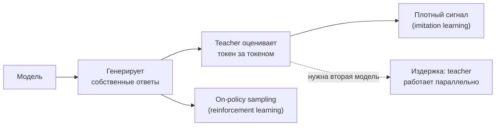
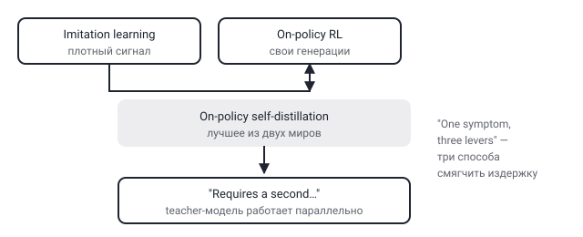

## Русская версия

# On-Policy Self-Distillation: один симптом, три рычага — и обрубленный на полуслове абстракт

В сегодняшнем дайджесте — статья [«One Symptom, Three Levers: A Critical Review of On-Policy Self-Distillation»](https://huggingface.co/papers/2608.25936) (Justin Robert, Raheel Qader). Уже само название задаёт формат: это не статья с новым методом, а критический обзор существующего подхода — «one symptom» (одна проблема), «three levers» (три способа на неё повлиять).

Метод, который разбирают авторы, on-policy self-distillation, устроен так: модель обучается на собственных генерациях, а «учитель» (teacher) оценивает их токен за токеном. Формулировка из абстракта прямая: подход «combines the dense supervision of imitation learning with the on-policy sampling of reinforcement learning» — то есть берёт лучшее из двух миров. От imitation learning — плотный, по каждому токену, обучающий сигнал (в отличие от разреженной награды в конце последовательности, как в классическом RL). От on-policy RL — то, что модель учится на собственных, а не на чужих (off-policy) генерациях, а значит видит именно те ошибки и распределения, которые сама и производит.

Дальше абстракт в дайджесте обрывается: «But it requires a second…» — и на этом всё. Продолжение отсутствует, поэтому досказывать за авторов не будем. Но даже по названию понятен формат: «one symptom» — это, вероятно, и есть то ограничение, на которое указывает оборванная фраза (что-то, требующее второй модели или второго прохода — teacher ведь оценивает генерации отдельно от самой обучаемой модели, а значит требует дополнительных вычислительных ресурсов на его прогон). «Three levers» — три конкретных параметра или решения, которыми это ограничение можно смягчить, не отказываясь от подхода целиком.

Формат «критический обзор существующего метода» сам по себе значим для этой рубрики: он не про то, что on-policy self-distillation не работает, а про то, что у него есть структурная цена, которую стоит явно называть, а не прятать за общей формулировкой «комбинирует лучшее из двух миров». Это ровно тот вид работы, который двигает область вперёд не новым трюком, а честной картой компромиссов существующего.

### Почему вам это важно

Если вы рассматриваете on-policy distillation как способ дообучения модели на собственных генерациях с более плотным сигналом, чем классический RLHF, — эта работа прямо про издержки такого выбора. Полный текст доступен по [ссылке на HuggingFace Papers](https://huggingface.co/papers/2608.25936); стоит прочитать её целиком, прежде чем закладывать вычислительный бюджет под вторую модель-«учителя», параллельную основной.

## English version

# On-Policy Self-Distillation: one symptom, three levers — and an abstract cut off mid-sentence

Today's digest carries a paper titled [«One Symptom, Three Levers: A Critical Review of On-Policy Self-Distillation»](https://huggingface.co/papers/2608.25936) (Justin Robert, Raheel Qader). The title already sets the format: this isn't a paper introducing a new method, it's a critical review of an existing one — "one symptom" (a single problem), "three levers" (three ways to act on it).

The method under review, on-policy self-distillation, works like this: the model trains on its own generations, while a "teacher" scores them token by token. The abstract states it directly — the approach "combines the dense supervision of imitation learning with the on-policy sampling of reinforcement learning," taking the best of both worlds. From imitation learning: a dense, per-token training signal (as opposed to a sparse, end-of-sequence reward like in classic RL). From on-policy RL: the model learns from its own generations rather than someone else's (off-policy), so it sees exactly the errors and distributions it actually produces.

The abstract in the digest then cuts off: "But it requires a second…" — and that's where it ends. We won't finish the sentence for the authors. But the title alone hints at the shape of it: "one symptom" is likely exactly the limitation that cut-off phrase is pointing at (something requiring a second model or a second pass — the teacher, after all, scores generations separately from the model being trained, which means extra compute just to run it). "Three levers" are presumably three specific knobs or design choices that can soften that limitation without abandoning the approach entirely.

The "critical review of an existing method" format matters here in its own right: it's not arguing that on-policy self-distillation doesn't work, but that it has a structural cost worth naming explicitly, rather than hiding it behind the tidy "combines the best of both worlds" framing. That's exactly the kind of work that moves a field forward not with a new trick but with an honest map of an existing approach's trade-offs.

### Why it matters

If you're considering on-policy distillation as a way to fine-tune a model on its own generations with a denser signal than classic RLHF, this paper is directly about the cost of that choice. The full text is available via the [HuggingFace Papers link](https://huggingface.co/papers/2608.25936) — worth reading in full before budgeting compute for a second, parallel "teacher" model.
