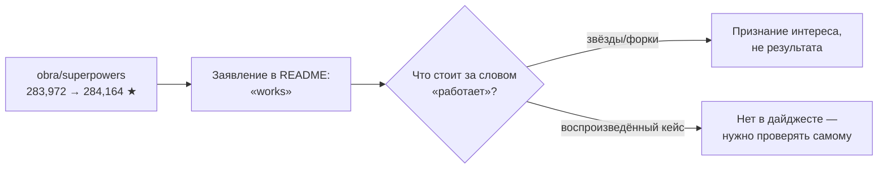
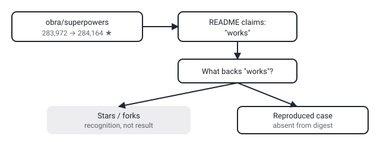

## Русская версия

# superpowers: 284 тысячи звёзд и обещание «методологии, которая работает» — на чём оно держится

В сегодняшнем GitHub trending на третьем месте — [obra/superpowers](https://github.com/obra/superpowers): 283,972 → 284,164 звёзд (+192 за окно, 688 «today»), Shell, уже огромная база. Описание в одну строку: «An agentic skills framework & software development methodology that works».

Слово, за которое стоит зацепиться, — «works». Не «framework for agentic skills» (нейтральное описание того, что это), а прямое утверждение о результате: методология работает. Это не то же самое, что название вроде i-have-adhd, которое просто описывает проблему, или deepseek-harness с его «everything is a plugin» — это архитектурный тезис. «Works» — оценочное суждение, которое обычно подкрепляют либо бенчмарком, либо кейсами внедрения, либо хотя бы структурой доказательства (что именно измерялось, у кого, против какой альтернативы). В дайджесте — только сам тезис, без ссылки на что-либо из перечисленного.

284 тысячи звёзд на репозитории про методологию разработки — сама по себе интересная цифра, но она измеряет ровно одно: сколько людей увидели описание и посчитали его достаточно убедительным, чтобы кликнуть ⭐. Это ближе к рейтингу заголовка, чем к рейтингу результата. Мы уже разбирали похожий случай 4 сентября с mattpocock/skills (248 тысяч звёзд): чужой `.agents`-каталог, оформленный как публичный репозиторий, собирает славу быстрее, чем кто-либо успевает его протестировать на своих задачах.

Здесь нет ничего специфически плохого про сам [superpowers](https://github.com/obra/superpowers) — вполне возможно, что методология действительно снижает трение в агентной разработке для части команд. Проблема в другом: у читателя дайджеста нет способа отличить «работает у автора и у тех, кто написал восторженный твит» от «работает воспроизводимо и в среднем случае». Пока в публичном описании нет ни одного числа про результат — только про его популярность.

### Почему вам это важно

Когда репозиторий заявляет не «что он делает», а «что он даёт» («works», «solves», «10x») — это сигнал остановиться на секунду и спросить, чем именно подкреплено заявление, прежде чем встраивать методологию в рабочий процесс своей команды. [superpowers](https://github.com/obra/superpowers) стоит того, чтобы прочитать полный README и попробовать на маленькой задаче — но 284 тысячи звёзд сами по себе этот вопрос не закрывают.

## English version

# superpowers: 284K stars and a promise that "the methodology works" — what's it actually built on

Today's GitHub trending #3 is [obra/superpowers](https://github.com/obra/superpowers): 283,972 → 284,164 stars (+192 over the window, 688 "today"), Shell, already on a huge base. The one-line description: "An agentic skills framework & software development methodology that works."

The word worth pausing on is "works." Not "a framework for agentic skills" (a neutral description of what it is), but a direct claim about outcome: the methodology works. That's different from a name like i-have-adhd, which just names a problem, or deepseek-harness's "everything is a plugin," which is an architectural thesis. "Works" is an evaluative claim — the kind usually backed by a benchmark, adoption case studies, or at least a sketch of what was measured, on whom, against what alternative. The digest carries only the claim itself, with nothing from that list attached.

284K stars on a development-methodology repo is an interesting number on its own, but it measures exactly one thing: how many people saw the description and found it convincing enough to click ⭐. That's closer to a headline-rating than an outcome-rating. We covered a similar case on September 4 with mattpocock/skills (248K stars): someone's personal `.agents` folder, packaged as a public repo, accumulating fame faster than anyone could realistically test it against their own workload.

None of this is specifically damning for [superpowers](https://github.com/obra/superpowers) itself — it's entirely plausible the methodology genuinely cuts friction in agentic development for some teams. The gap is elsewhere: a reader of the digest has no way to distinguish "works for the author and the people who tweeted enthusiastically" from "works reproducibly, on average." As it stands, the public description carries zero numbers about outcome — only about popularity.

### Why it matters

When a repo claims not "what it does" but "what it delivers" ("works," "solves," "10x"), that's a cue to pause and ask what actually backs the claim before wiring the methodology into your team's workflow. [superpowers](https://github.com/obra/superpowers) is worth reading in full and trying on a small task — but 284K stars alone don't settle the question.
