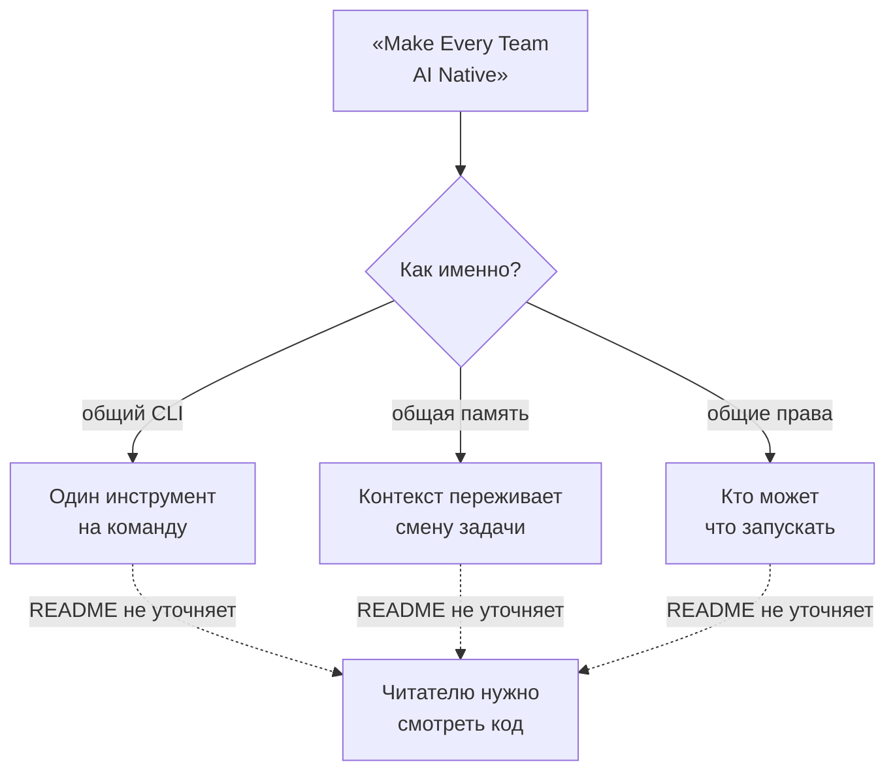
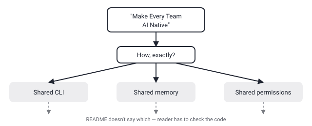

## Русская версия

# teamai-cli от Tencent: «Make Every Team AI Native» — лозунг, который не называет механизм

Второе место в сегодняшнем GitHub trending — [Tencent/teamai-cli](https://github.com/Tencent/teamai-cli): 2,907 → 3,234 звёзд (+327 за окно, 556 «today»), TypeScript. Пока это заметно скромнее, чем 283-тысячная база у superpowers из сегодняшнего же трендинга, но относительный прирост выше на порядок: +327 звёзд на базе в три тысячи — это больше 10% роста за одно окно, против долей процента у гигантов. Молодой репозиторий с крупным именем за спиной (Tencent) — сочетание, которое стоит разобрать отдельно от абсолютных цифр.

Слоган в описании — «Make Every Team AI Native» — по конструкции похож на то, что мы уже разбирали 4 сентября про hermes-agent: «grows with you» не называло механизм роста. Здесь то же самое: «AI native» — это состояние, а не действие, и фраза не говорит, что именно превращает команду в «AI native» — общий CLI для всех участников? Единая память между задачами разных людей? Общие права доступа к инструментам агента? Каждый из этих вариантов — совершенно разный продукт с разными рисками (например, общая память между людьми в команде — это ещё и вопрос, кто видит чей контекст).

Есть отличие от независимых репозиториев вроде i-have-adhd или superpowers: за teamai-cli стоит крупная компания, а не одиночный разработчик. Это меняет расчёт доверия в обе стороны. С одной стороны, у корпоративного репозитория обычно выше шанс на долгосрочную поддержку и code review внутри компании перед публикацией. С другой — «Tencent» в названии организации не гарантирует, что именно эта команда внутри компании прошла полноценный security review, и корпоративный бренд может работать как замена собственной проверки README в голове читателя, а не как её основание.

Стоит прямо сказать: ни описание в дайджесте, ни заголовок не дают достаточно, чтобы понять архитектуру инструмента. Единственный честный следующий шаг — открыть сам репозиторий и посмотреть, что там под капотом, прежде чем решать, подключать ли его к рабочим процессам команды.

### Почему вам это важно

Когда описание репозитория формулирует не функцию, а состояние («AI native», «grows with you», «works»), это сигнал: конкретный механизм скрыт за маркетинговой фразой, и её нужно распаковать самостоятельно. [teamai-cli](https://github.com/Tencent/teamai-cli) — свежий пример: имя крупной компании в организации не заменяет чтение кода, если вы решаете, доверять ли инструменту общий доступ команды к агентам.

## English version

# Tencent's teamai-cli: "Make Every Team AI Native" names a state, not a mechanism

Today's GitHub trending #2 is [Tencent/teamai-cli](https://github.com/Tencent/teamai-cli): 2,907 → 3,234 stars (+327 over the window, 556 "today"), TypeScript. That's a much smaller base than the 283K superpowers carries in today's own trending list, but the relative growth is an order of magnitude higher — +327 stars on a base of three thousand is over 10% growth in one window, against fractions of a percent for the giants. A young repo with a large name behind it (Tencent) is worth unpacking separately from the raw numbers.

The tagline — "Make Every Team AI Native" — is built the same way as hermes-agent's "grows with you," which we covered on September 4: it names a state, not a mechanism. "AI native" doesn't say what actually converts a team into one — a shared CLI across members? Shared memory across different people's tasks? Shared permissions for agent tools? Each of those is a genuinely different product with different risks (shared memory across teammates, for instance, raises the question of who sees whose context).

There's one difference from independent repos like i-have-adhd or superpowers: teamai-cli has a large company behind it, not a solo developer. That cuts the trust calculus both ways. On one hand, a corporate repo usually has a better shot at sustained maintenance and internal review before publication. On the other, "Tencent" in the org name doesn't guarantee that specific team inside the company ran a full security review, and the corporate brand can substitute for a reader's own README scrutiny rather than back it up.

Worth saying plainly: neither the digest description nor the headline gives enough to reconstruct the tool's architecture. The only honest next step is opening the actual repo and looking under the hood before deciding whether to wire it into a team's workflow.

### Why it matters

When a repo's description names a state rather than a function ("AI native," "grows with you," "works"), that's a cue that a concrete mechanism is hiding behind marketing language and needs unpacking on your own. [teamai-cli](https://github.com/Tencent/teamai-cli) is a fresh example: a big company's name in the org doesn't substitute for reading the code when you're deciding whether to trust a tool with your team's shared agent access.
