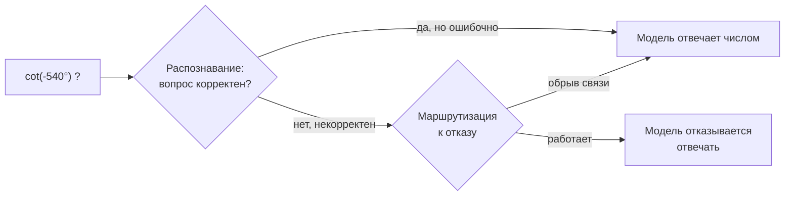
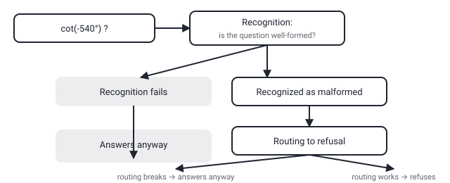

## Русская версия

# Модель знает, что вопрос бессмысленный, но всё равно отвечает: где рвётся цепочка

В сегодняшнем дайджесте — статья Yucheng Du и Xiyang Hu [«Recognition-Refusal Misalignment in LLMs»](https://huggingface.co/papers/2608.29109). Отправная точка простая и легко проверяемая на любой модели: большие языковые модели регулярно отвечают на структурно бессмысленные вопросы вместо того, чтобы отказаться отвечать. Примеры из аннотации — попросить посчитать `cot(-540°)` (котангенс угла, для которого функция просто не определена в этой точке) или спросить, вернёт ли `(1).startswith("1")` осмысленный результат (у числа `1` в большинстве языков программирования нет метода `.startswith` — вопрос сформулирован некорректно на уровне типов). В обоих случаях правильный ответ — не число и не «да/нет», а отказ: «этот вопрос некорректен».

Ключевой вопрос статьи — не «почему модели ошибаются», а более узкий и интереснее сформулированный: это сбой распознавания (модель действительно не видит, что вопрос некорректен) или сбой маршрутизации (модель где-то внутри «понимает», что что-то не так, но эта информация не доходит до решения отказаться отвечать)? Разница принципиальная для того, как это чинить. Если проблема в распознавании — нужно улучшать способность модели оценивать корректность вопроса как отдельную задачу. Если в маршрутизации — модель уже обладает нужным сигналом, но теряет его на пути от «внутреннего представления» к финальному ответу, и чинить нужно именно этот путь, а не само распознавание.

Аннотация в дайджесте обрывается на этом вопросе, не раскрывая, какой из двух вариантов подтвердился (или подтвердились оба, в разных пропорциях для разных типов вопросов) — для этого нужно читать полный текст на [странице статьи](https://huggingface.co/papers/2608.29109). Но сама постановка уже полезна как рамка: в следующий раз, когда агент отвечает на вопрос, который стоило отклонить, стоит спросить не «модель туповата», а «на каком именно шаге — распознавания или маршрутизации — терялся сигнал».

### Почему вам это важно

Если вы строите систему, где отказ отвечать («I don't know», «этот запрос некорректен») критичен — например, агент с доступом к реальным действиям, где ложный ответ на бессмысленный запрос хуже честного отказа, — разделение «recognition vs. refusal» из [этой статьи](https://huggingface.co/papers/2608.29109) даёт более точный инструмент диагностики, чем общее «модель галлюцинирует». Стоит проверить на собственных edge-кейсах, теряется ли сигнал на этапе распознавания или уже после него.

## English version

# The model knows the question is nonsense but answers anyway: where the chain breaks

Today's digest includes a paper by Yucheng Du and Xiyang Hu, [«Recognition-Refusal Misalignment in LLMs»](https://huggingface.co/papers/2608.29109). The starting point is simple and easy to check on any model: large language models routinely answer structurally unanswerable questions instead of declining to answer. The abstract's examples: asking a model to compute `cot(-540°)` (a cotangent that's simply undefined at that angle) or whether `(1).startswith("1")` returns a meaningful result (the integer `1` has no `.startswith` method in most languages — the question is malformed at the type level). In both cases the correct answer isn't a number or a yes/no — it's a refusal: "this question doesn't make sense."

The paper's real question isn't "why do models get this wrong" but a narrower, sharper one: is this a recognition failure (the model genuinely doesn't see that the question is malformed) or a routing failure (the model has, somewhere internally, "noticed" something's off, but that signal never reaches the decision to abstain)? The distinction matters a lot for how you'd fix it. If it's recognition, you need to improve the model's ability to judge question validity as its own task. If it's routing, the model already has the needed signal — it's getting lost on the path from internal representation to final answer, and that's the path to fix, not the recognition itself.

The digest's abstract cuts off right at this question, without revealing which of the two turned out to be the case (or whether both are, in different proportions for different question types) — for that you need the full text on the [paper's page](https://huggingface.co/papers/2608.29109). But the framing itself is already useful: next time an agent answers a question it should have declined, the more productive question isn't "the model is dumb" but "at which step — recognition or routing — did the signal get lost."

### Why it matters

If you're building a system where refusal ("I don't know," "this request is malformed") is load-bearing — an agent with access to real actions, where a false answer to a nonsense request is worse than an honest refusal — the recognition-vs-refusal split from [this paper](https://huggingface.co/papers/2608.29109) is a sharper diagnostic tool than a blanket "the model hallucinates." Worth checking on your own edge cases whether the signal drops at recognition or somewhere after it.
