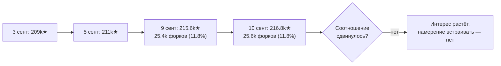
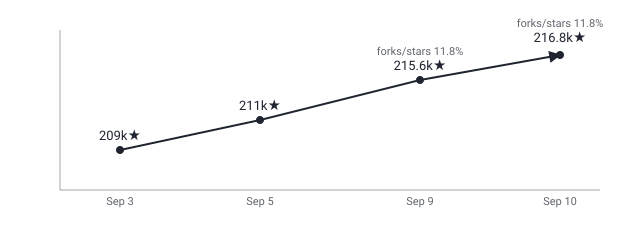

## Русская версия

# deepseek-harness: соотношение форки/звёзды не сдвинулось ни на процент за неделю — и это само по себе сигнал

Мы следим за [deepseek-ai/deepseek-harness](https://github.com/deepseek-ai/deepseek-harness) («Everything is a Plugin») с 3 сентября. Сегодняшние цифры: 215,565 → 216,754 звёзд (+1,189 за окно), 25,625 форков, TypeScript, категория «Deepseek» в дайджесте. 3 сентября мы разбирали архитектурный тезис «всё — плагин» и то, что расширяемость без модели прав доступа — это риск, а не только удобство: если любой компонент можно заменить плагином, вопрос «кто решает, какой плагин доверенный» становится центральным, а не побочным.

Сегодня интереснее не сам тезис, а то, что показывает динамика за неделю. 9 сентября форки/звёзды были 25,437 / 215,565 ≈ 11.8%. Сегодня — 25,625 / 216,754, тоже ≈ 11.8%. Абсолютный прирост звёзд за окно чуть вырос — с 1,018 (9 сентября) до 1,189 (сегодня), — но пропорция форков к звёздам не сдвинулась ни на десятую долю процента. Если считать форк более честным сигналом намерения («я хочу что-то реально сделать с этим кодом», а не просто отметить закладку) — это соотношение держится плоским уже несколько дней подряд.

Что это значит практически: приток внимания к репозиторию продолжается (звёзды растут), но соотношение людей, готовых форкнуть и разбираться, к тем, кто просто кликнул ⭐, не меняется. Это не говорит ни хорошо, ни плохо о самом инструменте — это говорит о том, что волна интереса пока не превращается в заметно большую долю активного использования, по крайней мере если судить по этому прокси. А вопрос про модель прав доступа для «everything is a plugin», поднятый неделю назад, за эту неделю никак публично не прояснился — ни в описании, ни в динамике, которая могла бы намекнуть на growing adoption среди разработчиков, реально встраивающих харнесс.

### Почему вам это важно

Если вы отслеживаете adopтion инструмента по GitHub trending, не ограничивайтесь абсолютным числом звёзд за день — считайте соотношение форки/звёзды в динамике за несколько дней. Плоское соотношение при растущих звёздах — сигнал, что растёт узнаваемость, а не обязательно готовность разворачивать инструмент в проде. Для [deepseek-harness](https://github.com/deepseek-ai/deepseek-harness) это особенно уместно, учитывая нерешённый вопрос про модель прав доступа к «плагинам».

## English version

# deepseek-harness: the fork-to-star ratio hasn't moved a tenth of a percent in a week — and that's a signal on its own

We've tracked [deepseek-ai/deepseek-harness](https://github.com/deepseek-ai/deepseek-harness) ("Everything is a Plugin") since September 3. Today's numbers: 215,565 → 216,754 stars (+1,189 over the window), 25,625 forks, TypeScript, filed under "Deepseek" in the digest. On September 3 we covered the "everything is a plugin" architectural thesis and the fact that extensibility without a permission model is a risk, not just a convenience: if any component can be swapped for a plugin, "who decides which plugin is trusted" becomes central, not incidental.

The more interesting thing today isn't the thesis itself but what the week's trend shows. On September 9, forks/stars were 25,437 / 215,565 ≈ 11.8%. Today: 25,625 / 216,754, also ≈ 11.8%. The absolute per-window star gain ticked up slightly — from 1,018 (Sept 9) to 1,189 (today) — but the fork-to-star ratio hasn't budged by a tenth of a percentage point. If a fork is treated as the more honest signal of intent ("I want to actually do something with this code," not just bookmark it), that ratio has held flat for several days running.

What this means in practice: the inflow of attention to the repo keeps growing (stars keep climbing), but the ratio of people willing to fork and dig in, versus those who just click ⭐, isn't shifting. That doesn't say anything good or bad about the tool itself — it says the interest wave isn't visibly converting into a growing share of active use, at least by this proxy. And the permission-model question for "everything is a plugin," raised a week ago, hasn't been publicly clarified in that time — not in the description, and not in a trend pattern that would hint at growing adoption among developers actually embedding the harness.

### Why it matters

If you're tracking tool adoption via GitHub trending, don't stop at the raw daily star count — track the fork-to-star ratio over several days. A flat ratio alongside rising stars signals growing recognition, not necessarily growing readiness to deploy the tool in production. That's especially relevant for [deepseek-harness](https://github.com/deepseek-ai/deepseek-harness), given the still-unresolved question of a permission model for its "plugins."
