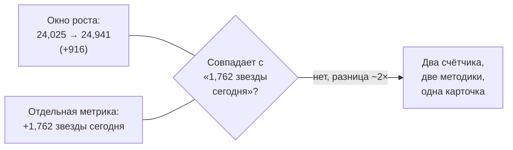
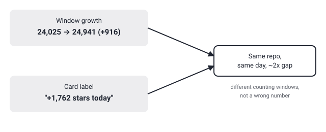

## Русская версия

# gods-eye-view: «данные настоящие», но собственные цифры дайджеста друг другу противоречат

В сегодняшнем трендовом списке репозиторий [bilawalsidhu/gods-eye-view](https://github.com/bilawalsidhu/gods-eye-view) идёт под номером 2: «симулятор шпионского спутника в браузере, только данные настоящие» — живая открытая геопространственная разведка на фотореалистичном 3D-глобусе, JavaScript. Сама идея звучит эффектно: не рендер выдуманной планеты, а визуализация поверх реальных источников. Но прежде чем поверить фразе «данные настоящие» на слово, стоит взглянуть на цифры роста самого репозитория — благо они у нас перед глазами.

Карточка даёт две метрики одновременно: окно роста звёзд 24,025 → 24,941, то есть +916, и отдельно подпись «1,762 stars today». Это разные числа для, по идее, одного и того же дня — расхождение почти в два раза. Такое уже случалось с другими репозиториями в этом дайджесте (например, с ECC несколько дней назад, где ранг #1 не совпадал с фактическими показателями роста): трендовые агрегаторы у GitHub считают «today» и «за окно наблюдения» по разным правилам — разные часовые пояса отсечки, разная ширина окна, разный момент снятия снимка. Ни одна из цифр не «неправильная» сама по себе, но карточка подаёт их так, будто это одно и то же число, и это стоит держать в уме, когда вы в следующий раз увидите красивый прирост в трендах.

Это не значит, что сам проект — фикция. «Настоящие данные» в описании репозитория — это утверждение о его архитектуре (какие источники он подключает), а не о темпах роста звёзд, и одно с другим никак не связано. Просто ирония в том, что репозиторий, который продаёт себя через доверие к данным, сам оказывается витриной для двух не бьющихся друг с другом чисел в одной карточке. Прежде чем доверять заявлению «данные настоящие» на уровне спутниковых снимков и геолокации, разумно посмотреть, откуда конкретно подключены источники и как часто они обновляются — это [написано в самом репозитории](https://github.com/bilawalsidhu/gods-eye-view), а не в трендовой карточке.

### Почему вам это важно

Когда вы оцениваете «живость» открытого проекта по трендам GitHub, не берите на веру единственное число на карточке — там часто соседствуют минимум две разные методики подсчёта звёзд за один день, и они не обязаны совпадать. То же правило переносится и на любое другое маркетинговое утверждение в описании репозитория: «настоящие данные» нужно проверять по источникам, а не по красивой формулировке.

## English version

# gods-eye-view: "the data is real," but the digest's own numbers don't agree with each other

Today's trending list puts [bilawalsidhu/gods-eye-view](https://github.com/bilawalsidhu/gods-eye-view) at #2: "a spy satellite simulator in your browser, except the data is real" — live open-source spatial intelligence on a photorealistic 3D globe, JavaScript. The pitch is striking on its own: not a rendering of a fictional planet, but a visualization layered on real sources. But before taking "the data is real" at face value, it's worth looking at the growth numbers for the repo itself — they're sitting right there.

The card reports two metrics at once: a growth window of 24,025 → 24,941 stars, i.e. +916, and separately a "1,762 stars today" label. Those are two different numbers for, ostensibly, the same day — a gap of nearly 2×. This has happened before with other repos in this digest (ECC a few days back, where the #1 rank didn't match its actual growth figures): GitHub trending aggregators compute "today" and "over the observation window" by different rules — different cutoff timezones, different window widths, different snapshot timing. Neither number is "wrong" on its own, but the card presents them as if they were the same figure, and that's worth remembering the next time a trending card shows an eye-catching gain.

None of this means the project itself is fiction. "Real data" in the repo's description is a claim about its architecture (which sources it wires up), not about its star-growth velocity, and the two have nothing to do with each other. The irony is simply that a repo that sells itself on trusting the data turns out to be a showcase for two numbers on its own card that don't reconcile. Before trusting a claim of "real data" at the level of satellite imagery and geolocation, it's reasonable to check exactly which sources are wired in and how often they refresh — that's [documented in the repo itself](https://github.com/bilawalsidhu/gods-eye-view), not on the trending card.

### Why it matters

When you gauge an open-source project's "liveness" from GitHub trending, don't take a single number on the card at face value — there are often at least two different star-counting methodologies sitting side by side, and they aren't required to agree. The same rule carries over to any other marketing claim in a repo's description: "real data" needs checking against the actual sources, not against a well-turned phrase.
