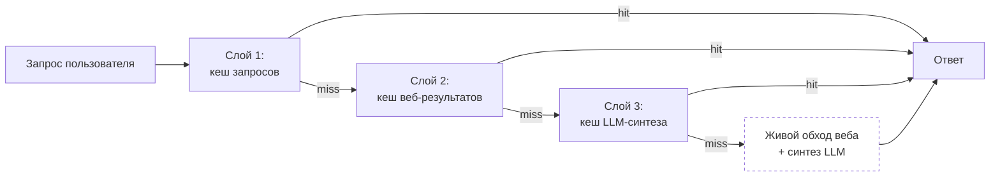
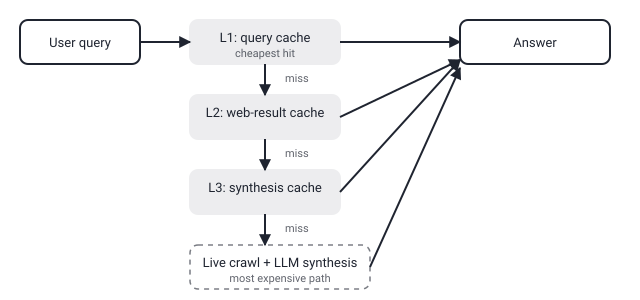

## Русская версия

# OreoLook: три слоя кеша ради того, чтобы ответ на базе LLM-поиска не ждал GPU

В сегодняшнем дайджесте — статья [«A Three-Layer Caching Architecture for Low-Latency LLM Web Search on Commodity CPU Hardware»](https://huggingface.co/papers/2609.05463) от Ayushman Bhattacharya и Nihal Gazi. Отправная точка авторов проста: продукты вроде ChatGPT search, Google AI Overviews и Perplexity дают ответы, синтезированные LLM поверх живых результатов веб-поиска — но всё это обычно предполагает GPU-инфраструктуру под капотом. Авторы представляют OreoLook (ранее lixSearch) — открытый движок ответов, который пытается дать сравнимый результат на обычном CPU-железе, и ключевой инструмент для этого — не более мощная модель, а трёхслойная архитектура кеширования.

Сама идея трёхуровневого кеша логична, если разложить путь запроса на этапы, где можно переиспользовать уже посчитанное. Первый уровень — кеш самих запросов: если кто-то уже спрашивал что-то похожее, ответ можно отдать сразу. Второй — кеш результатов веб-обхода: даже если формулировка вопроса новая, набор релевантных страниц для темы часто пересекается с уже проиндексированным. Третий — кеш LLM-синтеза: самый дорогой шаг, генерация связного ответа поверх найденных источников, тоже можно закешировать частично, если контекст похож. Логика в том, что каждый промах на верхнем уровне стоит дороже предыдущего, поэтому архитектура старается «отсеивать» как можно больше запросов на дешёвых слоях, прежде чем доходить до полноценного живого обхода и генерации.

Аннотация обрывается на слове «automated bro…» — судя по всему, речь про автоматизированный браузинг (automated browsing) как часть пайплайна сбора веб-результатов, но детали механизма остаются за кадром обрезанного текста; за точной архитектурой краулинга и метриками латентности нужно идти в [полный текст статьи](https://huggingface.co/papers/2609.05463). Важно, впрочем, не путать заявленную цель с доказанным результатом: «commodity CPU hardware» — это описание целевого сценария развёртывания, а не гарантия, что латентность действительно сопоставима с GPU-решениями конкурентов — эту часть стоит проверять по бенчмаркам в самой статье, а не по формулировке в заголовке.

### Почему вам это важно

Если вы проектируете LLM-поиск с бюджетом на инфраструктуру меньше, чем у крупных игроков, многослойное кеширование — это не экзотика, а прямой способ снизить долю запросов, которым нужен полный дорогой путь (веб-обход + синтез). Но прежде чем опираться на конкретную архитектуру вроде OreoLook, стоит смотреть не на заявление «CPU-friendly» в заголовке, а на реальные цифры латентности и hit-rate по слоям кеша в тексте статьи.

## English version

# OreoLook: three cache layers so an LLM-search answer doesn't have to wait on a GPU

Today's digest includes [«A Three-Layer Caching Architecture for Low-Latency LLM Web Search on Commodity CPU Hardware»](https://huggingface.co/papers/2609.05463) by Ayushman Bhattacharya and Nihal Gazi. The authors' starting point is straightforward: products like ChatGPT search, Google's AI Overviews, and Perplexity deliver LLM-synthesized answers grounded in live web results — but that setup typically assumes GPU infrastructure underneath. The authors present OreoLook (formerly lixSearch), an open-source answer engine that tries to deliver a comparable result on ordinary CPU hardware, and the key lever for that isn't a bigger model — it's a three-layer caching architecture.

The three-tier idea makes sense once you break a query's path into stages where already-computed work can be reused. The first layer caches the queries themselves: if someone already asked something similar, the answer can be returned directly. The second caches web-crawl results: even when the exact phrasing is new, the set of relevant pages for a topic often overlaps with what's already indexed. The third caches LLM synthesis: the most expensive step, generating a coherent answer from the retrieved sources, can also be partially cached when the context is similar. The logic is that each miss at a higher layer costs more than the last, so the architecture tries to filter out as many queries as possible at the cheap layers before falling through to a full live crawl and generation pass.

The abstract cuts off at "automated bro…" — presumably referring to automated browsing as part of the web-result collection pipeline, but the mechanism's details are lost to the truncated text; the exact crawling architecture and latency numbers require the [full paper](https://huggingface.co/papers/2609.05463). It's worth not conflating the stated goal with a proven result, though: "commodity CPU hardware" describes the target deployment scenario, not a guarantee that latency actually matches GPU-backed competitors — that part needs checking against the paper's own benchmarks, not the title's phrasing.

### Why it matters

If you're building LLM search on an infrastructure budget smaller than the big players', multi-layer caching isn't exotic — it's a direct lever for cutting the share of queries that need the full expensive path (web crawl plus synthesis). But before leaning on a specific architecture like OreoLook, look past the "CPU-friendly" claim in the title and check the actual latency numbers and per-layer hit rates reported in the paper's body.
