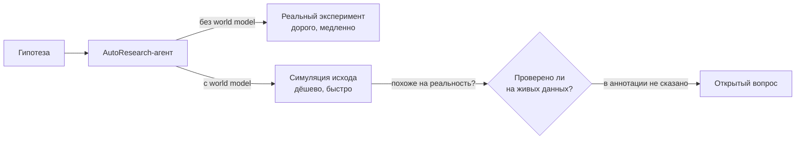
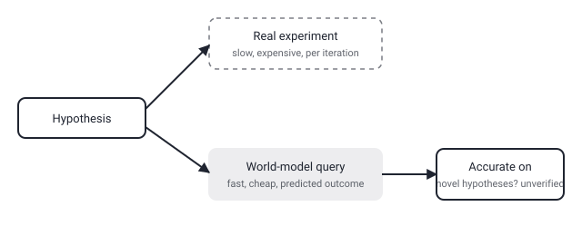

## Русская версия

# Зачем агенту, который автоматизирует исследования, вообще нужна «модель мира»

В сегодняшнем дайджесте — статья [«Scaling Automatic Research Agents via World Models»](https://huggingface.co/papers/2608.12564) (Xiyuan Yang, Sheikh Sarwar, Jingru Cheng, Zhan Shi, Duanshun Li и соавторы). Аннотация формулирует контекст: автоматизация эмпирических исследований — давнее направление в ИИ, и агенты AutoResearch приближают эту цель к реальности, поскольку современные LLM способны самостоятельно реализовывать… — и обрывается прямо на слове «implement». Дальше в тексте, видимо, идёт про то, что именно агенты реализуют самостоятельно (код эксперимента? анализ данных? весь пайплайн?), но эта часть осталась за пределами обрезанной аннотации.

Что можно сказать по заголовку и по устоявшемуся смыслу термина «world model» в других контекстах (RL, планирование): это обучаемая модель, которая предсказывает последствия действия, не выполняя его в реальности. Для агента, который автоматизирует исследования, идея масштабирования через world model напрашивается сама: реальный эксперимент — код, который нужно запустить, данные, которые нужно собрать, вычисления, которые нужно провести — стоит времени и денег на каждой итерации. Если у агента есть модель, которая с достаточной точностью предсказывает исход эксперимента без его фактического проведения, агент может перебрать на порядок больше гипотез за то же время, отбирая только самые многообещающие для реальной проверки. Именно так world models используются в обучении с подкреплением: агент играет с симуляцией среды, а не только с самой средой, что резко удешевляет исследование пространства возможных действий.

Ключевой вопрос, на который аннотация не отвечает: насколько предсказания world model в этой конкретной работе соответствуют результатам реальных экспериментов, и как авторы это измеряют. Это ровно то место, где подобные подходы обычно расходятся с ожиданиями — модель мира, обученная на прошлых экспериментах, может систематически ошибаться именно там, где реальность интереснее всего, то есть на новых, нетипичных гипотезах, а не на тех, что похожи на уже виденные. Ответ на этот вопрос — в [полном тексте статьи](https://huggingface.co/papers/2608.12564), а не в её первых двух предложениях.

### Почему вам это важно

Если вы видите фразу «masштабирование через world model» применительно к автоматизации исследований — это обещание меньшей стоимости на итерацию, а не гарантия качества итогового результата. Прежде чем полагаться на такой агент для реальных решений, стоит спросить: как измерена точность world model на гипотезах, которые она раньше не видела, а не только на тех, что похожи на обучающие данные.

## English version

# Why would a research-automating agent need a "world model" at all

Today's digest includes [«Scaling Automatic Research Agents via World Models»](https://huggingface.co/papers/2608.12564) (Xiyuan Yang, Sheikh Sarwar, Jingru Cheng, Zhan Shi, Duanshun Li, and co-authors). The abstract sets up the context: automating empirical research is a long-standing direction in AI, and AutoResearch agents are bringing that goal within reach as modern LLMs show the capacity to independently implement… — and it cuts off right at "implement." What follows presumably describes exactly what the agents implement independently (experiment code? data analysis? the whole pipeline?), but that part is lost to the truncated abstract.

What can be said from the title and from how "world model" is used elsewhere (RL, planning): it's a trainable model that predicts the consequences of an action without actually carrying it out. For an agent automating research, the scaling argument for a world model is intuitive: a real experiment — code that has to run, data that has to be collected, compute that has to be spent — costs time and money on every iteration. If an agent has a model that predicts an experiment's outcome accurately enough without actually running it, the agent can sift through an order of magnitude more hypotheses in the same amount of time, reserving real verification only for the most promising ones. That's exactly how world models get used in reinforcement learning: an agent plays against a simulation of the environment rather than the environment alone, which sharply cuts the cost of exploring the space of possible actions.

The key question the abstract leaves unanswered: how well do this particular work's world-model predictions actually match real experimental results, and how do the authors measure that. That's exactly where approaches like this tend to diverge from expectations in practice — a world model trained on past experiments can be systematically wrong precisely where reality gets interesting, on novel, atypical hypotheses, rather than ones resembling what it has already seen. That answer lives in the [full paper](https://huggingface.co/papers/2608.12564), not in its opening two sentences.

### Why it matters

If you see the phrase "scaling via a world model" applied to research automation, treat it as a promise of lower cost per iteration, not a guarantee of output quality. Before relying on such an agent for real decisions, ask how the world model's accuracy was measured on hypotheses it hadn't seen before — not just ones resembling its training data.
