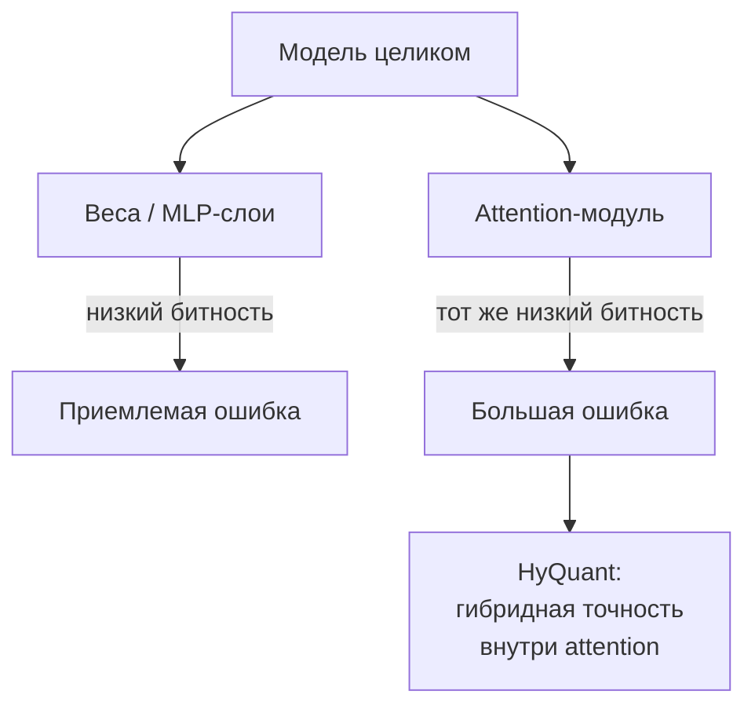
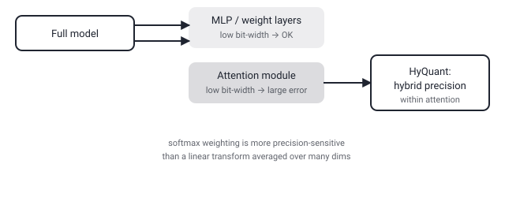

## Русская версия

# HyQuant: почему attention нельзя квантовать так же грубо, как остальную модель

В сегодняшнем дайджесте — статья [«HyQuant: Hybrid-Precision Quantization for LLM Attention»](https://huggingface.co/papers/2608.27875) (Jiatong Ding, Bingxin Xing, Yu Zhang, Dian Ding, Xiaodong Yi и соавторы). Отправная точка знакома всем, кто разворачивал LLM в проде: квантование — снижение битности чисел, которыми представлены веса и активации, — широко применяется в обучении и инференсе именно ради снижения стоимости и повышения эффективности. Проблема, которую формулируют авторы: низкобитное квантование attention-модуля вносит непропорционально большую ошибку по сравнению с квантованием остальных частей сети, и на этом аннотация обрывается — на словах «very low bit-wi…», прямо перед тем, как назвать конкретный битрейт.

Почему attention вообще ведёт себя иначе, чем, скажем, полносвязные слои — вопрос, который сама аннотация не раскрывает, но логика в отрасли обычно такая: attention считает веса значимости между токенами через softmax, и это по своей природе более чувствительная к точности операция, чем линейное преобразование в MLP-слое — небольшая ошибка округления в attention-скорах может резко исказить, каким токенам модель «уделяет внимание», в то время как та же ошибка в весах MLP-слоя усредняется по большему числу измерений. Название статьи — «гибридная точность» — намекает на решение: не квантовать весь attention-модуль одним и тем же низким битрейтом, а выборочно оставлять более высокую точность там, где ошибка обходится дороже всего, и опускать битность там, где это безопасно.

Здесь важно не путать название метода с доказанным результатом. «Hybrid-precision» — это архитектурное решение, гипотеза о том, где именно проходит граница между «можно ужать» и «нельзя ужать» внутри attention. Работает ли эта граница именно так, как предполагают авторы, и какой реальный выигрыш в скорости/памяти при этом сохраняется — вопрос к бенчмаркам в [полном тексте статьи](https://huggingface.co/papers/2608.27875), которых аннотация просто не успевает показать.

### Почему вам это важно

Если вы квантуете модель для продакшена и получаете неожиданно плохое качество при том же битрейте, который отлично работал для другой архитектуры — не считайте, что квантование «просто не работает» для вашего случая. Attention и MLP-слои по-разному переносят потерю точности, и однородное квантование всей модели одним битрейтом может быть не оптимальным выбором именно из-за attention-модуля.

## English version

# HyQuant: why attention can't be quantized as bluntly as the rest of the model

Today's digest includes [«HyQuant: Hybrid-Precision Quantization for LLM Attention»](https://huggingface.co/papers/2608.27875) (Jiatong Ding, Bingxin Xing, Yu Zhang, Dian Ding, Xiaodong Yi, and co-authors). The starting point is familiar to anyone who has deployed an LLM in production: quantization — lowering the bit-width of the numbers representing weights and activations — is widely used in training and inference specifically to cut cost and improve efficiency. The problem the authors state is that low-bit quantization of the attention module introduces a disproportionately large error compared to quantizing the rest of the network — and the abstract cuts off right there, at "very low bit-wi…," just before naming a specific bit rate.

Why attention behaves differently from, say, fully connected layers isn't something the abstract itself explains, but the usual industry reasoning goes like this: attention computes relevance weights between tokens through softmax, which is inherently a more precision-sensitive operation than a linear transform in an MLP layer — a small rounding error in attention scores can sharply distort which tokens the model "attends to," while the same error in an MLP layer's weights gets averaged out over many more dimensions. The paper's title — "hybrid precision" — hints at the fix: rather than quantizing the entire attention module to the same low bit rate, selectively keep higher precision where errors are most costly and drop bit-width where it's safe.

It's worth not conflating the method's name with a proven result here. "Hybrid-precision" is an architectural choice, a hypothesis about exactly where the line falls between "safe to compress" and "not safe to compress" inside attention. Whether that line actually falls where the authors expect, and what real speed/memory gain survives it, is a question for the benchmarks in the [full paper](https://huggingface.co/papers/2608.27875) — which the abstract simply doesn't get around to showing.

### Why it matters

If you quantize a model for production and get unexpectedly poor quality at a bit rate that worked fine for a different architecture, don't assume quantization "just doesn't work" for your case. Attention and MLP layers tolerate precision loss differently, and quantizing the whole model uniformly at one bit rate may not be the optimal choice specifically because of the attention module.
