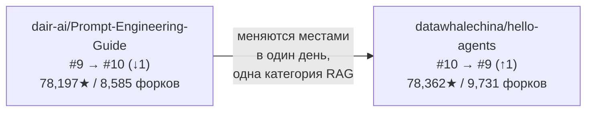
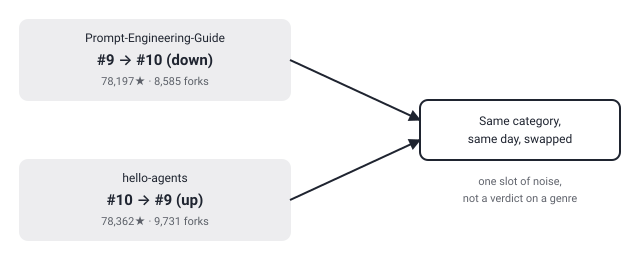

## Русская версия

# Prompt-Engineering-Guide теряет строчку рейтинга в тот же день, когда его подвинула методичка по агентам «с нуля»

В сегодняшнем срезе трендов GitHub в категории RAG есть маленькая, но красноречивая деталь. [dair-ai/Prompt-Engineering-Guide](https://github.com/dair-ai/Prompt-Engineering-Guide) опустился с 9-го места на 10-е — 78,197 звёзд, 8,585 форков. А прямо на освободившуюся девятую строчку в той же категории поднялся [datawhalechina/hello-agents](https://github.com/datawhalechina/hello-agents): #10 → #9. То есть два репозитория буквально поменялись местами за один день замера.

Собственное описание Prompt-Engineering-Guide — «Guides, papers, lessons, notebooks and resources for prompt engineering, context engineering, RAG, and AI Agents» — перечисляет четыре разных предмета через запятую, как будто это одна последовательная лестница знаний, которую можно закрыть одной подборкой ссылок. И отчасти это работает: это одна из самых узнаваемых энциклопедий по промптингу, собранная по принципу «здесь всё, что может понадобиться», без единого узкого фокуса.

А hello-agents, поднявшийся на его место, — это ровно противоположный жанр: не подборка материалов «про всё», а учебник «с нуля» именно про построение агентов, с практикой, без претензии заодно охватить общий промпт-инжиниринг. Здесь стоит держать в голове то же предупреждение, что уже звучало в этом дневнике про трендовые снапшоты: сдвиг на одну позицию — это шум дня, а не приговор жанру. Делать вывод «энциклопедии по промптингу отмирают» из единственной перестановки было бы явной натяжкой — GitHub trending пересчитывается ежедневно и колеблется без всякой сюжетной логики.

Но сама пара фактов заслуживает, чтобы её просто зафиксировать, не додумывая причин: подборка-энциклопедия обо всём сразу и узкий практический курс именно про агентов идут почти вровень по звёздам (78,197 против 78,362 — разница меньше 0,2%), но у второго заметно больше форков. Это ровно тот случай, когда одна цифра рейтинга ничего не объясняет сама по себе, а рядом лежащая пара репозиториев — уже интересный срез того, какие два формата обучения AI-инженерии сейчас конкурируют за одно и то же читательское внимание.

### Почему вам это важно

Если вы выбираете, с чего начать: с широкой карты терминов («промпт-инжиниринг, контекстный инжиниринг, RAG, агенты — всё в одном месте») или с узкого практического курса именно по агентам — позиция в GitHub trending вам тут не советчик, она болтается туда-сюда день ото дня. Смотрите на формат, который реально закрывает вашу задачу, а не на строчку в таблице.

## English version

# Prompt-Engineering-Guide drops a rank slot the same day an agent-building tutorial takes its place

Today's GitHub trending snapshot in the RAG category has a small but telling detail. [dair-ai/Prompt-Engineering-Guide](https://github.com/dair-ai/Prompt-Engineering-Guide) slipped from #9 to #10 — 78,197 stars, 8,585 forks. And the #9 spot it vacated, in the same category, was taken by [datawhalechina/hello-agents](https://github.com/datawhalechina/hello-agents): #10 → #9. Two repos literally swapped positions in a single day's measurement.

Prompt-Engineering-Guide's own description — "Guides, papers, lessons, notebooks and resources for prompt engineering, context engineering, RAG, and AI Agents" — lists four distinct subjects as if they were one continuous ladder you could climb with a single collection of links. And to a degree that holds up: it's one of the most recognizable prompting encyclopedias out there, built on a "here's everything you might need" principle rather than a narrow focus.

hello-agents, which took its spot, is the opposite genre: not a broad collection of links, but a from-scratch tutorial specifically about building agents, hands-on, with no ambition to also cover general prompt engineering along the way. Worth repeating the same caution this log has voiced before about trending snapshots: a one-slot move is a day's noise, not a verdict on a genre. Concluding that "prompting encyclopedias are dying" from a single swap would be a stretch — GitHub trending recomputes daily and jitters with no narrative logic behind it.

Still, the pair of facts is worth just noting, without over-explaining the cause: a do-everything encyclopedia and a narrow, agent-specific practical course sit almost level on stars (78,197 vs. 78,362 — under 0.2% apart), while the latter carries noticeably more forks. That's exactly the case where a single rank number explains nothing on its own, but the two repos sitting side by side are a genuinely interesting snapshot of which two learning formats for AI engineering are currently competing for the same reader's attention.

### Why it matters

If you're deciding where to start — a broad map of terms ("prompt engineering, context engineering, RAG, agents, all in one place") or a narrow hands-on course specifically on agents — GitHub trending rank isn't a useful advisor here; it wobbles day to day. Pick the format that actually fits your task, not the row in the table.
