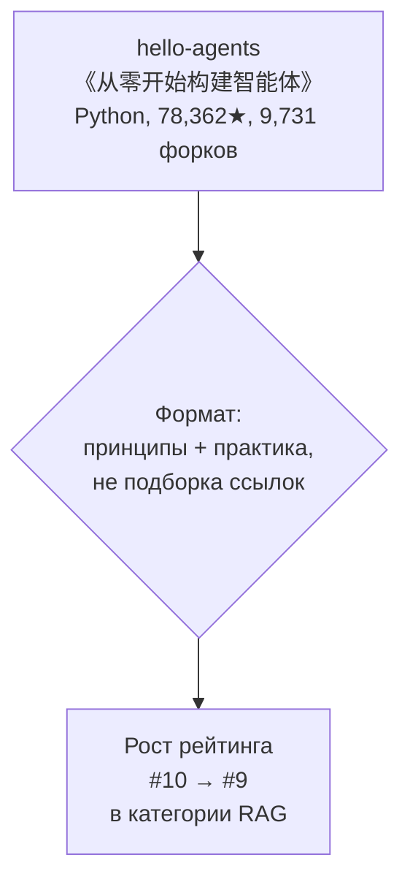
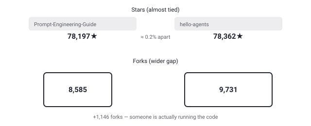

## Русская версия

# hello-agents: китайский учебник «постройте агента с нуля» почти догнал по звёздам главную энциклопедию промптинга

Сегодня в трендах GitHub в категории RAG поднимается [datawhalechina/hello-agents](https://github.com/datawhalechina/hello-agents): #10 → #9. Название на китайском — «从零开始构建智能体» — переводится как «построение агентов с нуля», с подзаголовком «从零开始的智能体原理与实践教程»: учебник принципов и практики агентов, написанный именно с прицелом на «с нуля», а не на готовую библиотеку, которую нужно просто подключить. Язык репозитория — Python, 78,362 звезды и 9,731 форк.

Число звёзд здесь любопытно само по себе: это почти вплотную к [dair-ai/Prompt-Engineering-Guide](https://github.com/dair-ai/Prompt-Engineering-Guide) (78,197★) — репозиторию, который сегодня же опустился на строчку ниже в том же самом рейтинге. Разница меньше 0,2%, при этом у hello-agents на 1,146 форков больше. Разница в форках интереснее разницы в звёздах: форк — это действие, а не клик, кто-то реально скопировал репозиторий, чтобы редактировать код или пройти примеры руками, а не просто отметил «нравится».

Ключевое отличие в формате, а не только в цифрах. Prompt-Engineering-Guide — это по собственному описанию подборка «guides, papers, lessons, notebooks and resources», то есть библиотека материалов на любой случай: открыл нужный раздел, взял то, что требуется прямо сейчас, закрыл вкладку. hello-agents — это последовательный курс: от принципов к практике, специально про то, как устроен агент изнутри — цикл рассуждения, вызов инструментов, память, — а не про то, как красиво сформулировать один промпт. Для читателя это разные типы усилий: один формат даёт вам карту местности и предлагает исследовать её самому в произвольном порядке, второй — ведёт по фиксированному маршруту шаг за шагом, от главы к главе.

Само по себе место в рейтинге ничего не доказывает — GitHub trending обновляется ежедневно и легко колеблется на одну-две позиции без всякой глубинной причины. Но количество форков, близкое к звёздам основного конкурента в категории, — это уже не шум одного дня, а сигнал, что аудитория реально садится и разбирает код, а не просто закладывает репозиторий в закладки.

### Почему вам это важно

Если вы выбираете учебный материал по агентам, обращайте внимание не столько на звёзды и позицию в трендах, сколько на формат: подборка ссылок «на всякий случай» и пошаговый курс «сделай сам» решают разные задачи и требуют разного времени на прохождение — выбирайте под то, что вам действительно нужно сейчас.

## English version

# hello-agents: a Chinese "build an agent from scratch" tutorial nearly ties the reigning prompting encyclopedia on stars

Today's GitHub trending in the RAG category shows [datawhalechina/hello-agents](https://github.com/datawhalechina/hello-agents) climbing: #10 → #9. Its Chinese title, 从零开始构建智能体, translates to "building agents from scratch," with the subtitle 从零开始的智能体原理与实践教程 — a principles-and-practice tutorial on agents, built explicitly around "from scratch" rather than a library you just plug in. It's written in Python, with 78,362 stars and 9,731 forks.

The star count alone is worth pausing on: it's nearly tied with [dair-ai/Prompt-Engineering-Guide](https://github.com/dair-ai/Prompt-Engineering-Guide) (78,197★), a repo that dropped a rank in the very same ranking today. The gap is under 0.2%, while hello-agents carries 1,146 more forks. The fork gap is more telling than the star gap: a fork is an action, not a click — someone actually copied the repo to edit the code or work through the examples by hand, not just bookmarked it.

The key difference is in format, not just the numbers. By its own description, Prompt-Engineering-Guide is a collection of "guides, papers, lessons, notebooks and resources" — a reference library for any situation. hello-agents is a sequential course: principles first, then practice, specifically about how an agent works under the hood rather than how to phrase a good prompt. For a reader, these ask for different kinds of effort: one hands you a map and lets you explore it yourself, the other walks you through a route step by step.

Rank position alone proves nothing — GitHub trending updates daily and wobbles by a slot or two without any deep cause behind it. But a fork count that close to the category's leading competitor isn't a single day's noise; it's a signal that people are actually sitting down and working through the code, not just bookmarking the repo for later.

### Why it matters

If you're picking learning material on agents, weigh format over stars and trending rank: a "just in case" link collection and a "do it yourself" step-by-step course solve different problems and demand different amounts of time — pick the one that matches what you actually need right now.
