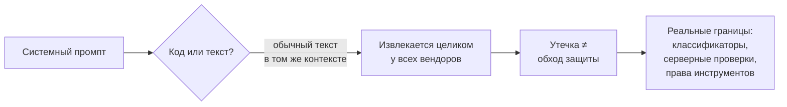
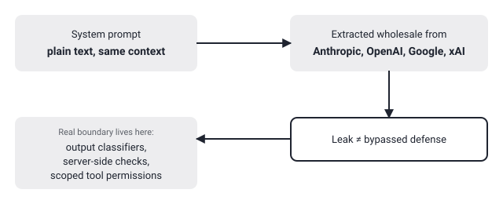

## Русская версия

# system_prompts_leaks: почему слитый системный промпт — не взломанная защита, а просто текст

Сегодня в трендах на третьем месте — репозиторий [asgeirtj/system_prompts_leaks](https://github.com/asgeirtj/system_prompts_leaks): 65,354 → 65,550 звёзд за окно (+196). Это не разовая утечка одного продукта, а постоянно обновляемая коллекция извлечённых системных промптов сразу у Anthropic (Claude Fable 5.1, Opus 5, Claude Design, Claude Code), у OpenAI (ChatGPT GPT-6-Astra, Codex), у Google (Gemini 3.8 Flash, 3.1 Pro, Antigravity), у xAI (Grok, Grok Bot), а также у Cursor, Kimi и других — репозиторий обновляется вслед за выходом новых моделей.

Соблазн прочитать такую подборку как «вот карта уязвимостей»: зная точный текст инструкции, её проще обойти. Но сама коллекция демонстрирует более полезный факт: системный промпт — это обычный текст в том же контекстном окне, что и остальной диалог, а не отдельный защищённый слой кода. Если инструкцию можно вытащить целиком у настолько разных вендоров и продуктов — от чат-бота до агентного харнесса вроде Claude Code, — значит, ни у одного из них системный промпт никогда не проектировался как криптографически или архитектурно защищённая граница. Это конфигурация поведения по умолчанию, а не замок.

Отсюда практический вывод для тех, кто строит поверх LLM: если ваша модель безопасности полагается на то, что «пользователь никогда не узнает системный промпт», у вас нет модели безопасности — у вас есть надежда. Настоящие ограничения (если они вообще нужны) должны жить не в тексте инструкции, а там, где их нельзя обойти простым переформулированием вопроса: классификатор контента поверх ответа, серверная проверка перед вызовом инструмента, урезанные права самого инструмента. Именно поэтому промпты Anthropic, OpenAI и Google утекают примерно с одинаковой частотой, а критичные для безопасности вещи (например, что агент не может списать деньги без отдельного подтверждения) в лучшем случае реализованы вне промпта — в коде, который не покажет ни один jailbreak.

Есть и забавная симметрия: инструкции агентных харнессов вроде Claude Code теперь тоже читаемы построчно в публичном репозитории — а значит, разработчикам таких систем стоит проектировать их так, будто пользователь и так знает содержимое инструкции, а не так, будто это секрет.

### Почему вам это важно

Если вы проектируете продукт на LLM, не кладите ничего критичного для безопасности в сам системный промпт — считайте его публичным документом, потому что рано или поздно (а часто и сразу) он таким и станет. Реальная граница безопасности — это код вокруг модели, а не текст внутри неё.

## English version

# system_prompts_leaks: why a leaked system prompt isn't a broken security boundary — it's just text

Today's #3 trending spot goes to [asgeirtj/system_prompts_leaks](https://github.com/asgeirtj/system_prompts_leaks): 65,354 → 65,550 stars over the window (+196). It's not a one-off leak of a single product but a continuously updated collection of extracted system prompts from Anthropic (Claude Fable 5.1, Opus 5, Claude Design, Claude Code), OpenAI (ChatGPT GPT-6-Astra, Codex), Google (Gemini 3.8 Flash, 3.1 Pro, Antigravity), xAI (Grok, Grok Bot), plus Cursor, Kimi and more — updated as new models ship.

The tempting read is "here's a map of exploitable weaknesses" — knowing the exact wording should make it easier to route around. But the collection itself demonstrates a more useful fact: a system prompt is ordinary text sitting in the same context window as the rest of the conversation, not a separately enforced layer of code. If the instruction can be pulled out wholesale across vendors this different and products this different — a chat assistant, an agentic harness like Claude Code — then none of them ever designed the system prompt to be a cryptographically or architecturally protected boundary. It's a default-behavior configuration, not a lock.

The practical takeaway for anyone building on top of an LLM: if your security model depends on "the user will never learn the system prompt," you don't have a security model — you have a hope. Whatever actually needs enforcing has to live somewhere a user can't undo just by rephrasing a question: a content classifier applied to the output, a server-side check before a tool call fires, a scoped-down permission on the tool itself. That's exactly why Anthropic, OpenAI, and Google prompts all leak at roughly the same rate — and why the things that actually matter for safety (an agent can't move money without a separate confirmation step, say) live outside the prompt, in code no jailbreak phrasing will show you.

There's a fitting symmetry too: agentic harness instructions like Claude Code's are now readable line by line in a public repo — a nudge to system designers to build as if the user already has the instruction text, not as if it's a secret.

### Why it matters

If you're building an LLM-backed product, don't put anything security-critical inside the system prompt itself — treat it as a public document, because sooner or later (often immediately) it will be one. The real security boundary is the code around the model, not the text inside it.
