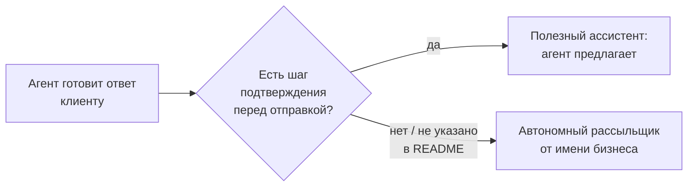
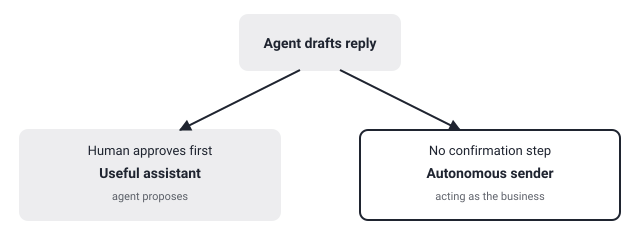

## Русская версия

# DeskcommCRM: ИИ-агент получает доступ к вашему WhatsApp, а не только к базе клиентов

Второе место в сегодняшних трендах — [melgarafael/DeskcommCRM](https://github.com/melgarafael/DeskcommCRM): 1,762 → 1,891 звезды за окно (+129), TypeScript. Позиционирование прямое: open-source «AI sales OS» — self-hosted CRM со «встроенными» ИИ-агентами и интеграцией WhatsApp через WAHA, заявленная как открытая альтернатива Kommo, Octadesk и Intercom для бизнеса, который продаёт через переписку. В описании также заявлены «MCP-ready», мультитенантность и соответствие LGPD (бразильский аналог GDPR) — судя по всему, проект целится в латиноамериканский рынок, где WhatsApp — основной канал продаж малого бизнеса.

Здесь стоит разделить два разных обещания. Первое — «self-hosted» и «LGPD-совместимый» — про то, где физически хранятся данные клиентов и кто формально отвечает за их обработку; self-hosting действительно закрывает часть вопросов резидентности данных, которые иначе упирались бы в стороннего SaaS-провайдера. Второе обещание — «native AI agents» с доступом к WhatsApp — совершенно другая история: агенту дают право отправлять сообщения реальным людям от имени бизнеса на живом канале продаж. WAHA (WhatsApp HTTP API) — неофициальный мост к WhatsApp через мультиустройство, а не официальный Business API со своими правилами модерации, а значит эта прослойка сама по себе не даёт вам ничего похожего на встроенные ограничения площадки.

Именно тут проходит настоящая граница авторизации, ради которой стоит открыть код [самого репозитория](https://github.com/melgarafael/DeskcommCRM), а не README: что именно может сделать агент сам — только предложить черновик ответа человеку-оператору на подтверждение, или отправить сообщение в WhatsApp немедленно? Есть ли отдельный шаг подтверждения перед реальной отправкой, лимиты на количество сообщений в единицу времени, журнал того, что агент сказал от имени компании? Ярлык «MCP-ready» сам по себе ничего не говорит об этом — это про совместимость протокола подключения инструментов, а не про то, какие права даны конкретным инструментам после подключения. Для CRM, которая живёт продажами через личную переписку, разница между «агент предлагает» и «агент отправляет» — это разница между полезным ассистентом и риском разослать клиентам что-то, чего никто не проверял.

### Почему вам это важно

Прежде чем подключать любого ИИ-агента к живому каналу коммуникации с клиентами — WhatsApp, email, SMS, — найдите в коде (не в маркетинговом описании) точку, где заканчивается предложение агента и начинается реальная отправка. Если такой точки подтверждения нет, у вас не «ИИ-ассистент по продажам», а автономный рассыльщик от имени вашего бизнеса.

## English version

# DeskcommCRM: the AI agent gets access to your WhatsApp, not just your customer database

Today's #2 trending spot is [melgarafael/DeskcommCRM](https://github.com/melgarafael/DeskcommCRM): 1,762 → 1,891 stars over the window (+129), TypeScript. The pitch is direct: an open-source "AI sales OS" — a self-hosted CRM with "native" AI agents and WhatsApp integration via WAHA, positioned as an open alternative to Kommo, Octadesk, and Intercom for chat-based sales businesses. The description also claims "MCP-ready," multi-tenancy, and LGPD compliance (Brazil's GDPR equivalent) — the project is clearly aimed at the Latin American market, where WhatsApp is the default sales channel for small business.

Worth separating two different promises here. The first — "self-hosted" and "LGPD-compliant" — is about where customer data physically lives and who's formally accountable for processing it; self-hosting genuinely closes off some data-residency questions that a third-party SaaS provider would otherwise own. The second promise — "native AI agents" wired to WhatsApp — is a completely different story: it's an agent granted the ability to send messages to real people, on behalf of a real business, over a live sales channel. WAHA (WhatsApp HTTP API) is an unofficial multi-device bridge into WhatsApp, not the official Business API with its own moderation rules — meaning this layer by itself doesn't hand you any platform-level guardrails.

That's exactly where the real authorization boundary sits, and it's worth reading [the repo's own code](https://github.com/melgarafael/DeskcommCRM) for rather than the README: can the agent only draft a reply for a human operator to approve, or does it send straight into WhatsApp on its own? Is there a confirmation step before a real send, a rate limit on messages per unit time, a log of what the agent said on the company's behalf? The "MCP-ready" label alone says nothing about any of this — it describes tool-connection protocol compatibility, not what rights a connected tool is actually granted once wired in. For a CRM whose whole business is selling through personal chat, the gap between "the agent proposes" and "the agent sends" is the gap between a useful assistant and the risk of blasting customers with something nobody reviewed.

### Why it matters

Before wiring any AI agent into a live customer communication channel — WhatsApp, email, SMS — find the point in the code (not the marketing copy) where a proposal ends and an actual send begins. If that confirmation point doesn't exist, what you have isn't a "sales assistant," it's an autonomous sender acting under your business's name.
