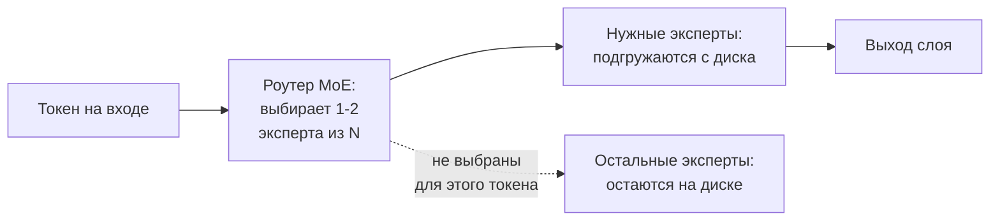
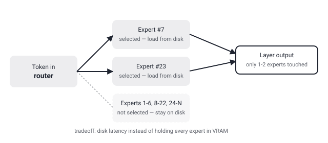

## Русская версия

# colibri: MoE-модель размером с фронтир умещается на вашем железе, потому что большая часть экспертов лежит на диске

Сегодня в топе трендов GitHub — [JustVugg/colibri](https://github.com/JustVugg/colibri), ранг #1, рост 29,671 → 30,312 звёзд. Питч короткий и амбициозный: «запускайте фронтир-модели MoE на железе, которое у вас уже есть — чистый C, ноль зависимостей, эксперты стримятся с диска. Крошечный движок, огромная модель». Написано на C, что само по себе необычно для инференс-движка в 2026 году, когда большинство таких проектов — обвязка на Python поверх CUDA-ядер.

Идея опирается на архитектурную особенность MoE (mixture-of-experts): в отличие от плотной модели, где каждый токен проходит через все веса, в MoE-слое роутер выбирает лишь одного-двух экспертов из десятков или сотен доступных. Это значит, что в любой момент времени активно используется маленькая доля от общего числа параметров модели — а раз так, нет строгой необходимости держать все эксперты одновременно в оперативной памяти или VRAM. Colibri, судя по описанию, эксплуатирует именно это: держит на диске экспертов, которые не нужны прямо сейчас, и подгружает конкретного эксперта только тогда, когда роутер его выбрал для текущего токена.

Плата за это — задержка. Диск, даже быстрый NVMe, на порядки медленнее VRAM, и если роутер для соседних токенов выбирает разных экспертов, движок будет постоянно гонять данные с диска в память — с прямым влиянием на токены в секунду. У этого подхода есть смысл ровно в одном сценарии: у вас нет достаточно VRAM, чтобы уместить всю модель целиком, но есть быстрый диск и вы готовы жертвовать скоростью ради самой возможности запустить модель такого размера локально. Фраза «immense model» в описании не говорит, о каком именно размере речь и какая latency получается на практике — эти цифры стоит смотреть в [самом репозитории](https://github.com/JustVugg/colibri), а не в одной строке трендовой карточки.

Кстати о карточке: она снова показывает знакомое нашему дайджесту расхождение — окно роста даёт +641 звезду (29,671 → 30,312), а отдельная подпись рапортует «868 stars today». Мы уже разбирали этот паттерн на примере gods-eye-view несколько дней назад: разные методики подсчёта «сегодня» у трендовых агрегаторов GitHub дают разные числа для одного и того же репозитория и дня. Ни цифра не врёт сама по себе — просто это два разных измерения, представленных как одно.

### Почему вам это важно

Если вы упираетесь в VRAM при попытке запустить крупную MoE-модель локально, offloading экспертов на диск — реальный, архитектурно обоснованный путь, а не трюк: он работает именно потому, что MoE уже активирует малую долю параметров на токен. Но прежде чем менять VRAM на диск в проде, проверяйте реальные цифры latency и throughput в репозитории, а не судите по формулировке «tiny engine, immense model» в описании.

## English version

# colibri: a frontier-sized MoE model fits your hardware because most of its experts just sit on disk

Today's top of GitHub trending is [JustVugg/colibri](https://github.com/JustVugg/colibri), ranked #1, with growth from 29,671 to 30,312 stars. The pitch is short and ambitious: "run frontier MoE models on hardware you already own — pure C, zero deps, experts streamed from disk. Tiny engine, immense model." It's written in C, which is unusual on its own for an inference engine in 2026, when most such projects are Python wrappers over CUDA kernels.

The idea leans on a specific architectural feature of mixture-of-experts (MoE) models: unlike a dense model, where every token passes through all the weights, an MoE layer's router picks only one or two experts out of the dozens or hundreds available. That means only a small fraction of the model's total parameters is actively used at any given moment — and if that's true, there's no strict requirement to keep every expert in RAM or VRAM at once. Colibri, going by its description, exploits exactly that: it keeps experts that aren't needed right now on disk, and pulls a specific expert into memory only once the router has selected it for the current token.

The cost is latency. Disk, even fast NVMe, is orders of magnitude slower than VRAM, and if the router picks different experts for adjacent tokens, the engine will keep shuttling data from disk into memory, with a direct hit to tokens per second. This tradeoff makes sense in exactly one scenario: you don't have enough VRAM to fit the whole model, but you do have a fast disk and are willing to trade speed for the mere ability to run a model of that size locally. The phrase "immense model" in the description doesn't say what size is actually meant or what latency that produces in practice — those numbers are worth checking in [the repo itself](https://github.com/JustVugg/colibri), not in one line on a trending card.

Speaking of the card: it shows a discrepancy this digest keeps running into — the window growth reports +641 stars (29,671 → 30,312), while a separate label reports "868 stars today." We covered the same pattern with gods-eye-view a few days back: different "today" counting methodologies on GitHub trending aggregators produce different numbers for the same repo on the same day. Neither figure is wrong on its own — they're just two different measurements presented as one.

### Why it matters

If you're VRAM-constrained trying to run a large MoE model locally, offloading experts to disk is a real, architecturally sound path, not a gimmick — it works precisely because MoE already activates only a small share of parameters per token. But before trading VRAM for disk in production, check the actual latency and throughput numbers in the repo rather than judging by the "tiny engine, immense model" phrasing in the description.
