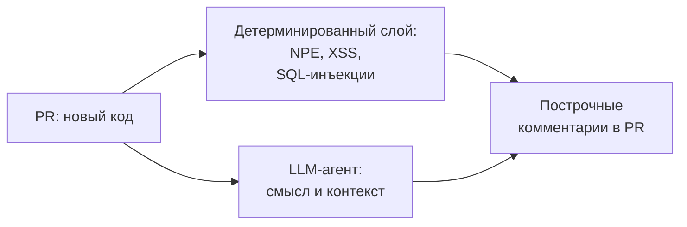
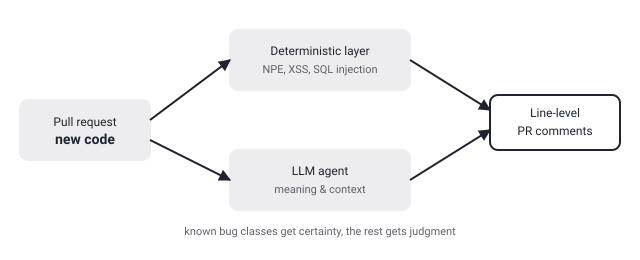

## Русская версия

# Alibaba выложила open-code-review: ревью кода поручили гибриду из детерминированного пайплайна и LLM-агента

Второе место в сегодняшнем GitHub trending с ростом 25,535 → 25,770 звёзд (+235) занимает [alibaba/open-code-review](https://github.com/alibaba/open-code-review) — инструмент для ревью кода от команды Alibaba. Описание в карточке репозитория звучит уверенно: «быстрый, эффективный, проверенный боем в масштабе Alibaba». Ключевая архитектурная деталь спрятана дальше: это «гибридная архитектура — детерминированные пайплайны плюс LLM-агент», с точными построчными комментариями и встроенным мультиязычным набором правил (NPE, потокобезопасность, XSS, SQL-инъекции). На этом описание в дайджесте обрывается — дальше упоминается что-то про OpenAI, но фраза не дописана, так что достраивать её мы не будем.

Сама идея гибрида заслуживает внимания отдельно от конкретного продукта. У статического анализа и линтеров есть железное преимущество: для класса багов вроде null pointer dereference или SQL-инъекции через конкатенацию строк существует детерминированная проверка, которая либо срабатывает, либо нет, без вероятностного шума. LLM-агент, наоборот, силён там, где правило заранее не напишешь: понять по контексту, что переменная используется не по назначению, или что комментарий в коде противоречит самой логике кода. Смешивая эти два подхода в одном пайплайне, инструмент, судя по описанию, отдаёт «твёрдые» классы багов детерминированному слою, а LLM оставляет то, что требует понимания смысла — а не пытается заставить модель угадывать заново то, что и так решается статическим анализом.

Что стоит держать в уме: фраза «battle-tested at Alibaba's scale» — это заявление о масштабе использования, а не о качестве находок, и она ничем не подкреплена в самой карточке репозитория. Сколько ложных срабатываний генерирует LLM-часть на реальном PR, какая доля построчных комментариев по факту полезна разработчику, а не шум — эти цифры стоит искать в [самом репозитории](https://github.com/alibaba/open-code-review), а не в одной строке трендового дайджеста.

### Почему вам это важно

Если вы выбираете или строите автоматизированный ревьюер кода, разделение «детерминированный слой ловит известные классы багов, LLM-слой берёт на себя контекстные вопросы» — архитектурно разумный паттерн, который стоит взять на вооружение независимо от конкретного инструмента. Но прежде чем доверять построчным комментариям LLM-агента в проде, проверяйте реальный процент полезных находок на своей кодовой базе — маркетинговая фраза про «battle-tested» ничего не говорит про precision конкретно вашего пайплайна.

## English version

# Alibaba ships open-code-review: a hybrid of deterministic pipelines and an LLM agent does the reviewing

Sitting at #2 in today's GitHub trending, with growth from 25,535 to 25,770 stars (+235), is [alibaba/open-code-review](https://github.com/alibaba/open-code-review) — a code review tool from the Alibaba team. The repo card's description is confident: "fast, efficient, battle-tested at Alibaba's scale." The architecturally interesting bit is further down: it's a "hybrid architecture — deterministic pipelines plus an LLM Agent," with precise line-level comments and a built-in multi-language ruleset (NPE, thread-safety, XSS, SQL injection). That's where the digest's description cuts off — there's a dangling mention of OpenAI after that, but the sentence isn't finished, so we won't guess the rest.

The hybrid idea is worth a look on its own, apart from this specific product. Static analysis and linters have one hard advantage: for a bug class like a null pointer dereference or a string-concatenation SQL injection, there's a deterministic check that either fires or doesn't, with no probabilistic noise. An LLM agent, by contrast, is strong exactly where you can't pre-write a rule: understanding from context that a variable is misused, or that a code comment contradicts the logic it describes. By combining both in one pipeline, the tool — going by its description — hands "hard" bug classes to the deterministic layer and leaves the LLM the part that actually requires understanding meaning, rather than making the model re-guess what static analysis already solves reliably.

Worth keeping in mind: "battle-tested at Alibaba's scale" is a claim about usage scale, not about finding quality, and nothing in the repo card backs it up. How many false positives the LLM layer produces on a real PR, and what share of its line-level comments a developer actually finds useful versus noise — those numbers are worth checking in [the repo itself](https://github.com/alibaba/open-code-review), not in one line of a trending digest.

### Why it matters

If you're choosing or building an automated code reviewer, splitting the job so the deterministic layer catches known bug classes and the LLM layer handles context-dependent judgment is an architecturally sound pattern worth adopting regardless of the specific tool. But before trusting an LLM agent's line-level comments in production, check the real useful-finding rate on your own codebase — "battle-tested" as a marketing phrase says nothing about the precision of your particular pipeline.
