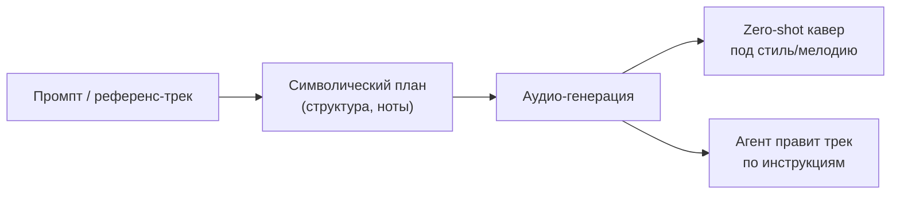
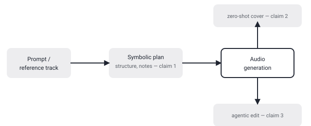

## Русская версия

# YuE2: «символическое планирование», «zero-shot каверы» и «агентское редактирование» музыки — три заявки в одной строке

Третье место в сегодняшнем GitHub trending занимает [multimodal-art-projection/YuE](https://github.com/multimodal-art-projection/YuE) — рост 8,291 → 8,349 звёзд (+58). Описание представляет YuE2 как «фронтир генерации музыки с символическим планированием, zero-shot каверами и агентским редактированием музыки». На Python, +559 звёзд «сегодня» по отдельной метке карточки — при том что окно роста в самих цифрах показывает лишь +58. Это тот же разрыв методик подсчёта «сегодня», который мы уже разбирали на примере colibri и gods-eye-view: два разных числа для одного и того же дня и репозитория, оба не врут по отдельности, просто измеряют по-разному.

Интереснее сама формулировка тега лайна — она упаковывает три разных, в принципе проверяемых по отдельности возможности в одну строку. «Символическое планирование» в контексте музыкальной генерации обычно означает, что модель сначала строит промежуточное символическое представление — что-то вроде партитуры или структуры трека (аккорды, форма, партии инструментов) — и только потом генерирует само аудио, в отличие от end-to-end генерации напрямую в waveform. Такой подход, если он реализован именно так, даёт больше контроля над структурой композиции ценой дополнительного этапа. «Zero-shot каверы» — вероятно, отсылка к идее, знакомой по voice cloning: сделать кавер в стиле или на мелодию референс-трека без дообучения модели именно под этот трек или исполнителя. И «агентское редактирование музыки» звучит как заявка на то, что генерация — не одноразовый акт, а итеративный процесс с правками по инструкциям, а не просто один прогон промпта в аудио.

Проблема в том, что дайджест не даёт ни одного примера, бенчмарка или аудиосэмпла ни на одну из трёх заявок — только теглайн. Это три отдельных, в принципе проверяемых обещания, слепленных в одну маркетинговую строку, и без прослушивания реальных сэмплов из [самого репозитория](https://github.com/multimodal-art-projection/YuE) невозможно понять, насколько «zero-shot» реально нулевой, а «агентское» редактирование — реально итеративный агент, а не переобученная формулировка того же генератора.

### Почему вам это важно

Когда тег лайн генеративного инструмента упаковывает сразу несколько бустеров — «фронтир», «zero-shot», «агентское» — разумно разбирать их по отдельности и искать конкретные сэмплы под каждую заявку, а не считать одну звучную строку доказательством всех трёх возможностей сразу.

## English version

# YuE2: "symbolic planning," "zero-shot covers," and "agentic music editing" bundled into one line

Ranked #3 in today's GitHub trending is [multimodal-art-projection/YuE](https://github.com/multimodal-art-projection/YuE), growing from 8,291 to 8,349 stars (+58). Its description pitches YuE2 as "frontier music generation with symbolic planning, zero-shot covers, and agentic music editing." Written in Python, with a separate card label reporting "+559 stars today" — even though the growth window in the raw numbers shows only +58. That's the same "today" counting discrepancy we already walked through with colibri and gods-eye-view: two different numbers for the same repo on the same day, neither wrong on its own, just measuring differently.

The tagline itself is the more interesting part — it packs three, in principle separately checkable, capabilities into one line. "Symbolic planning" in a music-generation context usually means the model first builds an intermediate symbolic representation — something like a score or track structure (chords, form, instrument parts) — before generating the actual audio, as opposed to end-to-end generation straight into a waveform. If implemented that way, it trades an extra stage for more control over compositional structure. "Zero-shot covers" is likely a nod to an idea familiar from voice cloning: producing a cover in the style of, or on the melody of, a reference track without fine-tuning the model specifically on that track or artist. And "agentic music editing" reads as a claim that generation isn't a one-shot act but an iterative process driven by instructions, rather than a single prompt-to-audio pass.

The catch is that the digest gives no example, benchmark, or audio sample backing any of the three claims — just the tagline. These are three separate, in-principle-testable promises fused into one marketing line, and without listening to actual samples from [the repo itself](https://github.com/multimodal-art-projection/YuE), there's no way to tell how "zero-shot" the zero-shot really is, or whether the "agentic" editing is a genuinely iterative agent rather than a repackaged description of the same generator.

### Why it matters

When a generative tool's tagline bundles several boosters at once — "frontier," "zero-shot," "agentic" — it's worth unpacking them separately and looking for concrete samples backing each claim, rather than treating one catchy line as proof of all three capabilities at once.
