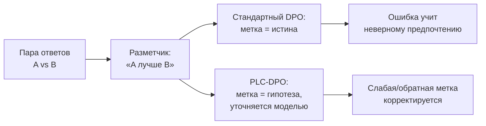
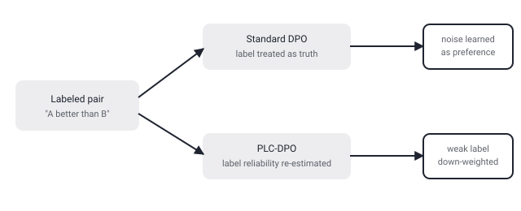

## Русская версия

# PLC-DPO: что делать с DPO, если разметчик предпочтений сам не уверен, какой ответ лучше

В сегодняшнем дайджесте — статья [«PLC-DPO: Posterior Label Correction in Noisy and Ambiguous Preference Optimization»](https://huggingface.co/papers/2608.30597) (Boryeong Cho, Sumyeong Ahn, Se-Young Yun). Отправная точка описана прямо в аннотации: Direct Preference Optimization (DPO) — метод выравнивания модели через попарные сравнения ответов («вот два ответа, этот лучше») — упрощает alignment по сравнению с полноценным RLHF, но опирается на неявное допущение, что каждая размеченная пара предпочтений надёжна. Реальные данные, по словам авторов, часто нарушают это допущение: метки бывают перепутаны местами, слабо выражены или откровенно двусмысленны — аннотация обрывается на слове «caus…», так что дальше про конкретный вред от этого мы досочинять не будем.

Сам DPO устроен просто: вместо обучения отдельной модели вознаграждения (как в классическом RLHF), он напрямую увеличивает вероятность предпочтённого ответа и уменьшает вероятность отвергнутого, используя пары «выбран / отвергнут» из разметки людьми или другой моделью. Вся конструкция держится на одном допущении — что метка «А лучше B» действительно отражает истинное предпочтение, а не шум разметки. Проблема в том, что на практике разметка предпочтений — особенно на сложных, спорных или пограничных случаях — сама по себе шумная: два хороших ответа могут быть почти неотличимы по качеству, разметчики расходятся во мнениях, а иногда метка попросту переворачивается по ошибке. Если модель обучается напрямую на такой метке как на неоспоримой истине, она в буквальном смысле учится тому предпочтению, которое размечено — вне зависимости от того, насколько оно надёжно.

Название метода — «posterior label correction» — намекает на общую идею, знакомую по обучению с шумными метками в других областях: вместо того чтобы принимать исходную метку как данность, модель (или отдельный механизм) переоценивает вероятность того, что метка верна, опираясь на апостериорное распределение — то есть на то, что модель уже знает о паре ответов из остального обучения. На основе этой переоценки слабые или подозрительные метки можно скорректировать или взвесить с меньшим доверием, не выбрасывая данные целиком. Точный механизм, который предлагают авторы — как именно считается апостериорная надёжность и как она встраивается в цикл обучения DPO — в обрезанной аннотации не раскрыт; за деталями — в [саму статью](https://huggingface.co/papers/2608.30597).

### Почему вам это важно

Если вы дообучаете модель через DPO на предпочтениях от людей или от другой LLM, стоит спросить себя не только «сколько у нас пар», но и «насколько надёжна каждая метка» — особенно на пограничных, спорных примерах, где шум разметки заметно выше среднего, и где стандартный DPO без коррекции рискует выучить именно этот шум как предпочтение.

## English version

# PLC-DPO: what to do with DPO when the labeler themselves isn't sure which answer is better

Today's digest includes [«PLC-DPO: Posterior Label Correction in Noisy and Ambiguous Preference Optimization»](https://huggingface.co/papers/2608.30597) (Boryeong Cho, Sumyeong Ahn, Se-Young Yun). The starting point is stated directly in the abstract: Direct Preference Optimization (DPO) — a method for aligning a model through pairwise response comparisons ("here are two answers, this one is better") — simplifies alignment compared to full RLHF, but relies on an implicit assumption that every labeled preference pair is reliable. Real data, per the authors, often violates that assumption: labels can be reversed, weak, or outright ambiguous — the abstract cuts off at "caus…", so we won't invent the specific consequence beyond that.

DPO itself is simple: instead of training a separate reward model (as in classic RLHF), it directly increases the probability of the preferred response and decreases the probability of the rejected one, using "chosen / rejected" pairs from human or model-generated labeling. The whole construction rests on one assumption — that the label "A is better than B" genuinely reflects a true preference rather than labeling noise. In practice, though, preference labeling — especially on hard, contested, or borderline cases — is itself noisy: two good answers can be nearly indistinguishable in quality, labelers disagree, and sometimes a label simply gets flipped by mistake. If a model is trained directly on such a label as unquestionable ground truth, it literally learns whatever preference was labeled, regardless of how reliable it actually was.

The method's name — "posterior label correction" — hints at a general idea familiar from noisy-label learning in other domains: instead of taking the original label at face value, the model (or a separate mechanism) re-estimates the probability that the label is correct, based on a posterior distribution — that is, on what the model already knows about the response pair from the rest of training. Based on that re-estimate, weak or suspicious labels can be corrected or down-weighted rather than being discarded entirely. The exact mechanism the authors propose — how posterior reliability is computed and how it's folded into the DPO training loop — isn't spelled out in the truncated abstract; for the details, see [the paper itself](https://huggingface.co/papers/2608.30597).

### Why it matters

If you're fine-tuning a model via DPO on preferences from humans or from another LLM, it's worth asking not just "how many pairs do we have" but "how reliable is each label" — especially on borderline, contested examples where labeling noise runs well above average, and where standard DPO without correction risks learning exactly that noise as a preference.
