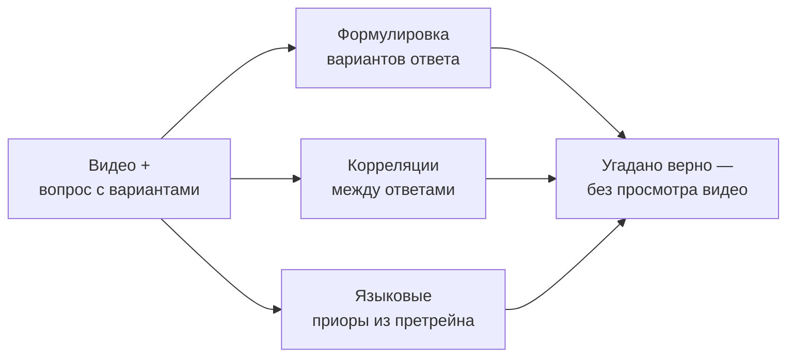
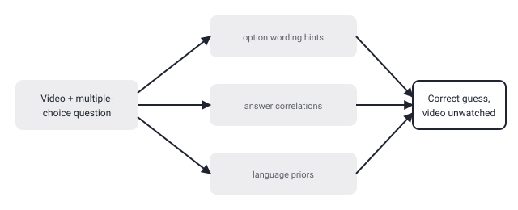

## Русская версия

# TempCloze: если видео-LLM отвечает правильно, значит ли это, что он понял видео?

В сегодняшнем дайджесте — статья [«TempCloze: Can Video-LLMs Identify the Missing Middle?»](https://huggingface.co/papers/2609.01515) (Wenqi Pei, Henry Hengyuan Zhao, Yilai Liu, Jiahao Meng, Han Chen и соавторы). Проблема, которую авторы формулируют прямо в аннотации: бенчмарки для оценки временнóго (temporal) понимания у видео-LLM почти всегда устроены как вопрос с вариантами ответа в текстовом виде — а раз ответ дан текстом, модель может угадать правильный вариант, вообще не посмотрев видео внимательно. Аннотация называет три конкретных пути такого угадывания: формулировка самих вариантов ответа может выдавать подсказку, между вариантами есть статистические корреляции, которые можно эксплуатировать без понимания контента, и языковые приоры, усвоенные моделью ещё на этапе претрейна на тексте, сами по себе повышают шанс угадать «типичный» правильный ответ. Дальше аннотация обрывается на «To reduce such shortcuts, w…» — конкретный метод, который предлагают авторы, в дайджесте не раскрыт.

Проблема, которую описывает первая часть аннотации, старше самой статьи и характерна не только для видео: в NLU-бенчмарках то же самое явление называют «shortcut learning» — когда модель обучается решать тест, а не задачу, которую тест должен измерять. Для видео-LLM это особенно коварно, потому что метрика (accuracy на бенчмарке) выглядит как прямое доказательство «понимания видео», а на деле может отражать способность модели угадывать по формулировке вопроса и статистике вариантов, которая никак не связана с содержимым конкретного ролика. Название «TempCloze» намекает на формат задачи, близкий к классическому cloze-тесту («заполни пропуск») — судя по подзаголовку «Can Video-LLMs Identify the Missing Middle?», речь, видимо, о том, чтобы модель определила пропущенный средний фрагмент видео, а не выбрала текстовый ответ из готового списка. Формат, где нужно опознать содержательный пропуск, а не выбрать вариант с наиболее «typical» формулировкой, в принципе меньше подвержен чисто языковым трюкам — но насколько именно это снижает bias, аннотация не говорит, а полный текст статьи в дайджест не попал.

### Почему вам это важно

Если вы оцениваете видео-LLM (или любую мультимодальную модель) по бенчмарку с вариантами ответа в текстовой форме, высокая accuracy сама по себе не доказывает, что модель «смотрит» видео, а не угадывает по формулировке и статистике вариантов — прежде чем доверять цифре, стоит проверить, устойчив ли бенчмарк к перемешиванию вариантов и к запуску модели вовсе без видео на входе.

## English version

# TempCloze: if a video-LLM answers correctly, does that mean it understood the video?

Today's digest includes [«TempCloze: Can Video-LLMs Identify the Missing Middle?»](https://huggingface.co/papers/2609.01515) (Wenqi Pei, Henry Hengyuan Zhao, Yilai Liu, Jiahao Meng, Han Chen, and co-authors). The problem the authors state directly in the abstract: temporal-reasoning benchmarks for Video-LLMs are almost always structured as multiple-choice questions in text form — and because the answer is delivered as text, a model can guess the right option without actually watching the video carefully. The abstract names three specific routes for such guessing: the wording of the answer options themselves can leak a hint, statistical correlations between options can be exploited without understanding the content, and language priors the model already absorbed from text pretraining raise the odds of guessing the "typical" correct answer on their own. The abstract then cuts off at "To reduce such shortcuts, w…" — the specific method the authors propose isn't disclosed in the digest.

The problem described in the first half of the abstract is older than this paper and isn't unique to video: in NLU benchmarks the same phenomenon is called "shortcut learning" — a model learning to solve the test rather than the task the test is meant to measure. For Video-LLMs this is especially deceptive, because the metric (benchmark accuracy) looks like direct proof of "video understanding," while in practice it may reflect the model's ability to guess from question phrasing and option statistics that have nothing to do with the actual footage. The name "TempCloze" hints at a task format close to a classic cloze test ("fill in the blank") — going by the subtitle "Can Video-LLMs Identify the Missing Middle?", it seems the model is asked to identify a missing middle segment of the video, rather than pick a text answer from a ready-made list. A format that requires identifying a substantive gap rather than picking the option with the most "typical" wording is, in principle, less exposed to purely linguistic tricks — but exactly how much that reduces bias isn't stated in the abstract, and the full paper text isn't in the digest.

### Why it matters

If you're evaluating a Video-LLM (or any multimodal model) on a benchmark with text-form answer options, a high accuracy number alone doesn't prove the model is "watching" the video rather than guessing from phrasing and option statistics — before trusting the number, it's worth checking whether the benchmark holds up under shuffled options and under running the model with no video input at all.
