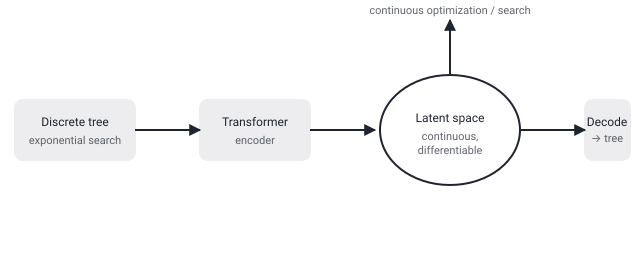

## Русская версия

# Деревья решений ищут не перебором, а в латентном пространстве VAE

В сегодняшнем дайджесте — статья [«Learning Sparse Decision Trees via Transformer Variational Auto-Encoders»](https://huggingface.co/papers/2609.01430) (Giacomo Fidone, Alessio Cascione, Riccardo Guidotti). Отправная точка авторов звучит знакомо всем, кто работал с интерпретируемым ML: деревья решений — одна из самых широко используемых моделей именно из-за прозрачной логики принятия решений, что делает их удобными для задач с высокими ставками, где нужно объяснить каждое предсказание. Проблема в том, что, по словам авторов, большинство существующих алгоритмов обучения деревьев — на этом месте аннотация обрывается, так что какие именно недостатки этих алгоритмов авторы имеют в виду, мы досочинять не будем.

Но контекст здесь понятен и без полной цитаты. Классические алгоритмы построения деревьев решений (вроде CART) — жадные: на каждом шаге они выбирают локально лучшее разбиение, не заглядывая вперёд, и это быстро, но не гарантирует ни компактности, ни точности итогового дерева. Поиск по-настоящему оптимального разреженного дерева — с минимальным числом узлов при заданной точности — это комбинаторная задача, которая экспоненциально дорога при точном переборе. Отсюда вечный компромисс в интерпретируемом ML: либо жадный, но субоптимальный алгоритм, либо точный, но неподъёмный по вычислениям.

Название статьи подсказывает, какой обходной путь предлагают авторы: transformer variational auto-encoder (VAE). Идея, знакомая по другим областям, где генеративные модели применяют к дискретным структурам (молекулы, графы, программы) — закодировать дерево решений в непрерывный латентный вектор через энкодер-трансформер, а затем искать не в исходном дискретном и комбинаторно необъятном пространстве всех возможных деревьев, а в гладком, дифференцируемом латентном пространстве, где применимы стандартные методы непрерывной оптимизации. Найденную точку в латенте затем декодируют обратно в конкретное дерево. Дает ли это реальный выигрыш в точности или компактности по сравнению с CART и другими жадными базовыми алгоритмами — аннотация обрывается ровно на моменте описания недостатков существующих подходов, так что конкретные цифры и сравнения — только в [самой статье](https://huggingface.co/papers/2609.01430).

### Почему вам это важно

Если вы выбираете между «жадным, но быстрым CART» и «оптимальным, но неподъёмным» деревом решений для задачи, где интерпретируемость критична (кредитный скоринг, медицина, юридические решения), стоит отслеживать этот класс работ: превращение дискретного поиска в непрерывную оптимизацию через латентное пространство — общий паттерн, который может со временем сдвинуть этот компромисс, но пока без опубликованных чисел судить о реальном выигрыше рано.

## English version

# Decision trees, searched not by brute force but inside a VAE's latent space

Today's digest includes the paper [«Learning Sparse Decision Trees via Transformer Variational Auto-Encoders»](https://huggingface.co/papers/2609.01430) (Giacomo Fidone, Alessio Cascione, Riccardo Guidotti). The authors' starting point will sound familiar to anyone who's worked with interpretable ML: decision trees are among the most widely used models precisely because of their transparent decision logic, which makes them well suited to high-stakes decision-making contexts where every prediction needs to be explainable. The catch, per the authors, is that most existing tree-learning algorithms — the abstract cuts off right there, so we won't guess at which specific shortcomings they mean.

The context is clear enough without the full quote, though. Classic tree-building algorithms like CART are greedy: at each step they pick the locally best split without looking ahead, which is fast but guarantees neither compactness nor accuracy in the final tree. Searching for a genuinely optimal sparse tree — minimal node count at a given accuracy — is a combinatorial problem that's exponentially expensive to solve exactly. Hence the long-standing tradeoff in interpretable ML: either a greedy, suboptimal algorithm, or an exact one that doesn't scale.

The paper's title hints at the workaround the authors propose: a transformer variational auto-encoder (VAE). It's an idea familiar from other domains where generative models get applied to discrete structures (molecules, graphs, programs) — encode a decision tree into a continuous latent vector via a transformer encoder, then search not the original discrete, combinatorially vast space of all possible trees, but a smooth, differentiable latent space where standard continuous optimization methods apply. The point found in that latent space is then decoded back into a concrete tree. Whether this yields a real gain in accuracy or compactness over CART and other greedy baselines isn't something the abstract gets to — it cuts off right at the description of existing approaches' shortcomings — so specific numbers and comparisons live only in [the paper itself](https://huggingface.co/papers/2609.01430).

### Why it matters

If you're choosing between a "greedy but fast CART" and an "optimal but intractable" decision tree for a task where interpretability is non-negotiable (credit scoring, medicine, legal decisions), this class of work is worth tracking: turning discrete search into continuous optimization via a latent space is a general pattern that could shift that tradeoff over time — but without published numbers yet, it's too early to judge the actual gain.
