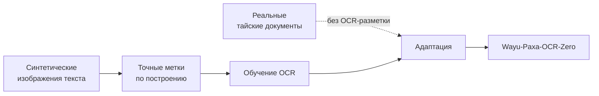
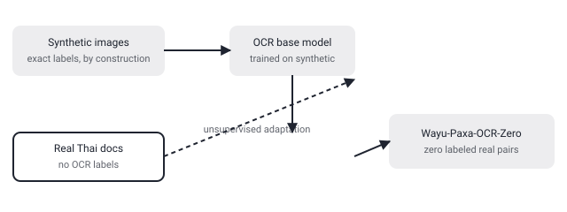

## Русская версия

# Сколько реального OCR можно выжать из синтетики: тайский язык как стресс-тест

В сегодняшнем дайджесте — статья [«How Far Can Synthetic Data Take Thai OCR?»](https://huggingface.co/papers/2609.03595) (Kunat Pipatanakul). Авторы исследуют, что именно делает синтетические данные для обучения OCR переносимыми на реальные тайские документы, и используют полученные выводы для построения модели Wayu-Paxa-OCR-Zero — тайского OCR, адаптированного без единой размеченной строки реального текста, только на реальных страницах документов без OCR-меток. По словам авторов, синтетика даёт точные метки «на масштабе» — аннотация обрывается ровно на этом слове, так что дальше о конкретной цене этой точности мы не додумываем.

Смысл постановки задачи понятен и без продолжения цитаты: разметка OCR для языка вроде тайского — с собственной системой письма, без пробелов между словами и с надстрочными диакритическими знаками — дорога и медленна, потому что каждую строку реального документа нужно вручную сверить с изображением. Синтетические данные обходят это узкое место: можно сгенерировать сколько угодно изображений текста с идеально точными метками «на бумаге», просто зная, какой текст был отрисован. Проблема давно известна в OCR и шире — «домейн-гэп»: шрифт, шум сканирования, реальные артефакты бумаги и печати у синтетики почти никогда не совпадают с реальными документами один в один, и модель, обученная только на синтетике, может провалиться именно там, где реальные данные отличаются от сгенерированных.

Ключевое слово в названии модели — «Zero»: адаптация к реальным тайским документам происходит без использования размеченных реальных OCR-пар, то есть модель как-то учится закрывать разрыв между синтетикой и реальностью, опираясь только на нередазмеченные реальные страницы — вероятно, через некоторую форму самообучения или доменной адаптации без учителя. Какой именно механизм переноса они используют и насколько велик остаточный домейн-гэп после адаптации — аннотация обрывается до этой части, подробности — в [самой статье](https://huggingface.co/papers/2609.03595).

### Почему вам это важно

Если вы строите OCR или любую другую задачу распознавания для языка или домена с дорогой ручной разметкой, стоит следить за этим классом работ: вопрос не «синтетика или реальные данные», а «что именно в синтетике переносится на реальность, а что нет» — и если у вас есть немаркированные реальные примеры (даже без меток), их можно использовать для закрытия разрыва без единой новой ручной аннотации.

## English version

# How much real OCR can you squeeze out of synthetic data: Thai as a stress test

Today's digest includes the paper [«How Far Can Synthetic Data Take Thai OCR?»](https://huggingface.co/papers/2609.03595) (Kunat Pipatanakul). The authors investigate what actually makes synthetic OCR supervision transfer to real Thai documents, and use the resulting insights to build Wayu-Paxa-OCR-Zero, a Thai OCR model adapted without a single labeled real-text example — only on unlabeled real Thai document pages. Per the authors, synthetic data provides exact labels "at scale" — the abstract cuts off right there, so we won't speculate about the specific price of that precision.

The framing makes sense even without the rest of the quote: OCR labeling for a language like Thai — its own script, no spaces between words, superscript diacritics — is expensive and slow, since every line of a real document has to be manually checked against the image. Synthetic data sidesteps that bottleneck: you can generate as many text images as you want with perfectly accurate labels "on paper," simply because you know what text was rendered. The well-known problem in OCR (and beyond) is the domain gap: synthetic fonts, scan noise, and real paper-and-print artifacts almost never match real documents exactly, and a model trained purely on synthetic data can fail precisely where real data diverges from the generated version.

The key word in the model's name is "Zero": adaptation to real Thai documents happens without any labeled real OCR pairs, meaning the model somehow closes the gap between synthetic and real relying only on unlabeled real pages — likely through some form of self-training or unsupervised domain adaptation. Which exact transfer mechanism they use, and how much residual domain gap remains after adaptation, isn't covered before the abstract cuts off — for details, see [the paper itself](https://huggingface.co/papers/2609.03595).

### Why it matters

If you're building OCR or any other recognition task for a language or domain with expensive manual labeling, this line of work is worth tracking: the question isn't "synthetic or real data" but "exactly what in the synthetic data transfers to reality and what doesn't" — and if you have unlabeled real examples on hand, even without annotations, they can help close that gap without a single new manual label.
