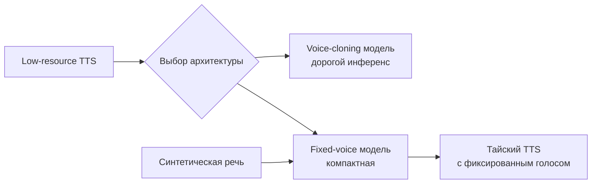
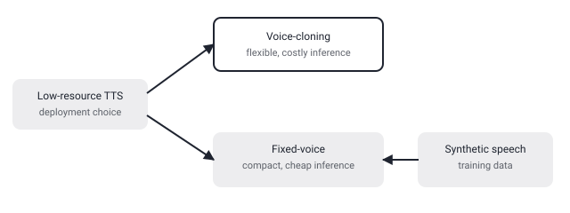

## Русская версия

# TTS не обязан клонировать голос: компактная фиксированная модель против дорогого voice-cloning

В сегодняшнем дайджесте — статья [«Building and Evaluating Fixed-Voice Thai TTS from Synthetic Speech»](https://huggingface.co/papers/2609.03502) (Kunat Pipatanakul, Potsawee Manakul, Warit Sirichotedumrong, Sittipong Sripaisarnmongkol, Pakorn Nathong и др.). Отправная точка авторов — развилка, знакомая всем, кто разворачивал TTS в продакшне для языка с ограниченными ресурсами: либо большая voice-cloning модель, способная имитировать голос по короткому образцу, но с дорогим инференсом, либо компактная система с фиксированным голосом, которая — на этом аннотация обрывается, так что что именно «требует» такая система, мы не додумываем.

Развилка тем не менее знакома по своей сути. Voice-cloning модели гибкие: одна модель, один forward pass с образцом голоса на входе — и можно синтезировать речь практически любым тембром. Но эта гибкость стоит вычислений: такие модели, как правило, крупнее и медленнее на инференсе, потому что должны кодировать и переносить характеристики произвольного голоса «на лету». Фиксированный голос — противоположная крайность: система умеет говорить только одним конкретным тембром, зато сама архитектура и объём модели могут быть меньше, а инференс — дешевле и предсказуемее, что критично, если TTS нужно обслуживать много запросов в реальном времени на ограниченном железе.

Ключевая деталь в названии — TTS строится «from synthetic speech», то есть обучающие данные для фиксированного тайского голоса синтетические, а не записанные диктором. Это перекликается с параллельной работой этой же исследовательской группы про синтетический OCR для тайского: похоже, команда системно исследует, где синтетические данные могут заменить дорогой сбор реальных данных для языков с ограниченными ресурсами — на этот раз для речи, а не для текста. Насколько качество итогового голоса конкурирует с моделями, обученными на реальных дикторских записях, и какую именно экономию по инференсу даёт fixed-voice архитектура по сравнению с voice-cloning — аннотация обрывается раньше, чем эти цифры появляются; подробности — в [самой статье](https://huggingface.co/papers/2609.03502).

### Почему вам это важно

Если вам не нужен произвольный клонированный голос, а достаточно одного стабильного «фирменного» голоса продукта — например, для голосового ассистента или озвучки интерфейса на низкоресурсном языке — компактная fixed-voice архитектура, обученная на синтетической речи, может оказаться сильно дешевле в эксплуатации, чем универсальная voice-cloning модель, и не требовать дорогого сбора студийных записей диктора.

## English version

# TTS doesn't have to clone a voice: a compact fixed-voice model against costly voice-cloning

Today's digest includes the paper [«Building and Evaluating Fixed-Voice Thai TTS from Synthetic Speech»](https://huggingface.co/papers/2609.03502) (Kunat Pipatanakul, Potsawee Manakul, Warit Sirichotedumrong, Sittipong Sripaisarnmongkol, Pakorn Nathong, et al.). The authors' starting point is a fork familiar to anyone who's deployed TTS in production for a low-resource language: either a large voice-cloning model capable of mimicking a voice from a short sample but with costly inference, or a compact fixed-voice system that — the abstract cuts off right there, so we won't guess at exactly what such a system "requires."

The fork is still recognizable in substance, though. Voice-cloning models are flexible: one model, one forward pass with a voice sample as input, and you can synthesize speech in almost any timbre. But that flexibility costs compute: such models tend to be larger and slower at inference, since they must encode and transfer arbitrary voice characteristics on the fly. A fixed voice is the opposite extreme: the system can only speak in one specific timbre, but the architecture and model size can be smaller, and inference cheaper and more predictable — which matters if the TTS has to serve many real-time requests on constrained hardware.

The key detail in the title is that the TTS is built "from synthetic speech" — meaning the training data for the fixed Thai voice is synthetic rather than recorded from a human speaker. This echoes a parallel paper from the same research group on synthetic OCR for Thai: it looks like the team is systematically probing where synthetic data can replace expensive real-data collection for low-resource languages — this time for speech rather than text. How the resulting voice quality compares to models trained on real recorded speech, and exactly how much inference cost the fixed-voice architecture saves versus voice-cloning, isn't something the abstract gets to before it cuts off; for the numbers, see [the paper itself](https://huggingface.co/papers/2609.03502).

### Why it matters

If you don't need an arbitrary cloned voice and a single stable "brand" voice is enough — say, for a voice assistant or interface narration in a low-resource language — a compact fixed-voice architecture trained on synthetic speech could end up much cheaper to run than a general voice-cloning model, without requiring expensive studio recordings of a human speaker.
