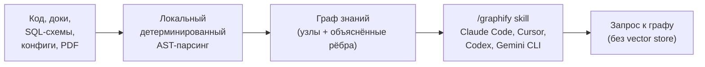
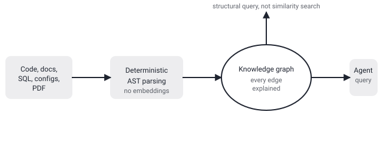

## Русская версия

# Graphify: кодовая база как граф знаний, без единого вектора

В сегодняшнем дайджесте трендов GitHub — репозиторий [Graphify-Labs/graphify](https://github.com/Graphify-Labs/graphify), который за последние сутки прибавил сразу +1,313 звёзд (116,840 → 118,153) — один из самых заметных скачков в дайджесте. Идея проекта: превратить любую кодовую базу вместе с её документацией, SQL-схемами, конфигами и PDF-файлами в единый запрашиваемый граф знаний. Технически это оформлено как `/graphify` skill для Claude Code, Cursor, Codex и Gemini CLI, а под капотом — локальный детерминированный AST-парсинг и принцип «каждое ребро графа объяснимо».

Ключевая формулировка в описании проекта — «no vector store». Это прямое заявление о выборе архитектуры retrieval-слоя, а не просто деталь реализации. Стандартный подход RAG для кода — разбить файлы на чанки, прогнать через embedding-модель и искать похожие куски по косинусному сходству в векторной базе. Это работает, но у эмбеддингов есть слабое место: они хороши в поиске «похожего по смыслу», но плохо передают точные структурные связи — какая функция вызывает какую, какая таблица в SQL-схеме на какую внешнюю ссылается, какой конфиг переопределяет какое значение по умолчанию. Граф знаний, построенный детерминированным парсингом AST (а не вероятностным embedding'ом), в теории отвечает на такие вопросы точно: ребро либо есть в коде, либо его нет, и его можно «объяснить» — показать, почему оно существует.

Цена такого подхода — гибкость: детерминированный парсер должен понимать грамматику каждого языка и формата, который вы хотите включить в граф, тогда как embedding-модель в принципе может «переварить» любой текст, даже не до конца понимая его структуру. Сам дайджест не раскрывает деталей о том, как именно устроен парсинг разных форматов (код, SQL, PDF) в единой графовой схеме и какие языки поддержаны на практике — эти детали стоит проверять в [самом репозитории](https://github.com/Graphify-Labs/graphify), прежде чем подключать инструмент к реальному проекту.

### Почему вам это важно

Если ваш агентный RAG-пайплайн регулярно путается в точных структурных связях (кто вызывает кого, что от чего зависит) при в целом неплохом семантическом поиске — это симптом, что единица retrieval'а выбрана неверно: смысловая близость через векторы и точная структурная связь через граф решают разные задачи, и рост интереса к graphify — сигнал, что многие команды сейчас пересматривают этот выбор для кода именно в пользу графа.

## English version

# Graphify: your codebase as a knowledge graph, no vector store required

Today's GitHub trending digest surfaced [Graphify-Labs/graphify](https://github.com/Graphify-Labs/graphify), which gained +1,313 stars in the last day alone (116,840 → 118,153) — one of the sharpest jumps in today's list. The idea: turn any codebase, along with its docs, SQL schemas, configs, and PDFs, into a single queryable knowledge graph. Technically it ships as a `/graphify` skill for Claude Code, Cursor, Codex, and Gemini CLI, built on local deterministic AST parsing with the stated principle that "every edge is explained."

The headline claim in the project description is "no vector store." That's a direct statement about a retrieval-layer architecture choice, not just an implementation detail. The standard RAG approach for code is to chunk files, run them through an embedding model, and search for similar chunks via cosine similarity in a vector database. That works, but embeddings have a known weak spot: they're good at finding things that are "semantically similar," but poor at carrying exact structural relationships — which function calls which, which table in a SQL schema references which foreign key, which config overrides which default. A knowledge graph built via deterministic AST parsing (rather than a probabilistic embedding) can, in principle, answer those questions exactly: an edge either exists in the code or it doesn't, and it can be "explained" — you can show why it's there.

The tradeoff is flexibility: a deterministic parser has to understand the grammar of every language and format you want in the graph, whereas an embedding model can in principle digest any text without fully understanding its structure. The digest itself doesn't detail how parsing across different formats (code, SQL, PDF) is unified into one graph schema, or which languages are actually supported in practice — those details are worth checking directly in [the repository](https://github.com/Graphify-Labs/graphify) before wiring the tool into a real project.

### Why it matters

If your agentic RAG pipeline keeps getting confused about exact structural relationships (who calls whom, what depends on what) despite otherwise decent semantic search, that's a symptom that the unit of retrieval is mismatched to the question: semantic closeness via vectors and exact structural links via a graph solve different problems, and graphify's growth is a signal that a lot of teams are now reconsidering that choice for code, in favor of the graph.
