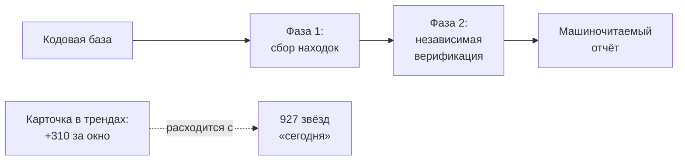
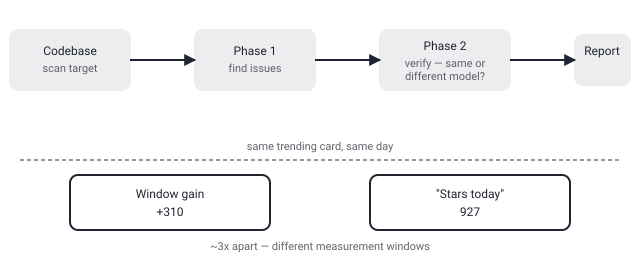

## Русская версия

# Cloudflare security-audit-skill: агент для аудита безопасности — и разночтение в цифрах на той же карточке

В сегодняшнем дайджесте трендов GitHub — [cloudflare/security-audit-skill](https://github.com/cloudflare/security-audit-skill), поднявшийся на #2 место. Это skill для кодового агента, который проводит многофазный аудит безопасности и выдаёт «независимо верифицированные, машиночитаемые находки» (independently verified, machine-readable findings), написан на JavaScript.

Сама карточка в дайджесте показывает разночтение в цифрах: с одной стороны, прирост звёзд за отслеживаемое окно — 6,965 → 7,275, то есть +310. С другой — в тексте той же карточки указано «927 stars today». Это не опечатка, которую стоит просто игнорировать: похожая ситуация уже встречалась в дайджесте 11 сентября с gods-eye-view, где разница между «+916 за окно» и «1,762 звезды сегодня» была почти двукратной. Похоже, площадки трендов GitHub используют разные определения «сегодня» (календарные сутки по UTC против скользящего окна отслеживания скрипта), и обе цифры при этом технически «правдивы» — просто отвечают на разные вопросы. Урок здесь не про cloudflare/security-audit-skill конкретно, а про то, что любая цифра роста в трендах требует уточнения, что именно она измеряет, прежде чем делать по ней выводы о скорости внедрения инструмента.

Что касается самого инструмента: словосочетание «independently verified findings» в описании skill'а для агента, который сам же ищет уязвимости, стоит читать внимательно. Вопрос, на который дайджест не отвечает: верификация здесь — это отдельный проход другой модели или детерминированного чекера по находкам первой фазы, или это тот же самый агент, который перепроверяет свою же работу в новом промпте? Разница принципиальна: независимая проверка другим механизмом снижает шанс, что систематическая ошибка модели (например, ложноположительный паттерн, который агент считает уязвимостью там, где её нет) пройдёт через обе фазы аудита, тогда как повторный проход той же модели такой гарантии не даёт. Детали архитектуры верификации — в [самом репозитории](https://github.com/cloudflare/security-audit-skill), дайджест их не раскрывает.

### Почему вам это важно

Если вы рассматриете агентные security-аудиты как замену (а не дополнение) ручному ревью, ключевой вопрос — не «сколько фаз» у пайплайна, а закрыта ли фаза верификации от той же модели, что нашла уязвимость: без этого разделения «многофазный аудит» может означать просто «модель проверила себя два раза», а не два независимых источника сигнала.

## English version

# Cloudflare's security-audit-skill: an audit agent — and a number mismatch on its own trending card

Today's GitHub trending digest surfaced [cloudflare/security-audit-skill](https://github.com/cloudflare/security-audit-skill) at #2. It's a coding-agent skill that runs multi-phase security audits and produces "independently verified, machine-readable findings," written in JavaScript.

The digest card itself shows a discrepancy: the tracked-window star gain is 6,965 → 7,275, i.e. +310. But the same card's text also says "927 stars today." That's not a typo to wave away — a nearly identical pattern showed up in the September 11 digest with gods-eye-view, where "+916 window growth" and "1,762 stars today" were almost 2x apart. GitHub trending surfaces appear to use different definitions of "today" (a calendar UTC day versus the tracking script's own rolling window), and both numbers can be technically "true" while answering different questions. The lesson isn't specific to cloudflare/security-audit-skill — it's that any trending growth figure needs its measurement window clarified before you draw conclusions about adoption speed from it.

As for the tool itself: the phrase "independently verified findings," in a skill description for an agent that both hunts for vulnerabilities and apparently verifies its own findings, is worth reading carefully. The question the digest doesn't answer: is verification a separate pass by a different model or a deterministic checker running against phase-one's findings, or is it the same agent double-checking its own work in a new prompt? The distinction matters — independent verification by a different mechanism reduces the chance that a systematic model error (say, a false-positive pattern the agent mistakes for a real vulnerability) survives both audit phases, while a repeated pass by the same model offers no such guarantee. The verification architecture's details live in [the repository itself](https://github.com/cloudflare/security-audit-skill); the digest doesn't spell them out.

### Why it matters

If you're considering agentic security audits as a replacement (rather than a supplement) for manual review, the question that matters isn't "how many phases" the pipeline has — it's whether the verification phase is walled off from the model that found the vulnerability in the first place. Without that separation, "multi-phase audit" can just mean "the model checked itself twice," not two independent sources of signal.
