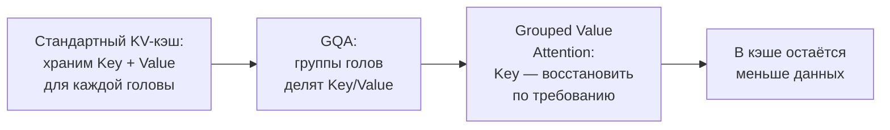
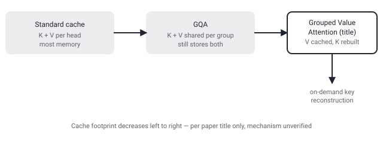

## Русская версия

# Grouped Value Attention: что если ключи в KV-кэше не хранить, а восстанавливать по требованию

В сегодняшнем дайджесте — статья [«Grouped Value Attention: Efficient KV Caching via On-Demand Key Reconstruction»](https://huggingface.co/papers/2609.13285) (Vishesh Tripathi, Abhay Kumar, Ramsha Khan). Отправная точка — знакомая всем, кто разбирался в инференсе трансформеров: KV-кэш является главным узким местом при декодировании, потому что его объём в памяти и трафик чтения растут вместе с длиной последовательности. Grouped-query attention (GQA), уже ставший стандартом де-факто в современных LLM, снижает эту стоимость за счёт того, что несколько голов запросов делят одни и те же ключи и значения — вместо отдельного набора K/V на каждую голову внимания хранится один набор на группу голов. Но, как отмечают авторы, даже после этого GQA всё равно хранит и ключи, и значения — просто в меньшем числе копий. Ровно на этом месте аннотация в дайджесте обрывается, так что дальше — только то, что подсказывает название статьи, без гарантии точности.

Название «Grouped Value Attention» и подзаголовок «via On-Demand Key Reconstruction» намекают на конкретный ход: если GQA уже показал, что можно группировать K и V вместе и делить их между головами, следующий шаг — спросить, нужно ли хранить сами ключи вообще, или их можно восстановить «по требованию» в момент, когда они нужны для вычисления внимания, а в кэше держать только (сгруппированные) значения. Если это действительно так, экономия памяти могла бы быть больше, чем у GQA: не просто меньше копий K и V, а полное исключение постоянного хранения одной из двух матриц. Но это предположение, основанное только на названии и первой фразе аннотации — какой именно механизм восстановления ключей предлагают авторы, какая цена в вычислениях (реконструкция явно не бесплатна) и какой реальный выигрыш в памяти или задержке получен на практике, аннотация не раскрывает. Все эти детали — только в [самой статье](https://huggingface.co/papers/2609.13285).

### Почему вам это важно

Если вы упираетесь в лимит видеопамяти при обслуживании длинных контекстов и уже используете GQA, стоит держать эту работу на радаре: судя по названию, это следующий шаг в той же логике («храним меньше, вычисляем больше по требованию»), но прежде чем менять архитектуру инференса под неё, нужны конкретные числа задержки и экономии памяти — а это можно узнать только из полного текста статьи, не из заголовка.

## English version

# Grouped Value Attention: what if keys in the KV cache weren't stored, but reconstructed on demand

Today's digest includes the paper [«Grouped Value Attention: Efficient KV Caching via On-Demand Key Reconstruction»](https://huggingface.co/papers/2609.13285) (Vishesh Tripathi, Abhay Kumar, Ramsha Khan). The starting point is familiar to anyone who's dug into transformer inference: the KV cache is the primary bottleneck for decoding, since its memory footprint and cache-read traffic grow with sequence length. Grouped-query attention (GQA), already the de facto standard in modern LLMs, cuts this cost by having several query heads share the same keys and values — instead of a separate K/V set per attention head, one set is stored per group of heads. But as the authors note, even after that, GQA still stores both keys and values — just in fewer copies. That's exactly where the digest's abstract snippet cuts off, so what follows is only what the paper's title suggests, with no guarantee of accuracy.

The title, "Grouped Value Attention," and its subtitle, "via On-Demand Key Reconstruction," hint at a specific move: if GQA already showed that K and V can be grouped and shared across heads, the next question is whether keys themselves need to be stored at all, or whether they can be reconstructed "on demand" at the moment they're needed for the attention computation, while the cache holds only the (grouped) values. If that's the actual mechanism, the memory savings could go beyond GQA's — not just fewer copies of K and V, but eliminating persistent storage of one of the two matrices entirely. But this is an inference drawn only from the title and the first sentence of the abstract; the abstract doesn't reveal what reconstruction mechanism the authors actually propose, what computational cost it carries (reconstruction is clearly not free), or what real memory or latency gain was measured in practice. All of that detail lives only in [the paper itself](https://huggingface.co/papers/2609.13285).

### Why it matters

If you're hitting VRAM limits serving long contexts and already run GQA, this line of work is worth watching: going by the title, it looks like the next step in the same logic ("store less, compute more on demand") — but before changing an inference architecture around it, you need concrete latency and memory numbers, and those can only come from the full paper, not the title.
